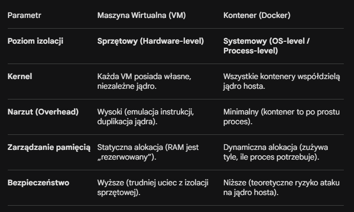
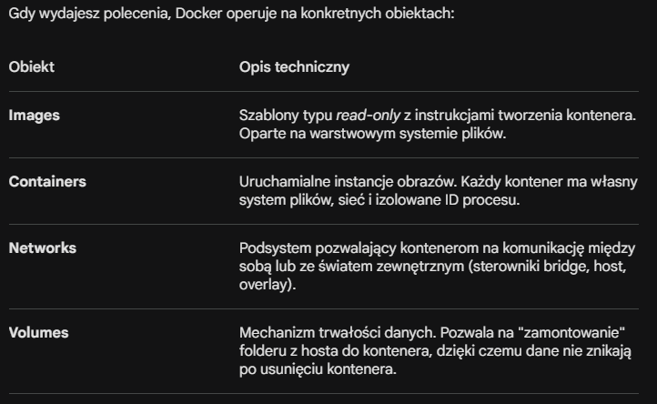

# Docker teoria

## Czym jest Docker?

Docker to platforma do konteneryzacji. Zamiast instalować bazę danych, Pythona czy Node.js bezpośrednio na komputerze (i ryzykować, że różne wersje będą się ze sobą gryzły), zamykasz je w odizolowanych kontenerach.

## Trzy filary Dockera:

1. Dockerfile (Przepis): To zwykły plik tekstowy, w którym piszesz instrukcje: „weź system Linux, zainstaluj Pythona, skopiuj moje pliki i uruchom komendę X”.

2. Image / Obraz (Zamrożona pizza): Gdy „zbudujesz” Dockerfile, powstaje obraz. To paczka ze wszystkim, czego aplikacja potrzebuje. Obraz jest „tylko do odczytu” – nie zmienia się.

3. Container / Kontener (Gotowa pizza na stole): To uruchomiony obraz. Możesz odpalić 10 kontenerów z tego samego obrazu – każdy będzie oddzielną, działającą instancją Twojej aplikacji.

### Czym jest drugi filar - obraz / image

Mówiąc najprościej: Obraz (Image) to „zamrożony” stan Twojej aplikacji i jej środowiska.

Jeśli kontener to biegający program, to obraz jest jego kodem źródłowym, wszystkimi bibliotekami i ustawieniami, spakowanymi w jeden plik (paczke), którego nie da się zmienić.

1. Najlepsze analogie dla obrazu
Żeby to dobrze poczuć, użyjmy kilku porównań:

- Przepis vs. Danie: Obraz to przepis w książce kucharskiej. Sam w sobie nie nasyci Cię, ale zawiera wszystkie instrukcje, jak zrobić obiad. Kontener to gotowe danie na talerzu.

- Klasa vs. Obiekt (Programowanie): Jeśli programujesz, obraz jest jak Klasa, a kontener to Instancja (obiekt) tej klasy.

- Gra na płycie vs. Uruchomiona gra: Obraz to płyta z grą (lub plik .iso). Leży na półce i nic nie robi. Kontener to moment, w którym wkładasz płytę do konsoli i grasz.

2. Z czego składa się obraz? (Warstwy)
To jest techniczne „mięcho”, które sprawia, że Docker jest genialny. Obraz nie jest jednym wielkim klocem. To stos warstw (Layers) ułożonych jedna na drugiej.

Każda linijka w Twoim pliku Dockerfile tworzy nową warstwę:

- Warstwa 1: System operacyjny (np. lekki Linux Ubuntu).

- Warstwa 2: Instalacja Pythona.

- Warstwa 3: Twoje biblioteki (np. Django, Flask).

- Warstwa 4: Twój kod źródłowy.

Dlaczego to jest ważne? Ponieważ warstwy są współdzielone! Jeśli masz 10 różnych aplikacji opartych na tym samym obrazie Linuxa, Docker pobierze ten system tylko raz. To oszczędza mnóstwo miejsca na dysku.

## Virtual Machine vs Container - czym są i ich różnice

1. Maszyna Wirtualna (Virtual Machine) – Abstrakcja na poziomie Sprzętu
Maszyna wirtualna to technologia emulacji sprzętu. Kluczowym elementem jest tutaj Hypervisor (VMM – Virtual Machine Monitor), który znajduje się między fizycznym sprzętem a systemem operacyjnym.

Hypervisor (Typu 1 lub 2): Tworzy warstwę abstrakcji dla procesora, pamięci RAM i dysków. Hypervisor „oszukuje” system operacyjny zainstalowany wewnątrz VM, sprawiając, że myśli on, iż działa na dedykowanym, fizycznym serwerze.

Guest OS (System operacyjny gościa): Każda VM uruchamia pełną instancję jądra (kernel) i wszystkie procesy systemowe. Oznacza to, że jeśli uruchomisz prosty skrypt w Pythonie na VM z Ubuntu, musisz załadować całe jądro Linuxa, sterowniki, demony systemowe (systemd) itp.

Izolacja: Jest realizowana na poziomie instrukcji procesora (np. technologie Intel VT-x lub AMD-V). Każda VM ma całkowicie oddzielną przestrzeń adresową pamięci.

2. Kontener (Container) – Abstrakcja na poziomie Systemu Operacyjnego
Konteneryzacja to izolacja procesów wewnątrz tego samego jądra systemu. Docker nie emuluje sprzętu; on wykorzystuje zaawansowane funkcje jądra Linuxa, aby stworzyć odizolowane środowisko dla konkretnego procesu.

Kluczowe mechanizmy jądra, które to umożliwiają:

Namespaces (Przestrzenie nazw): To one odpowiadają za to, co proces „widzi”. Izolują m.in. PID (listę procesów), Network (interfejsy sieciowe), Mount (system plików) oraz User (użytkowników). Dzięki temu proces w kontenerze myśli, że jest jedynym procesem w systemie i ma własną kartę sieciową.

Control Groups (cgroups): Odpowiadają za limitowanie zasobów. Pozwalają na twarde zdefiniowanie, ile % CPU, pamięci RAM czy przepustowości I/O może zużyć dany kontener. Zapobiega to sytuacji, w której jeden proces „wykrada” zasoby innym (tzw. noisy neighbor problem).

Union File System (UnionFS): Docker używa warstwowego systemu plików (np. Overlay2). Obrazy składają się z warstw tylko do odczytu, a podczas uruchamiania kontenera nakładana jest cienka warstwa zapisu (Copy-on-Write). To pozwala na ogromną oszczędność miejsca i błyskawiczny start.

3. Porównanie techniczne



4. Dlaczego Docker jest „szybszy”?
W przypadku Maszyny Wirtualnej, każde wywołanie systemowe (syscall) z aplikacji musi przejść przez jądro systemu gościa, zostać przechwycone przez Hypervisor, przetłumaczone na instrukcję systemu gospodarza i dopiero wykonane. To powoduje opóźnienia.

W Dockerze aplikacja wykonuje wywołania systemowe bezpośrednio do jądra gospodarza. Nie ma żadnej warstwy pośredniej w wykonywaniu kodu – kod wewnątrz kontenera działa z taką samą prędkością, jakby był uruchomiony natywnie na Linuxie.

## Architektura Dockera

1. Docker Daemon (dockerd)
To "mózg" całego systemu. Jest to proces działający w tle (serwer), który zarządza obiektami Dockera, takimi jak obrazy, kontenery, sieci i wolumeny (storage).

Nasłuchuje żądań przychodzących przez Docker Engine API.

Komunikuje się z innymi demonami w celu zarządzania usługami (np. w trybie Swarm).

Odpowiada za faktyczne izolowanie procesów przy użyciu wspomnianych wcześniej mechanizmów jądra (namespaces, cgroups).

2. Docker Client (docker)
To główny sposób, w jaki Ty – jako użytkownik – rozmawiasz z Dockerem. Kiedy wpisujesz w terminalu docker run, klient wysyła to polecenie do dockerd, który je wykonuje.

Klient może łączyć się z lokalnym demonem (przez gniazdo UNIX) lub zdalnym (przez sieć).

Jeden klient może zarządzać wieloma różnymi demonami (np. lokalnym laptopem i serwerem produkcyjnym).

3. Docker Registry (Rejestr)
Miejsce, w którym przechowuje się obrazy.

Docker Hub: Publiczny rejestr, z którego domyślnie korzysta Docker. To tam znajdziesz oficjalne obrazy Pythona, MySQL czy Nginx.

Prywatne rejestry: Firmy często stawiają własne rejestry (np. Harbor, AWS ECR), aby bezpiecznie przechowywać swój kod.

4. Obiekty Dockera - główne komponenty



5. Zastosowanie praktyczne

- Client: Wpisujesz docker pull nginx. Klient przesyła żądanie do Daemona.

- Daemon: Sprawdza, czy ma obraz nginx lokalnie. Jeśli nie, wysyła zapytanie do Registry.

- Registry: Przesyła warstwy obrazu do Daemona.

- Daemon: Zapisuje warstwy na dysku i melduje Klientowi, że operacja się udała.

## Czym jest Dockerfile

Dockerfile to serce automatyzacji w Dockerze. Najprościej mówiąc: jest to zwykły plik tekstowy, który zawiera listę instrukcji (komend), jakie Docker musi wykonać krok po kroku, aby zbudować Twój obraz.

Jeśli obraz jest „zamrożoną paczką” z aplikacją, to Dockerfile jest przepisem, według którego ta paczka powstaje.

1. Jak to działa w praktyce? (Analogia)
Wyobraź sobie, że zatrudniasz kucharza (to jest Docker Engine). Dajesz mu kartkę z instrukcjami (Dockerfile):

- Weź czysty garnek (FROM).

- Wsyp mąkę i cukier (COPY).

- Wymieszaj i zagotuj (RUN).

- Podawaj na talerzu o numerze 80 (EXPOSE).

- Kiedy klient przyjdzie, zacznij serwować (CMD).

Kucharz czyta te instrukcje i przygotowuje gotowe danie (Image).

## Bardzo podstawowe polecenia (słowa kluczowe)

Każda linia w Dockerfile zaczyna się od wielkich liter. Oto te, które musisz znać:

- FROM: Określa „fundament”, czyli obraz bazowy (np. python:3.11 lub ubuntu:22.04). Każdy Dockerfile musi się od tego zaczynać.

- WORKDIR: Ustawia folder roboczy wewnątrz kontenera (taki odpowiednik cd). Od tej pory wszystkie komendy będą wykonywane w tym folderze.

- COPY: Kopiuje pliki z Twojego komputera do wnętrza obrazu (np. Twój kod źródłowy).

- RUN: Wykonuje komendy podczas budowania obrazu (np. instalacja bibliotek: pip install pandas).

- EXPOSE: Informacja techniczna, na którym porcie aplikacja będzie nasłuchiwać (np. 8501 dla Streamlit).

- CMD: Główna komenda, która uruchamia się tylko wtedy, gdy startuje kontener. To tu wpisujesz python app.py.

## Typowy ForkFlow Dockera

1. Budowanie (Build) – Tworzenie obrazu

Wszystko zaczyna się w Twoim folderze z projektem (tym z GitHub).

- Co robisz: Piszesz kod aplikacji i tworzysz plik Dockerfile.

- Proces: Wydajesz komendę docker build. Docker czyta Twój "przepis" i pakuje kod, biblioteki oraz system operacyjny w jedną paczkę zwaną Obrazem (Image).

- Komenda: ```powershell
docker build -t moja-apka:v1 .

2. Przechowywanie (Ship) – Wysyłka do rejestru

Kiedy obraz jest gotowy, chcesz go udostępnić innym lub przenieść na serwer.

- Co robisz: Wysyłasz obraz do Registry (np. Docker Hub, GitHub Container Registry).

- Proces: Używasz komendy push. Obraz ląduje w chmurze, skąd Ty (lub Twoi koledzy) możecie go pobrać w dowolnym momencie.

3. Uruchamianie (Run) – Startowanie kontenera

To moment, w którym obraz ożywa.

- Co robisz: Pobierasz obraz na dowolny komputer z zainstalowanym Dockerem i go uruchamiasz.

- Proces: Używasz komendy run. Docker tworzy izolowane środowisko (Kontener) i odpala w nim Twoją aplikację.

## Czym są wolumeny

Kontenery są z natury ulotne (ephemeral). Jeśli zapiszesz plik wewnątrz kontenera i go usuniesz (docker rm), ten plik zniknie na zawsze. Wolumeny to sposób na „wyciągnięcie” danych poza kontener.

- Jak to działa: Wolumen to specjalny folder na Twoim komputerze (hoście), który jest „montowany” do środka kontenera.

- W Data Science: Używasz ich do przechowywania:

    - Zbiorów danych (/data), których nie chcesz kopiować do obrazu (bo są za duże).

    -Wytrenowanych modeli (.pkl, .h5), które muszą zostać na dysku po wyłączeniu obliczeń.

    - Logów z procesu uczenia.

## Docker Compose

W prawdziwym świecie aplikacja rzadko jest samotną wyspą. Zazwyczaj potrzebujesz np. aplikacji Streamlit, bazy danych PostgreSQL i być może panelu Adminera do podglądu tej bazy.

Jak to działa: Zamiast wpisywać trzy długaśne komendy docker run w trzech terminalach, tworzysz jeden plik docker-compose.yml. Tam opisujesz wszystkie usługi, ich porty i połączenia.

Kluczowa zaleta: Jedna komenda docker-compose up uruchamia cały Twój ekosystem. Kontenery automatycznie widzą się wewnątrz wspólnej sieci (np. Twoja aplikacja może połączyć się z bazą danych po nazwie usługi db zamiast adresu IP).

3. Optymalizacja obrazów – Odchudzanie wieloryba

Standardowy obraz z Pythonem i bibliotekami ML (Pandas, Scikit-learn, PyTorch) może ważyć nawet 4–8 GB. To problem przy przesyłaniu go na serwer.

Techniki optymalizacji:

- Obrazy Slim/Alpine: Zamiast pełnego Ubuntu, używasz python:3.11-slim (zawiera tylko absolutne minimum do działania Pythona).

- Kolejność warstw: Docker keszuje każdą linię Dockerfile. Jeśli najpierw skopiujesz kod, a potem zrobisz pip install, to przy każdej zmianie jednej literki w kodzie Docker będzie od nowa instalował wszystkie biblioteki. Zawsze najpierw kopiuj requirements.txt i instaluj zależności.

- Multi-stage builds: Budujesz aplikację w jednym (dużym) obrazie, a gotowy plik wynikowy kopiujesz do drugiego (bardzo małego) obrazu, który idzie na produkcję.

4. Zmienne środowiskowe (Environment Variables)

To mechanizm pozwalający konfigurować aplikację bez zmiany jej kodu.

- Bezpieczeństwo: Nigdy nie wpisuj haseł do baz danych ani kluczy API (jak Twój HF_TOKEN) bezpośrednio w skryptach Pythona.

- Zastosowanie: W kodzie piszesz os.getenv("DB_PASSWORD"), a faktyczną wartość podajesz w pliku .env lub w sekcji environment w Docker Compose. Dzięki temu ten sam obraz Dockera może działać na Twoim laptopie (z testową bazą) i na serwerze (z prawdziwą bazą) bez żadnych zmian w kodzie.

5. Integracja z Chmurą (Cloud Integration)

Konteneryzacja to bilet wstępu do chmury (AWS, Google Cloud, Azure).

- Container Registry: To taki „prywatny sklep z obrazami”. Budujesz obraz u siebie i robisz docker push do np. Amazon ECR lub Google Artifact Registry.

- Usługi uruchomieniowe: Chmura nie uruchamia Twojego laptopa – ona uruchamia Twój obraz.

- AWS ECS / Google Cloud Run: Wrzucasz tam obraz, a chmura zajmuje się resztą (skalowaniem, portami, certyfikatami SSL).

- Kubernetes (K8s): Jeśli Twoja aplikacja składa się z setek kontenerów, Kubernetes zarządza nimi automatycznie (ale to już poziom Senior/DevOps).

## Sieci w Dockerze

Na rozmowie mogą Cię zapytać: „Jak Twój skrypt w Pythonie połączy się z bazą danych, która działa w osobnym kontenerze?”.

Bridge (Most): To domyślny typ sieci. Docker tworzy wirtualny „router” wewnątrz Twojego komputera. Każdy kontener dostaje swoje wewnętrzne IP.

DNS w Docker Compose: To jest klucz! W pliku docker-compose.yml każda usługa (service) ma swoją nazwę (np. db, app). Docker automatycznie konfiguruje wewnętrzny serwer DNS. Dzięki temu w kodzie Pythona nie wpisujesz adresu IP, tylko nazwę usługi: pd.read_sql(..., host='db').

Port Mapping (Przekierowanie): Kontener jest jak zamknięty pokój. -p 8501:8501 to „wybicie okna”. Lewa strona to port na Twoim laptopie, prawa to port wewnątrz kontenera.

Odpowiedź na rozmowie: „Używam Docker Compose, który automatycznie tworzy sieć typu bridge. Dzięki temu kontenery mogą komunikować się między sobą, używając nazw usług jako nazw hostów, co izoluje aplikację od zewnętrznego świata i ułatwia konfigurację”.

## Multi Stage Build

Standardowo w Dockerfile masz jeden obraz bazowy (np. python:3.11). Aby zainstalować niektóre biblioteki ML (jak XGBoost czy LightGBM), Docker często musi pobrać kompilatory C++ (gcc, g++), narzędzia typu make czy curl.

Te narzędzia zajmują mnóstwo miejsca i nie są potrzebne do samego działania aplikacji, a jedynie do jej „zbudowania”. Jeśli zostawisz je w obrazie:

- Obraz waży 2 GB zamiast 600 MB.

- Haker ma ułatwione zadanie (ma gotowe narzędzia wewnątrz kontenera).

**Rozwiązanie: Dwa etapy (Stages)**

Multi-stage build pozwala użyć kilku instrukcji FROM w jednym pliku Dockerfile. Każda instrukcja FROM rozpoczyna nowy etap. Kluczem jest to, że możesz kopiować pliki z jednego etapu do drugiego, a na końcu Docker zachowa tylko ten ostatni etap.

```dockerfile
# ETAP 1: Budowanie (Builder)
FROM python:3.11-slim AS builder

WORKDIR /app

# Instalujemy narzędzia potrzebne TYLKO do kompilacji
RUN apt-get update && apt-get install -y build-essential gcc

COPY requirements.txt .

# Instalujemy biblioteki do konkretnego folderu
RUN pip install --user --no-cache-dir -r requirements.txt


# ETAP 2: Produkcja (Runner)
FROM python:3.11-slim AS runner

WORKDIR /app

# Kopiujemy TYLKO zainstalowane biblioteki z poprzedniego etapu
# Nie kopiujemy kompilatorów, cache'u ani zbędnych plików systemowych
COPY --from=builder /root/.local /root/.local
COPY . .

# Ustawiamy ścieżkę, by Python widział skopiowane biblioteki
ENV PATH=/root/.local/bin:$PATH

USER myuser
EXPOSE 8501
ENTRYPOINT ["streamlit", "run", "app.py"]
```

**Dlaczego to jest genialne? (Kluczowe zalety)**

- Ekstremalnie mały rozmiar: Twój końcowy obraz nie zawiera gcc, make ani tymczasowych plików pobranych podczas instalacji. Zawiera tylko Twój kod i gotowe biblioteki.

- Bezpieczeństwo (Security): W Twoim kontenerze na serwerze nie ma kompilatorów. Jeśli ktoś włamałby się do środka, nie może skompilować własnego złośliwego kodu, bo nie ma czym.

- Czystość: Nie musisz ręcznie usuwać plików tymczasowych (rm -rf /var/lib/apt/lists/*) w każdej linii, bo i tak zostaną one porzucone po zakończeniu pierwszego etapu.

## Docker Healthcheck

Z punktu widzenia Dockera, kontener "działa", jeśli proces główny (np. Streamlit) się nie wywalił. Ale w Data Science często mamy sytuację, gdzie proces działa, ale aplikacja "wisi" (np. model ML jeszcze ładuje 10 GB wag do pamięci RAM albo baza danych nie odpowiada).

Healthcheck to instrukcja, która każe Dockerowi regularnie sprawdzać, czy aplikacja w środku faktycznie "żyje" i odpowiada.

```yaml
services:
  car-app:
    build: .
    healthcheck:
      # Test: sprawdź, czy strona główna Streamlit zwraca kod 200
      test: ["CMD", "curl", "-f", "http://localhost:8501/"]
      interval: 30s    # Sprawdzaj co 30 sekund
      timeout: 10s     # Czekaj max 10s na odpowiedź
      retries: 3       # Jeśli zawiedzie 3 razy z rzędu - oznacz jako "Unhealthy"
      start_period: 20s # Daj aplikacji 20s na "rozruch" przed pierwszym testem
```

Dlaczego to ważne dla Data Scientisty?

- Status kontenera: Wpisując docker ps, zobaczysz nie tylko Up, ale Up (healthy).

- Orkiestracja: Jeśli masz inne usługi, które zależą od Twojej apki, Docker nie uruchomi ich, dopóki Twój kontener nie przejdzie testu zdrowia.

- Auto-restart: Możesz skonfigurować system tak, aby automatycznie restartował kontener, gdy ten stanie się "unhealthy".

## Docker dla GPU

Kontenery z natury są odizolowane od sprzętu (hardware). Standardowy Docker "widzi" procesor (CPU) i RAM, ale nie widzi karty graficznej (GPU). Jeśli chcesz trenować sieci neuronowe (PyTorch, TensorFlow) lub przyspieszać XGBoost za pomocą karty NVIDIA, potrzebujesz specjalnego mostu.

Ten most to NVIDIA Container Toolkit.

Jak to działa (3 filary):

- Host: Musisz mieć zainstalowane sterowniki NVIDIA na swoim Windowsie/Linuxie.

- Toolkit: Instalujesz NVIDIA Container Toolkit, który pozwala Dockerowi "przekazać" dostęp do GPU do wnętrza kontenera.

- Base Image: W Dockerfile musisz użyć obrazu bazowego, który ma zainstalowane biblioteki CUDA, np.:

```dockerfile
FROM nvidia/cuda:12.1.0-base-ubuntu22.04
```

Przykład w docker-compose.yaml:

Aby Docker wiedział, że ma oddać kartę graficzną konkretnemu kontenerowi, musisz to zadeklarować:

```yaml
services:
  ml-training:
    image: my-gpu-image
    deploy:
      resources:
        reservations:
          devices:
            - driver: nvidia
              count: 1  # Przydziel jedno GPU do tego kontenera
              capabilities: [gpu]
```

## Pełen proces konteneryzacji podzielony na 4 logiczne etapy

### Etap 1: Biuro Projektowe (Konfiguracja)

Na tym etapie masz tylko swój kod w Pythonie. Musisz stworzyć dla Dockera instrukcje, jak ma z nim postępować. Tworzysz "Świętą Trójcę":

1. Dockerfile (Przepis na aplikację): Instrukcja krok po kroku. Mówisz w niej: "Weź odchudzonego Linuxa z Pythonem (slim), utwórz bezpiecznego użytkownika non-root, zainstaluj dokładnie te wersje bibliotek z requirements.txt i wrzuć tam mój kod".

2. .dockerignore (Ochroniarz na wejściu): Blokujesz wejście do fabryki dla niepotrzebnych plików z Twojego Windowsa (np. ukryte foldery .git, cache Pythona, duże pliki .csv). Dzięki temu cały proces będzie szybki, a obraz lekki.

3. docker-compose.yaml (Kierownik budowy): Opisujesz środowisko. Mówisz: "Kiedy będziesz to uruchamiać, otwórz port 8501, żeby można było wejść przez przeglądarkę, i podepnij rurę (Bind Mount) z folderu /app/reports do mojego Windowsa, żeby raporty nie znikały".

### Etap 2: Taśma Produkcyjna (Budowanie Obrazu)

Kiedy pliki są gotowe, wydajesz komendę: docker compose build (lub docker build).

Tutaj dzieje się magia:

- Docker pobiera system operacyjny, instaluje xgboost, streamlit i kopiuje Twój kod.

- Dzięki odpowiedniej kolejności warstw w Dockerfile, Docker używa Layer Caching – zapamiętuje ciężkie biblioteki, więc przy kolejnych poprawkach kodu nie pobiera ich od nowa.

- Na końcu "zamraża" cały ten system w jeden stały, niezmienny plik nazywany Obrazem (Image). Ten obraz to paczka gotowa do wysyłki.

### Etap 3: Plac Boju (Testowanie i Konteneryzacja)

Masz gotowy Obraz, więc czas go ożywić. Wpisujesz: docker compose up -d.

- Docker bierze Twój zamrożony Obraz i uruchamia na jego podstawie Kontener (Container). Kontener to izolowany, żyjący mini-komputer z własnym RAM-em, procesorem i siecią.

- W tym momencie wykonujesz testy, które robiliśmy wcześniej:

  - docker ps – czy serce bije i kontener nie upadł?

  - docker logs – czy Streamlit wystartował poprawnie?

  - docker exec ... whoami – czy aplikacja faktycznie działa jako bezpieczny ds_user?

  - Zapisujesz plik w apce i sprawdzasz, czy przeszedł przez wolumen do Twojego Windowsa.

### Etap 4: Magazyn Centralny (Wdrożenie / Deployment)

Testy przeszły na zielono. Czas udostępnić Twój model światu, żeby nie leżał tylko na Twoim dysku.

1. Tagowanie (docker tag): Naklejasz na swoją paczkę etykietę kurierską z Twoim nickiem i wersją, np. przemsonn/car-price-prediction:v1.0.

2. Wypchnięcie (docker push): Wysyłasz obraz z Twojego komputera do chmury – do Docker Hub (oficjalnego rejestru obrazów).

3. Finał (Użycie przez innych): Od teraz problem "u mnie działa" nie istnieje. Rekruter, nie mając u siebie zainstalowanego Pythona, kodu, ani Twoich plików konfiguracyjnych, wpisuje po prostu docker run -p 8501:8501 przemsonn/car-price-prediction:v1.0. Docker sam znajduje obraz w internecie, pobiera go i uruchamia w sekundę.

---

## Kluczowe komendy (np. do wywoływania czy zarządzania)

- docker build -t nazwa-obrazu . – Buduje obraz na podstawie Dockerfile w bieżącym folderze (.). Flaga -t nadaje mu nazwę (tag).

- docker images – Lista wszystkich obrazów, które masz pobrane lub zbudowane lokalnie.

- docker image ls - sprawdza ile miejsca zajmuje obraz

- docker rmi nazwa-obrazu – Usuwa obraz z dysku (jeśli nie jest używany przez żaden kontener).

- docker run -p 8501:8501 nazwa-obrazu – Uruchamia kontener.

    - p 8501:8501 przekierowuje porty (Twój komputer : Kontener).

- docker run -d nazwa-obrazu – Uruchamia kontener w tle (detached). Konsola pozostaje wolna.

- docker ps – Pokazuje listę działających kontenerów.

- docker ps -a – Pokazuje listę wszystkich kontenerów (również tych zatrzymanych).

- docker stop nazwa-kontenera – Grzecznie zatrzymuje działający kontener.

- docker rm nazwa-kontenera – Usuwa kontener (pamiętaj: usuwa instancję, ale nie obraz!).

- docker logs -f nazwa-kontenera – Pokazuje logi aplikacji (np. błędy Pythona). Flaga -f (follow) śledzi je na żywo.

- docker exec -it nazwa-kontenera sh (lub bash) – Pozwala "wejść" do środka działającego kontenera i rozglądać się po plikach jak w zwykłym Linuxie.

- docker inspect nazwa-kontenera – Zwraca gigantyczną ilość szczegółów technicznych (IP, wolumeny, konfiguracja).

- docker-compose up – Buduje (jeśli trzeba) i uruchamia wszystko, co opisałeś w pliku.

- docker-compose up --build – Wymusza przebudowanie obrazów przed startem (używaj, gdy zmienisz coś w kodzie!).

- docker compose up -d - uruchom projekt w trybie odizolowanym (w tle)

- docker-compose down – Zatrzymuje i od razu usuwa kontenery oraz sieci stworzone przez Compose. Czyści pole bitwy.

- docker system prune – Czyści wszystko, co nie jest używane: zatrzymane kontenery, nieużywane sieci i "wiszące" obrazy. Złota komenda, gdy brakuje miejsca na dysku.

- docker container prune - usuwanie wszystkich wyłączonych kontenerów na raz.

- docker volume prune – Usuwa nieużywane wolumeny (uważaj, to kasuje dane, których nie podpiąłeś!).

- docker stop $(docker ps -q) - Zatrzymanie wszystkich działających kontenerów (Tylko pauza)

- docker stats - zobaczysz tabelę na żywo: ile % procesora i ile MB RAMu zużywa Twój projekt.

--wypuszczanie w chmurę--

- docker login - jeśli nie jesteś zalogowany

- docker tag nazwa_mojego_nowego_kontenera przemsonn/nowy-projekt:v1.0 - otaguj obraz swoją nazwą z Docker Hub

- docker push przemsonn/nowy-projekt:v1.0 - wypchnij obraz w świat

---

## Odpowiedzi na pytania

### Optymalizacja warstw

Zasada jest prosta: Rzeczy, które zmieniają się rzadko (instalacja bibliotek), powinny być WYŻEJ niż rzeczy, które zmieniają się często (Twój kod).

**Zły Dockerfile**:

```dockerfile
COPY . . 
RUN pip install -r requirements.txt
```

**Dobry Dockerfile**:

```dockerfile
COPY requirements.txt .
RUN pip install -r requirements.txt
COPY . .
```

### Deterministyczne środowisko: Dlaczego == jest kluczowe?

W świecie Data Science kod to tylko połowa sukcesu. Druga połowa to środowisko.

- Problem: Jeśli w requirements.txt wpiszesz samo scikit-learn, Docker zainstaluje najnowszą wersję (np. 1.8.0). Jeśli Twój model był trenowany na 1.7.2, matematyka pod spodem może się minimalnie różnić, co zmieni wyniki przewidywań lub wygeneruje błędy.

- Rozwiązanie: Dzięki przypięciu wersji (pinning), tworzysz środowisko „zamrożone w czasie”. Gwarantujesz, że model na serwerze zachowa się identycznie jak na Twoim laptopie.

### Optymalizacja obrazu: -slim i warstwy

- python-slim vs Pełny obraz: Standardowy obraz Pythona jest jak szafa pełna narzędzi, których nigdy nie użyjesz (np. sterowniki do starych drukarek). Obraz -slim to tylko to, co niezbędne do uruchomienia Pythona. Dzięki temu obraz zajmuje 600 MB zamiast 2 GB.

- Kolejność warstw: Docker buduje obraz jak wieżę z klocków. Każda komenda (RUN, COPY) to nowa warstwa. Jeśli najpierw zainstalujesz biblioteki, a potem skopiujesz kod, Docker „pamięta” zainstalowane biblioteki (cache). Zmieniasz kod? Docker podmienia tylko ostatni klockek, zamiast budować całą wieżę od nowa. Oszczędzasz minuty przy każdym budowaniu.

### Bezpieczeństwo: Dlaczego ds_user, a nie root?

- Zasada najniższych uprawnień: Domyślnie Docker działa jako root (wszechmogący administrator). Jeśli Twoja aplikacja Streamlit ma lukę w zabezpieczeniach i haker się do niej włamanie, przejmuje kontrolę nad całym kontenerem.

- ds_user: Tworząc zwykłego użytkownika, zamykasz hakerowi drzwi. Nawet jeśli wejdzie do środka, nie może nic zainstalować, usunąć plików systemowych ani „wyjść” poza kontener do Twojego Windowsa.

### Zarządzanie danymi: Co to znaczy, że dane są trwałe?

- Ulotność kontenera: Kontener jest jak hotelowy pokój — kiedy się wymeldowujesz (docker compose down), obsługa (Docker) sprząta wszystko do zera. Wszystkie pliki, które aplikacja stworzyła w środku, znikają.

- Wolumeny (Volumes): To „bezpieczny sejf” poza pokojem hotelowym. Mapując folder reports/ z kontenera na Twój dysk twardy, sprawiasz, że nawet po zniszczeniu kontenera, wyniki Twoich analiz (pliki CSV, PDF, wykresy) bezpiecznie leżą na Twoim komputerze.

### Chmura (Docker Hub): Build Once, Run Anywhere

- Koniec z „u mnie nie działa”: Zamiast wysyłać komuś instrukcję instalacji Pythona, bibliotek i sterowników, wysyłasz mu gotowy „obraz systemu”.

- Docker Hub: To GitHub dla Twoich gotowych aplikacji. Jedna komenda docker pull sprawia, że Twój model ruszy na serwerze w chmurze (AWS, Google Cloud) lub na laptopie kolegi z zespołu w kilka sekund, bez instalowania czegokolwiek poza samym Dockerem.

### Gdy zapytają Cię: "Dlaczego w ogóle użyłeś Dockera do tego modelu?", odpowiedz:

Użyłem Dockera, aby zapewnić reprodukowalność wyników poprzez deterministyczne środowisko bibliotek. Zastosowałem obraz typu slim i layer caching, aby zoptymalizować czas wdrożenia, oraz wdrożyłem użytkownika non-root, dbając o bezpieczeństwo danych zgodnie ze standardami produkcyjnymi

## Ściąga MLOps

### Krok 1: Przygotowanie "gruntu" (Zależności)

Zanim dotkniesz Dockera, Twój kod w Pythonie musi być czysty i przewidywalny.

Upewnij się, że masz plik requirements.txt.

Kluczowa zasada: Zawsze "zamrażaj" wersje (używaj ==). Nie pisz pandas, pisz pandas==2.2.0. Dzięki temu projekt uruchomiony za rok nie wybuchnie z powodu aktualizacji jakiejś biblioteki.

### Krok 2: "Święta Trójca" (Pliki konfiguracyjne)

Tworzysz w głównym folderze projektu 3 pliki. To Twój uniwersalny szablon:

1. .dockerignore (Ochroniarz)
Zabezpiecza przed kopiowaniem śmieci.

```plaintext
.git
.env
__pycache__
*.pyc
.ipynb_checkpoints
venv/
```

2. Dockerfile (Przepis na obraz)
Zoptymalizowany pod kątem szybkości (layer caching) i bezpieczeństwa (non-root).

```dockerfile
FROM python:3.11-slim

WORKDIR /app

# 1. Narzędzia systemowe
RUN apt-get update && apt-get install -y build-essential curl && rm -rf /var/lib/apt/lists/*

# 2. Bezpieczny użytkownik
RUN useradd -m -u 1000 app_user

# 3. Instalacja bibliotek (Cache)
COPY requirements.txt .
RUN pip install --no-cache-dir -r requirements.txt

# 4. Kopiowanie kodu
COPY --chown=app_user:app_user . .

# 5. Zmiana uprawnień
USER app_user
EXPOSE 8501

# Tutaj zmieniasz komendę, jeśli to np. FastAPI albo czysty skrypt Pythona
ENTRYPOINT ["streamlit", "run", "app.py", "--server.port=8501", "--server.address=0.0.0.0"]
```

3. docker-compose.yaml (Kierownik budowy)

```yaml
services:
  app:
    build: .
    container_name: nazwa_mojego_nowego_kontenera
    ports:
      - "8501:8501"
    volumes:
      - ./moj_folder_z_wynikami:/app/moj_folder_z_wynikami
    # environment: (odkomentuj jeśli potrzebujesz np. API Keys z pliku .env)
    #  - MOJ_KLUCZ_API=${MOJ_KLUCZ_API}
```

### Krok 3: Budowa i Uruchomienie (Lokalnie)

Gdy pliki są na miejscu, odpalasz fabrykę.

Otwierasz terminal w folderze projektu.

Wpisujesz komendę, która buduje obraz i od razu go uruchamia w tle:

```PowerShell
docker compose up --build -d
```

(Docker pobierze Pythona, zainstaluje biblioteki i postawi kontener).

### Krok 4: Rytuał Weryfikacji (Smoke Test)

Sprawdzasz, czy wszystko działa, zanim wypuścisz to w świat.

1. Czy działa? Wpisz `docker logs -f nazwa_mojego_nowego_kontenera`. Poczekaj na linki i otwórz przeglądarkę (localhost:8501).

2. Czy jest bezpiecznie? Wpisz `docker exec nazwa_mojego_nowego_kontenera whoami`. Musi zwrócić app_user.

3. Czy dane są trwałe? Zapisz coś w aplikacji i sprawdź, czy plik pojawił się w zmapowanym folderze na Twoim Windowsie.

### Krok 5: Wypuszczenie w chmurę (Docker Hub)

Projekt działa u Ciebie, czas wysłać go na serwery, żeby działał u każdego.

1. Jeśli nie jesteś zalogowany: `docker login`.

2. Otaguj obraz swoją nazwą z Docker Hub:

```powershell
# docker tag stara_nazwa_z_compose twoj_nick/nazwa_projektu:wersja
docker tag nazwa_mojego_nowego_kontenera przemsonn/nowy-projekt:v1.0
```

3. Wypchnij obraz w świat:

```powershell
docker push przemsonn/nowy-projekt:v1.0
```