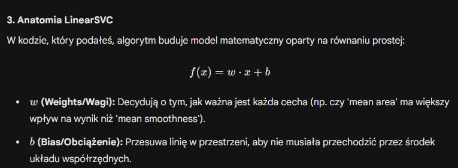
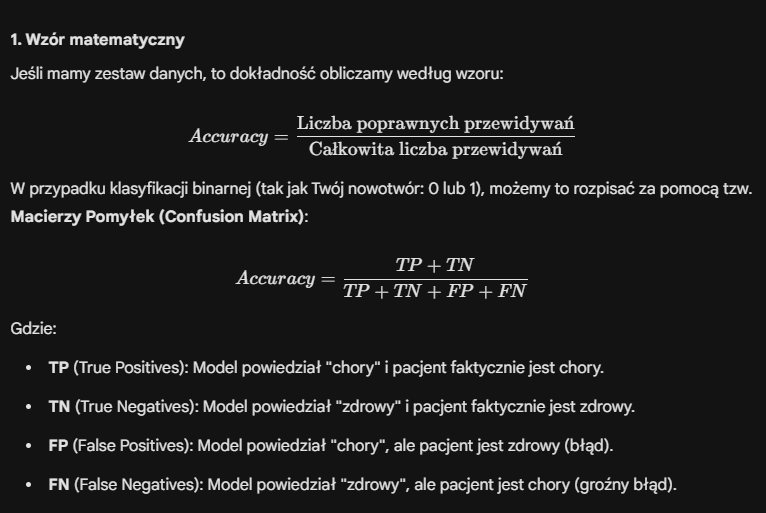
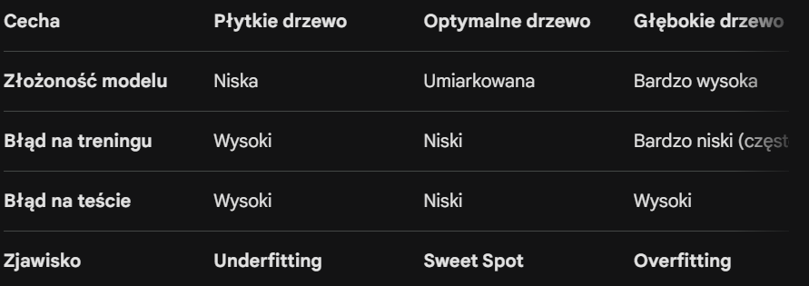

# Ciekawe zagadnienia bazując na labach z ML

## Z lab4

### Po co as_frame = True

Domyślnie Scikit-learn zwraca dane w formacie tablic NumPy. Jeśli ustawisz True, dane zostaną załadowane jako pandas DataFrame.

Dlaczego to ważne? DataFrame jest znacznie czytelniejszy dla człowieka – ma nazwane kolumny i indeksy, co ułatwia analizę (zobaczysz to w następnym kroku).

### Po co robimy .values

Zamieniasz obiekt typu DataFrame (tabelę Pandas) na czystą tablicę NumPy (macierz liczb).

Po co? Większość algorytmów w bibliotece Scikit-learn preferuje surowe tablice liczbowe zamiast rozbudowanych obiektów Pandas. Usuwasz w ten sposób nagłówki i indeksy, zostawiając same dane do obliczeń.

### Czym jest LinearSVC

To klasyfikator, który próbuje narysować prostą linię (lub płaszczyznę) oddzielającą jedną grupę od drugiej.

Słowo "Linear" oznacza, że algorytm zakłada, iż dane da się rozdzielić linią prostą (w 2D), płaszczyzną (w 3D) lub hiperpłaszczyzną (w wielu wymiarach).

Zaleta: Jest bardzo szybki, nawet przy ogromnej liczbie danych.

Wada: Jeśli Twoje dane układają się np. w kształt koła (jedna klasa w środku drugiej), LinearSVC sobie z tym nie poradzi, bo nie potrafi "zginać" linii podziału.

### Różnica między SVC a SVR

O ile w klasyfikacji (SVC) szukaliśmy linii, która trzyma punkty jak najdalej od siebie, o tyle w regresji (SVR) szukamy linii, która trzyma punkty jak najbliżej siebie.

Wyobraź sobie, że Twoim zadaniem jest narysowanie prostej linii przez chmurę punktów.

- W zwykłej regresji liniowej każda odległość punktu od linii jest karana.

- W LinearSVR tworzymy wokół linii "bezpieczny korytarz" (tubę) o szerokości określanej przez parametr $\epsilon$ (epsilon). 

Dopóki punkty znajdują się wewnątrz tej tuby, model uznaje, że błąd wynosi zero. Nie przejmuje się nimi. Model zaczyna "cierpieć" (naliczać karę) dopiero wtedy, gdy punkty wypadają poza tubę.

Model LinearSVR próbuje zbalansować dwie rzeczy:

- Płaskość: Chce, aby linia była jak najmniej "stroma" (małe wagi $w$).

- Błędy: Chce, aby jak najwięcej punktów mieściło się w tubie. Te, które się nie mieszczą, są nazywane wektorami nośnymi (support vectors) i to one "wyginają" linię tak, by do nich pasowała.

### Czym jest loss i jakie ma opcje

Parametr loss określa funkcję straty, czyli matematyczny sposób karania modelu za błędy podczas nauki. W LinearSVC masz dwie główne opcje:

1. loss='hinge' (Strata zawiasowa)
To klasyczne podejście dla SVM.

Jak działa: Model dostaje "karę" tylko wtedy, gdy punkt danych znajdzie się po złej stronie marginesu lub wewnątrz niego. Jeśli punkt jest daleko po właściwej stronie, kara wynosi zero.

Kiedy stosować: Gdy zależy Ci na matematycznym "oryginale" SVM. Wymaga ona jednak użycia parametru dual=True w konfiguracji modelu (to techniczny wymóg biblioteki scikit-learn).

2. loss='squared_hinge' (Kwadratowa strata zawiasowa)
To jest opcja domyślna w LinearSVC.

Jak działa: To po prostu hinge podniesione do kwadratu. Kara za błędy rośnie tutaj kwadratowo, co oznacza, że model bardzo surowo traktuje punkty, które są ewidentnie po złej stronie.

Kiedy stosować: Zazwyczaj daje bardziej stabilne wyniki i szybciej się oblicza. Jest domyślnym wyborem w większości przypadków.

### Po co jest max_iter

max_iter=10000: Algorytm uczy się iteracyjnie (metodą prób i błędów). Czasami domyślna liczba kroków (zwykle 1000) to za mało, by znaleźć idealną linię, więc zwiększamy ją do 10 000, żeby dać mu "więcej czasu na myślenie".

### Czym jest Pipeline

W scikit-learn Pipeline to obiekt, który wiąże kilka kroków przetwarzania danych w jeden wspólny obiekt. Zazwyczaj składa się z:

Transformatorów (dowolna liczba): kroki, które czyszczą lub zmieniają dane (np. StandardScaler, uzupełnianie brakujących wartości, wybór cech).

Estymatora (tylko jeden, na końcu): czyli Twój właściwy model (np. LinearSVC, RandomForest).

Dlaczego stosujemy?

- Zapobieganie "wyciekowi danych" (Data Leakage)
    
    To najważniejszy, techniczny powód.

    - Problem: Jeśli przeskalujesz całe dane (używając średniej z całego zbioru) przed podziałem na testowe i treningowe, Twój model "podejrzy" informacje ze zbioru testowego. To tak, jakby uczeń przed egzaminem zobaczył średnią ocen z arkusza, którego jeszcze nie rozwiązywał – to oszustwo.

    - Rozwiązanie: Pipeline dba o to, by skaler uczył się parametrów (średniej i odchylenia) tylko na danych treningowych, a potem stosował te same parametry do danych testowych.

### Skalowanie - StandardScaler()

Co robi? Standaryzuje dane, czyli przekształca je tak, aby każda cecha miała średnią równą 0 i odchylenie standardowe 1.

Po co to tutaj jest? Pamiętasz, jak wspomniałem, że LinearSVC jest wrażliwy na skalę? mean area (duże liczby) i mean smoothness (małe ułamki) bez skalera "dezorientują" model. Skaler sprawia, że obie cechy są traktowane jako równie ważne.

### Jak liczymy metryke accuracy

### Czym jest mean_squared_error

1. Definicja w jednym zdaniuMSE (Mean Squared Error), czyli błąd średniokwadratowy, to średnia arytmetyczna kwadratów różnic między wartościami przewidzianymi przez model a wartościami rzeczywistymi.

2. Rozbicie na czynniki pierwsze (Proces)Wyobraź sobie, że MSE to trzyetapowy proces "rozliczania" modelu:

- Liczymy błąd (Residuum): Dla każdego punktu sprawdzamy, o ile model się pomylił ($y - \hat{y}$).

- Podnosimy do kwadratu: Każdy błąd potęgujemy. To kluczowy krok, bo eliminuje on znaki minus (błędy się nie znoszą) i sprawia, że duże błędy stają się gigantycznymi karami.

- Wyciągamy średnią: Sumujemy te kwadraty i dzielimy przez liczbę wszystkich obserwacji ($n$), żeby wiedzieć, jak model radzi sobie "przeciętnie".

### Co zwracają podwójne nawiasy `[[...]]`

W bibliotece Pandas nawiasy kwadratowe służą do wybierania danych, ale ich liczba zmienia to, co otrzymasz w wyniku:

- Pojedynczy nawias df['kolumna']: Zwraca obiekt typu Series (to po prostu jedna kolumna, coś jak lista).

- Podwójny nawias df[['kolumna1', 'kolumna2']]: Zwraca obiekt typu DataFrame (czyli mniejszą tabelę).

Modele uczenia maszynowego (jak Twój LinearSVC) zawsze oczekują danych wejściowych $X$ w formacie dwuwymiarowym (tabela z wierszami i kolumnami). Nawet gdybyś wybierał tylko jedną kolumnę, użycie podwójnego nawiasu df[['petal length (cm)']] gwarantuje, że wynik będzie "pionową tabelą", a nie "płaską listą".

### Jak działa reshape

Funkcja reshape przyjmuje argumenty w formacie (liczba_wierszy, liczba_kolumn).

1 (drugi argument): Mówisz programowi: "Chcę mieć dokładnie jedną kolumnę".

-1 (pierwszy argument): To jest "magiczny" znak zastępczy. Mówi on NumPy: "Oblicz resztę za mnie". NumPy patrzy, ile masz wszystkich elementów w danych i tak dobiera liczbę wierszy, żeby wszystko pasowało do tej jednej kolumny.

### Czym jest kernel='poly'

W standardowym modelu liniowym szukamy prostej linii. Jednak wiele danych w świecie rzeczywistym układa się w krzywe.

- Zamiast fizycznie dodawać nowe kolumny do tabeli (jak $x^2, x^3$), Kernel pozwala modelowi obliczyć matematyczne relacje między punktami tak, jakby znajdowały się one w przestrzeni o wielu wymiarach.

- Zaleta: Oszczędzasz pamięć RAM, bo nie tworzysz gigantycznej tabeli z nowymi cechami. Wszystko dzieje się "w locie" podczas obliczeń matematycznych.

### Kernel trick

To jest „supermoc” SVM. Często danych nie da się oddzielić prostą linią na płaskiej kartce (np. gdy kropki smogowe są otoczone kropkami czystymi).

SVM „wypycha” dane do trzeciego (lub wyższego) wymiaru.

To tak, jakbyś rzucił kropki w górę i w locie przeciął je kartką papieru. Z perspektywy 2D wygląda to na skomplikowaną krzywą, ale w wyższym wymiarze to była prosta płaszczyzna.

### Parametry C i Coef0

C: To siła regularyzacji. Małe C oznacza szeroką, wybaczającą błędy "tubę". Duże C zmusza model do bardzo ciasnego trzymania się punktów (ryzyko overfittingu).

    - Małe C (np. 0.1, 1): Model jest „wyluzowany”. Pozwala na to, by niektóre punkty znalazły się po złej stronie granicy, byle tylko zachować jak najszerszy i najprostszy margines.

        - Zaleta: Lepiej radzi sobie z nowymi danymi (dobra generalizacja).

        - Ryzyko: Może zbyt uprościć problem (Underfitting).

    - Duże C (np. 100, 1000): Model staje się „perfekcjonistą”. Chce za wszelką cenę uniknąć błędów w treningu, nawet jeśli oznacza to stworzenie bardzo powyginanej, nienaturalnej granicy.

        - Zaleta: Wysoka celność na danych, które już zna.

        - Ryzyko: Przetrenowanie (Overfitting) – model „nauczy się na pamięć” Twoich outlierów z Krakowa i zawiedzie w przyszłości.

coef0: Kluczowy przy jądrze wielomianowym. Kontroluje, jak bardzo model ma być zdominowany przez wysokie potęgi (stopień 4) w stosunku do niższych. Pomaga kontrolować "wygięcie" krzywej.

Parametr coef0 występuje tylko w jądrach poly i sigmoid. W matematyce oznacza on stałą $r$ we wzorze:

$$K(x, y) = (\gamma \cdot \langle x, y \rangle + r)^d$$

W praktyce kontroluje on, jak bardzo model ma być podatny na wpływ wielomianów wyższego stopnia w porównaniu do tych niższych.

- Jeśli coef0 = 0: Model opiera się głównie na czystym mnożeniu cech. Jest bardzo wrażliwy na skalę danych.

- Jeśli coef0 > 0: Dodajemy stałą wartość do wyniku przed podniesieniem go do potęgi. To sprawia, że model staje się bardziej elastyczny i stabilny.

Pomaga to modelowi „zauważyć” prostsze zależności, nawet jeśli kazałeś mu użyć skomplikowanego wielomianu (np. stopnia 3).

### Dlaczego scoring='neg_mean_squared_error'

Używamy MSE (o którym rozmawialiśmy), ale w wersji negatywnej (neg_).

Po co? Scikit-learn zawsze próbuje zmaksymalizować wynik. Ponieważ w błędach chcemy, aby wynik był jak najniższy, biblioteka zamienia go na minus (np. błąd 5 staje się -5). Im "większa" liczba (bliższa zeru), tym lepszy model.

### Co robi parametr n_jobs

n_jobs=-1: To dopalacz. Mówi komputerowi: "użyj wszystkich dostępnych rdzeni procesora". Dzięki temu testowanie 9 kombinacji pójdzie znacznie szybciej, bo będą liczone równolegle.

### Co robi .best_params_

Przykład: best_C = gs.best_params_['svr__C']:
Obiekt gs (Twój GridSearchCV) po zakończeniu przeszukiwania przechowuje zwycięską kombinację w słowniku best_params_. Tutaj wyciągasz wartość C, która dała najniższy błąd (najmniejszy neg_mean_squared_error).

### Różnica między SVR a PolynomialFeatures

A. PolynomialFeatures + Linear Model (Podejście "Ręczne")

- Tutaj fizycznie tworzysz nowe kolumny w danych przed uruchomieniem modelu.

- Jeśli masz cechę $x$, to PolynomialFeatures stworzy $x^2, x^3$ itd.Problem: Liczba kolumn rośnie drastycznie (eksplozja wymiarowości). 

- Jeśli masz 10 cech i stopień wielomianu 3, nagle masz setki kolumn. To spowalnia komputer i grozi przetrenowaniem.

B. SVR(kernel='poly') (Podejście "Kernel Trick")

- Tutaj nie tworzysz żadnych nowych kolumn. Twoje dane wejściowe pozostają takie same.

- Magia: SVR oblicza „podobieństwo” między punktami tak, jakby były one w wyższym wymiarze, ale robi to za pomocą sprytnego wzoru matematycznego (jądra).

- Zaleta: Jest znacznie szybszy obliczeniowo przy wielu cechach i nie zajmuje dodatkowej pamięci RAM na nowe kolumny.

### Kiedy nie warto stosowac accuracy

Główne wady Accuracy:

1. Problem niezbalansowanych klas (Imbalanced Data):

- Wyobraź sobie, że w Krakowie dni z ekstremalnym smogiem (powyżej 200 µg/m³) jest tylko 5 w roku. Pozostałe 360 dni jest "w normie".Jeśli Twój model będzie zawsze, bezmyślnie mówił: „Nie będzie smogu”, to jego Accuracy wyniesie 98,6% ($360/365$).Model jest matematycznie „genialny”, ale w praktyce bezużyteczny, bo nie wykrył ani jednego alarmu.

2. Brak rozróżnienia na typy błędów:

- Accuracy traktuje każdy błąd tak samo. W przypadku jakości powietrza mamy dwa rodzaje pomyłek:

    - False Positive (Fałszywy alarm): Model mówi „będzie smog”, a jest czysto. Ludzie niepotrzebnie zostają w domu. (Mała szkodliwość).
    - False Negative (Przeoczenie): Model mówi „jest super”, a w rzeczywistości pył dusi miasto. Ludzie wychodzą biegać i niszczą sobie płuca. (Bardzo duża szkodliwość).Accuracy nie powie Ci, który błąd model popełnia częściej.

---

## Z lab5

### Czym jest XAI

XAI, czyli Explainable Artificial Intelligence (Wytłumaczalna Sztuczna Inteligencja), to obecnie jeden z najważniejszych nurtów w świecie uczenia maszynowego. Jej głównym celem jest sprawienie, aby decyzje podejmowane przez algorytmy były zrozumiałe dla człowieka.

Co bardzo ciekawe – Twoje poprzednie pytania dotyczyły drzew decyzyjnych, a one są wręcz książkowym, idealnym przykładem algorytmów XAI!

Aby dobrze zrozumieć, czym jest XAI, musimy najpierw spojrzeć na problem, który ona rozwiązuje.

Problem "Czarnej Skrzynki" (Black Box)
Większość współczesnych, potężnych algorytmów AI (np. głębokie sieci neuronowe, Lasy Losowe) działa jak "czarna skrzynka".

Wrzucasz do nich dane (np. wyniki badań krwi pacjenta).

Wewnątrz dzieje się niesamowicie skomplikowana matematyka (miliony obliczeń, których człowiek nie jest w stanie prześledzić).

Model wypluwa wynik: "Rak złośliwy, prawdopodobieństwo 98%".

Problem polega na tym, że model nie mówi dlaczego. Lekarz nie wie, na jakiej podstawie podjęto decyzję, pacjent jest przerażony, a jeśli model się pomylił, nikt nie wie, gdzie leży błąd.

Jak XAI otwiera tę skrzynkę?
XAI to zbiór narzędzi i technik, które mają przekształcić AI z "magicznej wyroczni" w asystenta, który potrafi wytłumaczyć swój tok rozumowania. Dzieli się to zazwyczaj na dwa podejścia:

1. Modele z natury wytłumaczalne (White-box models)
To algorytmy, które same w sobie są tak proste i logiczne, że człowiek może je łatwo przeczytać.

Przykład: Wspomniane wcześniej Drzewa Decyzyjne (widzisz dokładnie, jaka ścieżka pytań doprowadziła do decyzji) lub Regresja Liniowa (widzisz, jak dużą wagę model przypisał do konkretnej cechy).

2. Metody post-hoc (Tłumaczenie czarnych skrzynek)
Jeśli musimy użyć skomplikowanej sieci neuronowej, bo daje lepsze wyniki, stosujemy do niej dodatkowe narzędzia (np. algorytmy o nazwie SHAP lub LIME). Pozwalają one "zapytać" model już po podjęciu decyzji, co było dla niego najważniejsze.

Przykład: Złożony model odrzuca Twój wniosek o kredyt. Algorytm XAI analizuje tę decyzję i generuje raport: "Wniosek odrzucony. Decydujące czynniki: (1) Zbyt krótka historia zatrudnienia obniżyła szansę o 40%, (2) Brak wkładu własnego obniżył szansę o 30%".

3. Techniki XAI

LIME (Local Interpretable Model-agnostic Explanations)
Nazwa w języku polskim oznacza: Lokalne, interpretowalne i niezależne od modelu wyjaśnienia. To brzmi mądrze, ale idea jest zaskakująco prosta.

Intuicja (Człowiek z opaską na oczach):
Wyobraź sobie, że stoisz na bardzo pofałdowanym terenie w górach (to Twoja skomplikowana czarna skrzynka), masz opaskę na oczach i chcesz wiedzieć, jak ukształtowany jest teren dokładnie tam, gdzie stoisz. Co robisz? Nie musisz badać całych gór! Po prostu robisz kilka małych kroków w lewo, w prawo, w przód i w tył. Jeśli idąc w lewo czujesz, że robisz krok pod górę, a w prawo w dół – już wiesz, że stoisz na zboczu opadającym w prawą stronę. Dokładnie tak działa LIME.

Jak to działa technicznie?

- Wybór pacjenta (Lokalność): Wybieramy jedną, konkretną decyzję do wyjaśnienia (np. wniosek kredytowy Pana Jana).

- Klonowanie i mutacja (Perturbacje): LIME bierze dane Pana Jana i tworzy wokół niego chmurę "sztucznych klonów", nieznacznie zmieniając ich dane (np. jednemu klonowi dodaje 200 zł do wypłaty, innemu odejmuje rok z wieku).

- Wysłanie na pożarcie czarnej skrzynce: LIME przepuszcza wszystkie te sztuczne punkty przez czarną skrzynkę i patrzy, jak zmieniły się werdykty.

- Zbudowanie prostego modelu: Na podstawie tylko tych lokalnych zmian, LIME buduje banalnie prosty model (np. regresję liniową), który uczy się naśladować czarną skrzynkę, ale tylko w najbliższym otoczeniu Pana Jana.

SHAP (SHapley Additive exPlanations)
SHAP to dzisiaj "złoty standard" branży XAI. Jest dużo bardziej rygorystyczny matematycznie niż LIME, a jego korzenie sięgają... Nagrody Nobla z dziedziny Teorii Gier (konkretnie Wartości Shapleya). Wykres kaskadowy (waterfall), który widziałeś w poprzedniej wiadomości, to typowy wynik działania SHAP.

Intuicja (Rozliczanie zespołu z premii):
Wyobraź sobie, że trzech graczy – Anna, Bartek i Celina – wzięło udział w turnieju e-sportowym i wspólnie wygrali 10 000 zł (nagroda to decyzja modelu, np. wysokie ryzyko kredytowe). Chcą podzielić nagrodę sprawiedliwie, adekwatnie do wkładu, ale w e-sporcie role się zazębiają.
Aby ustalić zasługi, musielibyśmy zagrać mecz bez Anny, potem bez Bartka, potem tylko Anny i Celiny itd. Sprawdzając wszystkie te kombinacje, moglibyśmy policzyć, o ile punktów średnio spadał wynik zespołu, gdy kogoś brakowało.

Jak to działa technicznie w AI?
Zamiast graczy, SHAP rozlicza cechy z Twojego zbioru danych (Wiek, Zarobki, Wzrost).

- Gra w chowanego: SHAP bierze model i zaczyna go "odpytywać", losowo ukrywając przed nim pewne cechy pacjenta (np. zmusza model do oceny ryzyka raka wiedząc tylko o wieku, ale nie o paleniu).

- Obliczanie udziałów: Sprawdza każdą możliwą kombinację ukrytych i widocznych cech.

- Przydział winy/zasługi: Oblicza matematycznie, o ile procent przeciętnie obecność np. "Palenia papierosów" podniosła ryzyko, niezależnie od tego, jakie inne cechy były obecne.

### Jak działa Random Forest

Intuicja: Konsylium Lekarskie a "Mądrość Tłumu"
Wyobraź sobie, że masz nietypowy ból brzucha:

Pojedyncze Drzewo Decyzyjne to pójście do jednego, bardzo skrupulatnego lekarza. Ten lekarz ma jednak tendencję do nadinterpretacji. Może spojrzeć na to, że masz pieprzyk na lewym ramieniu i zjadłeś wczoraj jabłko, po czym na tej podstawie zdiagnozować rzadką chorobę tropikalną (stworzył zbyt szczegółową regułę – przeuczył się).

Random Forest to zwołanie konsylium 100 różnych lekarzy. Każdy z nich ma trochę inne doświadczenie i dostaje nieco inną część Twoich wyników badań. Każdy z nich stawia własną diagnozę. Na koniec robisz głosowanie. Jeśli 80 lekarzy mówi "to tylko niestrawność", a 20 mówi "choroba tropikalna", ufasz większości.

Zjawisko to w uczeniu maszynowym nazywamy uczeniem zespołowym (Ensemble Learning). Zespół wielu przeciętnych, ale różnorodnych modeli prawie zawsze pokona jednego "genialnego", ale niestabilnego eksperta.

Jak dokładnie działa Random Forest? (Dwa filary losowości)
Aby Las Losowy działał, jego drzewa muszą się od siebie różnić. Gdybyśmy wytrenowali 100 drzew na tych samych danych, dostalibyśmy 100 identycznych klonów i głosowanie nie miałoby sensu. Las wprowadza losowość na dwa sposoby:

1. Bagging (Bootstrap Aggregating) – Losowanie pacjentów
Algorytm nie daje każdemu drzewu całego zbioru danych. Zamiast tego, dla każdego drzewa losuje podzbiór danych ze zwracaniem.
Oznacza to, że jeśli mamy 1000 pacjentów, pierwsze drzewo dostanie pacjenta nr 1, 5, 5 (wylosowanego dwa razy), 8 itd., a drugie drzewo pacjenta 2, 3, 9... Dzięki temu każde drzewo ma nieco inne "doświadczenie życiowe".

2. Losowanie cech (Feature Randomness) – Zasłanianie wyników badań
Kiedy pojedyncze drzewo buduje węzeł (szuka np. najwyższego spadku Gini), patrzy na wszystkie dostępne cechy (Wiek, Waga, Ciśnienie, Cukier).
W Lesie Losowym jest inaczej! W każdym nowym węźle algorytm losuje np. tylko 3 cechy i pozwala drzewu wybrać najlepszą regułę tylko z tej trójki.
Dlaczego? Załóżmy, że cecha "Wiek" jest bardzo silna. Gdybyśmy jej nie blokowali, każde ze 100 drzew zaczęłoby swój korzeń od pytania o Wiek i wszystkie byłyby do siebie zbyt podobne. Ograniczanie cech zmusza drzewa do odkrywania innych, ukrytych zależności.

Co się dzieje na końcu? (Agregacja)
Gdy przepuścisz nowego pacjenta przez Las Losowy, każde drzewo w lesie wydaje werdykt.

W klasyfikacji (Classification): Odbywa się głosowanie większościowe (tzw. twarde głosowanie) lub wyciągana jest średnia z prawdopodobieństw (miękkie głosowanie). Wygrywa klasa z największym poparciem.

W regresji (Regression): Model po prostu sumuje wyniki wszystkich drzew i dzieli przez ich liczbę, podając Ci średnią arytmetyczną (np. średnią przewidywaną cenę mieszkania).

Podsumowanie (Plusy i Minusy Random Forest)

Zalety:

- Odporność na overfitting: Dzięki głosowaniu i losowości, bardzo trudno jest przeuczyć Random Forest.

- Moc wyjęta z pudełka: Często działa rewelacyjnie na domyślnych hiperparametrach, bez żmudnego strojenia.

- Wbudowana ważność cech (Feature Importance): Las potrafi sam z siebie ocenić, które cechy były używane najczęściej i dawały największy zysk z podziału, zwracając Ci ładny ranking najważniejszych zmiennych.

Wady:

- Utrata interpretowalności (Czarna Skrzynka): O ile pojedyncze drzewo możesz narysować i przeczytać, o tyle odczytanie 500 drzew naraz jest dla człowieka niemożliwe. Właśnie tutaj, aby zrozumieć decyzję Lasu Losowego, musimy użyć technik XAI (takich jak SHAP), o których rozmawialiśmy wcześniej!

- Rozmiar i czas: Trenowanie 500 drzew i przewidywanie za ich pomocą zajmuje więcej pamięci operacyjnej i czasu niż korzystanie z jednego prostego drzewa.

### Czym modele drzwiaste typu Random Forest są podatne na overfitting

1. Kiedy Las Losowy może się przeuczyć?
Pamiętasz analogię z konsylium lekarskim? Nawet 100 świetnych lekarzy postawi złą diagnozę, jeśli wszyscy pozwolą sobie na zbyt głęboką, nielogiczną nadinterpretację wyników (brak limitów) na bardzo zaszumionych, wadliwych danych.

Główne przyczyny overfittingu w Lasach Losowych to:

- Brak ograniczeń dla pojedynczych drzew: Domyślnie biblioteki takie jak scikit-learn pozwalają drzewom w lesie rosnąć bez żadnych limitów (max_depth=None, min_samples_leaf=1). Oznacza to, że każde ze 100 drzew uczy się danych treningowych na pamięć (w 100%). Mimo że proces uśredniania (Bagging) łagodzi ten efekt, to przy bardzo specyficznych, zaszumionych danych, średnia z 100 potężnie przeuczonych drzew wciąż daje lekko przeuczony las.

- Bardzo głośny "szum" w danych: Jeśli Twoje dane zawierają dużo błędów, wartości skrajnych (outlierów) lub losowych anomalii, a Ty nie ograniczysz głębokości drzew, model nauczy się tych anomalii i uzna je za ważne reguły.

- Zbyt duża liczba cech używanych przy podziale: Jeśli hiperparametr max_features jest ustawiony zbyt wysoko (np. algorytm widzi prawie wszystkie cechy przy każdym podziale), drzewa w lesie stają się do siebie zbyt podobne. Tracimy wtedy magię "różnorodności tłumu" i wracamy do problemu pojedynczego drzewa.

2. Wielki Mit: "Więcej drzew = większe przeuczenie"
Wielu początkujących analityków myśli, że jeśli ustawią parametr n_estimators (liczba drzew w lesie) na ogromną wartość, np. 5000, to model się przeuczy. To matematycznie niemożliwe w Lesie Losowym.

Zwiększanie liczby drzew w algorytmie Baggingu (jakim jest Random Forest) nigdy nie zwiększa overfittingu. Posiadanie 5000 drzew zamiast 500 sprawi jedynie, że granica decyzyjna będzie gładsza, a model bardziej stabilny. W pewnym momencie (np. przy 300 drzewach) dokładność przestanie rosnąć i po prostu "osiądzie" na stałym poziomie. Jedynym minusem dodania 5000 drzew jest to, że Twój komputer będzie to liczył godzinami.

3. Jak chronić Las Losowy przed przeuczeniem?
Ponieważ Las składa się z drzew, używamy dokładnie tych samych "hamulców" (hiperparametrów), o których pisaliśmy wcześniej, aby utemperować zapędy algorytmu:

- max_depth (np. 10-15): Nie pozwól drzewom rosnąć w nieskończoność. Niech będą to drzewa "płytkie", które widzą szerszy obraz.

- min_samples_leaf (np. 5-10): Wymuś, aby każdy liść w każdym drzewie opierał swoją decyzję na co najmniej kilku obserwacjach, a nie na pojedynczych przypadkach.

- max_features (np. 'sqrt' lub 'log2'): Zmuszaj drzewa do poszukiwania kreatywnych rozwiązań, dając im przy każdym podziale dostęp tylko do ułamka (np. pierwiastka kwadratowego) wszystkich dostępnych cech. To zwiększa różnorodność lasu.

Podsumowując: Las Losowy to niesamowicie bezpieczny algorytm "wyjęty prosto z pudełka". Wybacza bardzo dużo błędów, na które pojedyncze drzewo byłoby niezwykle wrażliwe. Zawsze warto jednak monitorować wyniki (porównywać F1-score ze zbioru treningowego i testowego), aby sprawdzić, czy model nie próbuje nauczyć się danych na pamięć.

### Parametry i hiperparametry Random Forest

1. Parametry (To, czego model uczy się sam)Parametry to wewnętrzne wartości, które algorytm sam wylicza na podstawie danych treningowych. Nie ustawiasz ich ręcznie. W przypadku Lasu Losowego parametrami są:

- Zestaw wygenerowanych reguł podziału: Konkretne pytania w każdym węźle każdego drzewa (np. "Czy Wiek $\le$ 45.5?", "Czy Zarobki > 5200?").

- Struktura drzew: To, jak drzewa ostatecznie wyglądają (ile mają liści, jak głęboko wyrosły – w ramach narzuconych limitów).

- Wartości w liściach: Ostateczne prognozy przypisane do każdego liścia (np. "Prawdopodobieństwo klasy A wynosi 85%").

- Feature Importances (Ważność cech): Wynikowy ranking, który model tworzy po zakończeniu treningu, określający, które cechy najmocniej przyczyniły się do redukcji błędu.

2. Hiperparametry (Twoje "pokrętła kontrolne")Hiperparametry to ustawienia, które Ty (Data Scientist) konfigurujesz przed uruchomieniem treningu. W Lasach Losowych dzielimy je na dwie grupy: te sterujące rozmiarem całego lasu oraz te sterujące kształtem pojedynczych drzew.

A. Hiperparametry całego Lasu (Zespołowe)

- n_estimators (Liczba drzew):

    - Co robi: Określa, z ilu pojedynczych drzew będzie składał się Twój las.

    - Wpływ: Im więcej, tym lepiej. Większa liczba drzew wygładza granice decyzyjne i stabilizuje wynik. W przeciwieństwie do innych algorytmów, zwiększanie tej liczby nie powoduje przeuczania (overfittingu). Jedynym minusem jest dłuższy czas treningu i większe zużycie pamięci.

    - Praktyka: Zazwyczaj ustawia się wartości od 100 do 500.

- max_features (Maksymalna liczba cech przy podziale):

- Co robi: To najważniejszy hiperparametr Lasu Losowego. Określa, ile losowych cech algorytm może wziąć pod uwagę, gdy szuka najlepszego podziału w pojedynczym węźle.

- Wpływ: Jeśli ustawisz za wysoką wartość (np. wszystkie cechy), drzewa będą do siebie zbyt podobne (najsilniejsza cecha zdominuje wszystkie korzenie). Ograniczenie tej liczby wymusza na drzewach różnorodność i kreatywność.

- Praktyka: W klasyfikacji standardem jest pierwiastek kwadratowy z liczby wszystkich cech (np. mając 100 kolumn danych, każde drzewo widzi tylko 10 losowych przy danym podziale). W regresji często bierze się 1/3 cech.

- bootstrap (Losowanie próbek ze zwracaniem):

    - Co robi: Włącza lub wyłącza technikę "Baggingu" (o której pisaliśmy wcześniej). Jeśli True, każde drzewo dostaje nieco inny zbiór pacjentów/danych (niektórzy się powtarzają, innych brakuje).

    - Praktyka: Prawie zawsze zostawia się True. Ustawienie na False sprawi, że każde drzewo zbuduje się na dokładnie tym samym zbiorze danych, co niszczy sens Lasu Losowego.

- max_samples (Rozmiar próbki Bootstrap):

    - Co robi: Jeśli włączyłeś bootstrap, ten parametr pozwala określić, jak duży podzbiór danych wylosować dla każdego drzewa. Jeśli masz zbiór 100 000 wierszy, możesz nakazać każdemu drzewu uczyć się tylko na 10 000 losowych wierszach.

    - Praktyka: Świetne narzędzie do przyspieszania treningu na gigantycznych zbiorach danych.

B. Hiperparametry pojedynczych drzew (Zabezpieczenia)

To są dokładnie te same parametry, co w zwykłym Drzewie Decyzyjnym. W Lesie Losowym możesz pozwolić im na trochę więcej swobody, ale wciąż warto je kontrolować.

- max_depth (Maksymalna głębokość): Hamulec bezpieczeństwa. Ogranicza, jak bardzo skomplikowane pytania mogą zadawać drzewa.

- min_samples_split: Ile minimalnie obserwacji musi być w węźle, by można było zadać kolejne pytanie (domyślnie 2).

- min_samples_leaf: Ile minimalnie obserwacji musi znaleźć się na samym końcu gałęzi (w liściu), by podział był ważny. Świetne do ignorowania szumu.

### Czym są i jak działają drzewa decyzyjne

Drzewa decyzyjne (ang. Decision Trees) to jeden z najbardziej intuicyjnych i popularnych algorytmów uczenia maszynowego. Możesz o nich myśleć jak o zaawansowanej grze w "Zgadnij kto to?" lub logicznym schemacie blokowym (flowcharcie), który komputer buduje samodzielnie na podstawie danych.

Można je stosować zarówno do klasyfikacji (np. przewidywanie: czy e-mail to spam?), jak i do regresji (np. przewidywanie ceny mieszkania).

Czym są i z czego się składają?
Drzewo decyzyjne składa się z trzech głównych elementów konstrukcyjnych (wizualnie zazwyczaj rysuje się je "do góry nogami" – korzeń jest na samej górze):

- Korzeń (Root Node): Pierwszy, najważniejszy punkt decyzyjny. Obejmuje cały zestaw danych.

- Węzły wewnętrzne (Internal Nodes): Miejsca, w których dane są dzielone na podstawie określonej reguły (np. pytania w stylu "Czy wiek > 30?"). Każdy węzeł wewnętrzny ma co najmniej dwie gałęzie wychodzące.

- Liście (Leaf Nodes): Końcowe punkty drzewa. Nie ma tu już żadnych pytań. Liść zawiera ostateczną decyzję (np. "Klasa: Zdrowy" lub "Przewidywana cena: 450 000 zł").

Jak dokładnie działają?
Algorytm buduje drzewo w sposób "z góry na dół" (top-down), stosując podejście zwane algorytmem zachłannym (greedy algorithm). Działa to krok po kroku:

- Szukanie najlepszego podziału: Algorytm analizuje wszystkie dostępne cechy (np. wiek, zarobki, wzrost) i testuje różne punkty podziału.

- Ocena podziału: Dla każdego możliwego podziału oblicza matematyczną "jakość".

W klasyfikacji używa miar takich jak Wskaźnik Giniego (Gini Impurity) lub Entropia, które mierzą, jak "czyste" są dane po podziale (idealnie chcemy, aby w jednej grupie znaleźli się sami przedstawiciele Klasy A, a w drugiej sami Klasy B).

W regresji używa miar takich jak Błąd Średniokwadratowy (MSE) – szuka podziału, po którym wartości w nowo utworzonych grupach będą do siebie jak najbardziej zbliżone.

- Wybór: Wybiera tę cechę i ten próg, który daje największy zysk informacyjny (najlepiej separuje dane).

- Powtarzanie (Rekurencja): Proces ten jest powtarzany dla każdej nowo utworzonej gałęzi, aż do spełnienia kryterium zatrzymania (np. osiągnięto maksymalną głębokość drzewa lub w węźle zostały próbki tylko jednej klasy).

Najważniejsze cechy drzew decyzyjnych (Zalety i Wady)

Zalety:

- Łatwość interpretacji (Biała Skrzynka): To największa zaleta. Możesz narysować drzewo i dokładnie prześledzić, dlaczego model podjął taką, a nie inną decyzję.

- Brak konieczności standaryzacji: Drzewa nie dbają o skalę danych. Cecha wyrażona w milionach (np. cena) działa tak samo dobrze obok cechy wyrażonej w ułamkach (np. procenty).

- Odporność na wartości odstające (outliery): Ponieważ podziały opierają się na progach (np. "większe niż"), pojedyncza ekstremalnie wysoka wartość nie psuje całego modelu.

- Nieliniowość: Świetnie radzą sobie z danymi, których nie da się oddzielić prostą linią.

Wady: 

- Skłonność do przeuczania (Overfitting): Drzewa mają tendencję do rozrastania się w nieskończoność. Jeśli im na to pozwolić, wyrosną tak głęboko, że stworzą osobną regułę dla każdej pojedynczej próbki w zbiorze treningowym. Przestaną wtedy uogólniać wiedzę. Ratunkiem jest ograniczanie ich głębokości (tzw. przycinanie - pruning).

- Niestabilność: Drzewa są bardzo czułe na dane treningowe. Bardzo mała zmiana w danych (np. usunięcie kilku punktów) może spowodować, że model wybierze zupełnie inną cechę na samym początku (w korzeniu), co zaowocuje zbudowaniem zupełnie innego drzewa.

Dlatego w dzisiejszych czasach rzadko używa się pojedynczych drzew decyzyjnych do zaawansowanych problemów. Zamiast tego łączy się setki drzew w potężne algorytmy takie jak Lasy Losowe (Random Forests) lub XGBoost, które eliminują wadę niestabilności i przeuczania.

### DecisionTreeClassifier i DecisionTreeRegressor - jak działają

1. DecisionTreeClassifier (Klasyfikator)

Cel: Podzielenie danych tak, aby na samym końcu (w liściach) znalazły się próbki należące w 100% do jednej klasy (np. sami zdrowi lub sami chorzy). Szukamy maksymalnej czystości.

Jak model ocenia podział? (Matematyka)
Klasyfikator najczęściej używa miary zwanej Wskaźnikiem zanieczyszczenia Giniego (Gini Impurity) lub Entropii. Domyślnie w scikit-learn jest to Gini.

Wzór na wskaźnik Giniego dla pojedynczego węzła to:

$$Gini = 1 - \sum_{i=1}^{C} p_i^2$$

Gdzie $C$ to liczba klas (np. 2: chory/zdrowy), a $p_i$ to ułamek próbek danej klasy w tym węźle.

- Przykład idealny (czysty): W węźle jest 10 osób chorych i 0 zdrowych. $p_1 = 1$, $p_2 = 0$.$Gini = 1 - (1^2 + 0^2) = 0$. Wartość 0 oznacza idealną czystość – model jest w 100% pewny.

- Przykład najgorszy (całkowity chaos): W węźle jest 5 chorych i 5 zdrowych. $p_1 = 0.5$, $p_2 = 0.5$.$Gini = 1 - (0.5^2 + 0.5^2) = 1 - 0.5 = 0.5$. Model rzuca monetą.

Jak działa podejmowanie decyzji o podziale?
Algorytm bierze po kolei każdą cechę (np. rozmiar guza) i każdy możliwy próg podziału (np. rozmiar $\le$ 2.5). Następnie oblicza ważoną średnią wskaźnika Giniego dla lewej i prawej gałęzi, która by z tego podziału powstała. Algorytm wybiera ten próg, który daje najmniejszą wartość Gini po podziale.

Co przewiduje liść?
Kiedy drzewo przestaje rosnąć, a nowe dane wpadną do konkretnego liścia, model patrzy, jaka klasa ma tam większość. Jeśli w liściu zostało 8 chorych i 2 zdrowych, model krzyknie: "Chory!". Prawdopodobieństwo tej decyzji wynosi 80%.

2. DecisionTreeRegressor (Regresor)

Cel: Podzielenie danych tak, aby na końcu znalazły się próbki o bardzo zbliżonych do siebie wartościach liczbowych (np. domy o podobnej cenie). Szukamy minimalnego błędu.

Jak model ocenia podział? (Matematyka)
Regresor nie może liczyć klas. Zamiast tego domyślnie używa Błędu Średniokwadratowego (MSE – Mean Squared Error).

Wzór na MSE w węźle:

$$MSE = \frac{1}{n} \sum_{i=1}^{n} (y_i - \hat{y})^2$$

Gdzie $n$ to liczba próbek w węźle, $y_i$ to rzeczywista wartość próbki, a $\hat{y}$ to średnia wartość wszystkich próbek w tym węźle.

- Jak to rozumieć? Algorytm sprawdza, jak bardzo liczby w danym węźle różnią się od swojej średniej. Jeśli w węźle mamy domy warte [100k, 105k, 95k], średnia to 100k, a wartości są bardzo blisko niej – błąd MSE jest mały (węzeł jest "dobry"). Jeśli mamy [100k, 500k, 10k], średnia mało nam mówi, a błąd MSE wybije w kosmos.

Jak działa podejmowanie decyzji o podziale?
Podobnie jak w klasyfikacji, algorytm testuje różne cechy i punkty podziału (np. liczba pokoi $\le$ 3). Oblicza średnią z lewej grupy, średnią z prawej grupy i sprawdza, który podział sprawi, że suma błędów MSE z obu stron będzie najmniejsza.

Co przewiduje liść?
Dla nowych danych, które wpadną do danego liścia, drzewo regresyjne po prostu zwraca średnią arytmetyczną ($\hat{y}$) ze wszystkich próbek treningowych, które wcześniej do tego liścia trafiły.

Wspólny mianownik: Zachłanność (Greedy Approach)
Zarówno regresor, jak i klasyfikator to algorytmy "zachłanne". Oznacza to, że szukając najlepszego podziału w danym kroku, wybierają ten, który daje najlepszy rezultat tu i teraz. Model nie planuje 5 kroków w przód (bo wymagałoby to gigantycznej mocy obliczeniowej). Konsekwencją tego jest to, że drzewa rosną tak długo, aż każdy liść będzie idealnie czysty lub błąd zerowy.

Zrozumienie tych matematycznych fundamentów bardzo ułatwia dobieranie odpowiednich parametrów. Czy chciałbyś, abym wyjaśnił, dlaczego drzewa mają przez to ogromną tendencję do "przeuczania się" (overfittingu) i jak temu zapobiegać w praktyce?

### Czym jest Gini Impurity

Wskaźnik zanieczyszczenia Giniego to najważniejsza miara matematyczna używana przez drzewa decyzyjne do oceny podziałów w zadaniach klasyfikacji.

Mówiąc najprościej: Gini mierzy, jak bardzo "wymieszane" są dane w jednym miejscu (węźle).

Intuicja (Worek z kulkami)

Wyobraź sobie, że masz przed sobą worek z piłeczkami w dwóch kolorach: czerwonym (Klasa A) i niebieskim (Klasa B). Jeśli włożysz rękę do worka i wylosujesz jedną piłeczkę, a następnie spróbujesz zgadnąć jej kolor na podstawie tego, jakich piłeczek jest najwięcej w worku, jak często się pomylisz? Właśnie to prawdopodobieństwo błędu mierzy Gini.

- Idealna czystość ($Gini = 0$): W worku są tylko czerwone piłki. Nie ma żadnego zanieczyszczenia innymi kolorami. Model jest w 100% pewien decyzji.

- Całkowity chaos ($Gini = 0.5$): W worku jest dokładnie połowa czerwonych i połowa niebieskich piłek. Zanieczyszczenie jest maksymalne. Dla modelu to jak rzut monetą – nie wie, jaką decyzję podjąć.

(Uwaga: Wartość maksymalna wynosi 0.5 tylko dla dwóch klas. Przy większej liczbie klas ten próg rośnie, ale zawsze dąży do zera, gdy węzeł staje się czystszy).

Jak to policzyć? (Matematyka)

Wzór na Gini Impurity jest bardzo prosty:

$$Gini = 1 - \sum (p_i)^2$$

Gdzie $p_i$ to ułamek (prawdopodobieństwo) występowania konkretnej klasy w danym zbiorze.

Przykład obliczeń:

Mamy węzeł, w którym znalazło się 10 pacjentów: 8 chorych i 2 zdrowych.

- Ułamek chorych ($p_1$) = 8/10 = 0.8

- Ułamek zdrowych ($p_2$) = 2/10 = 0.2

- Podnosimy ułamki do kwadratu: $0.8^2 = 0.64$, oraz $0.2^2 = 0.04$

- Odejmujemy ich sumę od jedynki: $1 - (0.64 + 0.04) = 1 - 0.68 = \mathbf{0.32}$

Wynik $0.32$ mówi nam, że węzeł jest już w miarę czysty, ale wciąż jest miejsce na poprawę (kolejny podział drzewa).

Dlaczego to jest ważne dla algorytmu?

Gdy drzewo decyzyjne szuka reguły (np. "Czy pacjent ma gorączkę?"), oblicza Gini przed podziałem i po podziale. Jeśli nowy podział znacznie zmniejsza ogólne zanieczyszczenie (zbliża je do zera w nowo powstałych gałęziach), drzewo uznaje to za świetny krok i wybiera tę regułę. 

### Jakie są hiperparametry drzew decyzyjnych

Hiperparametry to "pokrętła kontrolne" modelu, które ustawiasz zanim model zacznie się uczyć (w przeciwieństwie do zwykłych parametrów, których model uczy się sam z danych, takich jak konkretne progi podziału np. wiek > 30).

W przypadku drzew decyzyjnych sterowanie hiperparametrami służy głównie jednemu celowi: powstrzymaniu drzewa przed przeuczeniem (overfittingiem). Jak ustaliliśmy wcześniej, puszczone samopas drzewo będzie rosło w nieskończoność, tworząc osobną regułę dla każdego najdrobniejszego szumu w danych.

Oto najważniejsze hiperparametry drzew decyzyjnych (używam nazw z biblioteki scikit-learn, z której korzystałeś w swoim kodzie):

1. max_depth (Maksymalna głębokość)
To najważniejszy i najczęściej używany hamulec. Określa, jak wiele poziomów pytań "Tak/Nie" drzewo może zadać.

- Mała wartość (np. 2-3): Drzewo zada tylko kilka pytań. Model będzie bardzo prosty, ale może nie wyłapać skomplikowanych zależności (ryzyko underfittingu - niedouczenia).

- Duża wartość (np. 20) lub None: Drzewo rośnie, aż liście będą w 100% czyste. Prawie na pewno skończy się to potężnym przeuczeniem (overfitting).

2. min_samples_split (Minimalna liczba próbek do podziału)
Określa, ile co najmniej obserwacji musi znajdować się w węźle, aby algorytm w ogóle spróbował go podzielić.

- Domyślnie wynosi 2. Oznacza to, że nawet jeśli w węźle zostały tylko 2 próbki z różnych klas, algorytm spróbuje zadać kolejne pytanie, by je rozdzielić.

- Zwiększenie tej wartości (np. do 10 lub 20) zmusza drzewo do ignorowania mikroskopijnych, nieistotnych różnic. Zatrzymuje tworzenie bardzo specyficznych reguł.

3. min_samples_leaf (Minimalna liczba próbek w liściu)
Podobne do powyższego, ale działa na samym końcu. Reguła ta mówi: "Możesz wykonać podział tylko wtedy, jeśli w obu nowych gałęziach (liściach) znajdzie się co najmniej X próbek".

- Domyślnie wynosi 1. To pozwala na tworzenie liści z jednym, pojedynczym pacjentem/domem, co jest definicją przeuczenia.

- Ustawienie np. na 5 sprawia, że model "uogólnia" – ostateczna decyzja musi być oparta na doświadczeniu z co najmniej 5 podobnych przypadków, a nie na jednym wyjątkowym.

4. max_features (Maksymalna liczba cech)
Drzewo w każdym węźle sprawdza wszystkie dostępne cechy, szukając najlepszego podziału. Ten parametr pozwala wymusić, aby w danym węźle algorytm sprawdził tylko losową pulę cech (np. tylko 3 losowe z 10 dostępnych).

Po co? Wprowadza to element losowości, co pomaga zapobiegać przeuczeniu i przyspiesza obliczenia. Jest to fundament działania potężniejszego algorytmu – Lasów Losowych (Random Forest).

5. criterion (Kryterium podziału)
Zmienia matematyczny "silnik" oceniający jakość podziału.

- W klasyfikacji: Zazwyczaj do wyboru jest gini (Wskaźnik Giniego - domyślny, często szybszy) lub entropy (Entropia z teorii informacji). W praktyce dają bardzo zbliżone wyniki.

- W regresji: Wybór to najczęściej squared_error (Błąd średniokwadratowy - MSE) lub absolute_error (Średni błąd bezwzględny - MAE). MSE mocniej karze duże odchylenia (outliery).

### Czy drzewa są modelami parametrycznymi

Krótka i treściwa odpowiedź brzmi: Nie, drzewa decyzyjne są modelami nieparametrycznymi.

W uczeniu maszynowym rozróżnienie na modele parametryczne i nieparametryczne nie dotyczy tego, czy model "ma jakieś parametry" (bo prawie każdy ma), ale tego, jak ich liczba i struktura zmieniają się wraz z danymi.

Oto dlaczego drzewa zaliczamy do grupy modeli nieparametrycznych:

1. Brak założeń dotyczących rozkładu danych
Modele parametryczne (np. regresja liniowa czy logistyczna) z góry zakładają postać funkcji, którą próbują dopasować do danych (np. że zależność jest liniowa). Muszą "zmieścić" dane w konkretny, sztywny wzór.

Drzewa decyzyjne nie robią żadnych założeń co do kształtu relacji między cechami a celem. Nie zakładają, że dane mają rozkład normalny czy że granica decyzyjna jest prostą linią.

2. Złożoność zależna od wielkości zbioru danych
W modelach parametrycznych liczba parametrów (wag) jest stała i znana przed rozpoczęciem treningu (np. w regresji liniowej masz dokładnie tyle wag, ile jest cech + wyraz wolny).

W drzewach decyzyjnych:

- Struktura modelu (liczba węzłów, głębokość, podziały) powstaje dopiero w trakcie treningu.

- Im więcej masz danych i im bardziej są one złożone, tym "większe" i bardziej skomplikowane może stać się drzewo (jeśli go nie ograniczysz). Liczba "parametrów" (splitów) rośnie więc wraz z danymi.

3. Elastyczność
Modele nieparametryczne są zazwyczaj znacznie bardziej elastyczne. Drzewa potrafią idealnie dopasować się do danych treningowych (nawet za bardzo, co prowadzi do overfittingu), ponieważ mogą dzielić przestrzeń cech na coraz mniejsze "pudełka", aż uchwycą każdą zależność.

### Czym jest F1 score

F1 Score to jedna z najważniejszych metryk oceny modeli klasyfikacji w uczeniu maszynowym. Jest to średnia harmoniczna precyzji (Precision) oraz czułości (Recall).

Stosuje się ją głównie wtedy, gdy zależy nam na znalezieniu złotego środka między tymi dwiema wartościami, szczególnie w sytuacjach, gdy mamy do czynienia z niezbalansowanymi zbiorami danych (np. wykrywanie rzadkich chorób lub oszustw bankowych).

1. Składniki F1 Score

Aby zrozumieć F1 Score, musisz najpierw znać jego dwa filary:

- Precyzja (Precision): Odpowiada na pytanie: „Z wszystkich przypadków, które model oznaczył jako pozytywne, ile faktycznie nimi było?”. Skupia się na unikaniu błędów typu False Positive (fałszywych alarmów).Czułość 

- (Recall / Sensitivity): Odpowiada na pytanie: „Z wszystkich faktycznie pozytywnych przypadków, ile model zdołał poprawnie wykryć?”. Skupia się na unikaniu błędów typu False Negative (przeoczeń).

2. Wzór matematycznyF1 Score obliczamy za pomocą średniej harmonicznej:$$F1 = 2 \cdot \frac{\text{Precision} \cdot \text{Recall}}{\text{Precision} + \text{Recall}}$$

Dlaczego średnia harmoniczna, a nie zwykła (arytmetyczna)?

Średnia harmoniczna bardzo "karze" niskie wartości. Jeśli jedna z metryk (np. Precision) wynosi 0, F1 Score również wyniesie 0, nawet jeśli Recall wynosi 1. To sprawia, że F1 jest bardzo bezpiecznym wskaźnikiem – wysoki wynik F1 oznacza, że model radzi sobie dobrze na obu polach.

3. Kiedy używać F1 Score zamiast Accuracy (Dokładności)?

Wyobraź sobie test na rzadką chorobę, która występuje u 1 na 1000 osób.Jeśli model zawsze mówi "Jesteś zdrowy", jego Accuracy wyniesie 99,9%. Brzmi świetnie, ale model jest bezużyteczny, bo nie wykrył żadnego chorego.

W takim przypadku jego Recall wyniesie 0, a co za tym idzie – F1 Score również wyniesie 0. F1 Score natychmiast obnaży fakt, że model kompletnie zawodzi w wykrywaniu klasy pozytywnej.

### Zalety i wady drzew decyzyjnych

1. Zalety drzew decyzyjnych

- Wysoka interpretowalność: Model można przedstawić graficznie w formie schematu blokowego. Nawet osoba bez wiedzy technicznej zrozumie, dlaczego model podjął taką, a nie inną decyzję.

- Minimalne przygotowanie danych: * Nie wymagają skalowania ani normalizacji cech (w przeciwieństwie do SVM czy KNN).

- Radzą sobie z brakującymi wartościami (zależy od implementacji).

- Obsługują zarówno dane liczbowe, jak i kategoryczne.

- Naturalna selekcja cech: Podczas budowy drzewa, algorytm sam wybiera najbardziej istotne zmienne, umieszczając je na górze (w korzeniu i pierwszych węzłach).

- Modelowanie nieliniowości: Drzewa świetnie radzą sobie z wykrywaniem skomplikowanych, nieliniowych zależności między cechami bez konieczności ręcznej transformacji danych.

- Odporność na wartości odstające (outliers): Ponieważ drzewa dzielą dane na przedziały, pojedynczy rekord o ekstremalnej wartości ma zazwyczaj ograniczony wpływ na strukturę całego modelu.

2. Wady drzew decyzyjnych

- Tendencja do przeuczenia (Overfitting): To największa bolączka. Bez nałożenia ograniczeń (np. maksymalnej głębokości), drzewo będzie rosło tak długo, aż idealnie zapamięta zbiór treningowy, tracąc zdolność do generalizacji na nowych danych.

- Niestabilność (Wysoka wariancja): Mała zmiana w danych treningowych może skutkować budową zupełnie innego drzewa. Jeden nowy rekord może zmienić główny podział w korzeniu, co zburzy całą dalszą strukturę.

- Problemy z diagonalnymi zależnościami: Drzewa dzielą przestrzeń zawsze prostopadle do osi (poziomo lub pionowo). Jeśli zależność w danych jest ukośna, drzewo musi stworzyć mnóstwo małych "schodków", by ją odwzorować, co jest mało efektywne.

- Brak płynności (w regresji): Drzewa regresyjne nie przewidują wartości w sposób ciągły, lecz "skokowy" (średnia z liścia). Nie potrafią też przewidywać wartości spoza zakresu widzianego w treningu (brak ekstrapolacji).

- Dominacja cech o wielu poziomach: Algorytmy drzewiaste mają tendencję do preferowania cech kategorycznych, które mają bardzo dużo unikalnych wartości (np. ID użytkownika), co może prowadzić do błędnych wniosków.

### Jaki wpływ ma głębokość na drzewa

1. Płytkie drzewo (Mała głębokość)
Gdy drzewo ma tylko 1-3 poziomy głębokości, jest bardzo proste. Takie drzewo nazywamy czasem „pniakiem decyzyjnym” (decision stump), jeśli ma tylko jeden poziom.

Zaleta: Bardzo małe ryzyko przeuczenia (Low Variance). Model jest stabilny i łatwy do zrozumienia.

Wada: Zbyt duże uproszczenie (High Bias). Model może nie zauważyć ważnych zależności w danych, co prowadzi do underfittingu (niedouczenia).

Przykład: Jeśli drzewo o głębokości 1 ma przewidzieć cenę domu tylko na podstawie metrażu, zignoruje lokalizację, rok budowy i standard, dając bardzo niedokładny wynik.

2. Głębokie drzewo (Duża głębokość)
Głębokie drzewo tworzy bardzo specyficzne reguły dla małych grup danych.

Zaleta: Bardzo wysoka precyzja na zbiorze treningowym (Low Bias). Model potrafi wychwycić nawet najbardziej subtelne i nieliniowe korelacje.

Wada: Ekstremalnie wysokie ryzyko overfittingu (przeuczenia / High Variance). Drzewo zaczyna "uczyć się na pamięć" szumu i błędów w danych treningowych zamiast ogólnych trendów.

Wynik: Model ma 100% skuteczności na danych, które już widział, ale kompletnie gubi się na danych testowych.

3. Kluczowy balans: Bias-Variance Tradeoff
Wpływ głębokości najlepiej obrazuje poniższa tabela, pokazująca, jak zmieniają się błędy w zależności od tego, jak głęboko pozwolimy drzewu "rosnąć":

Jak kontrolować głębokość?

W praktyce rzadko zostawia się drzewom "wolną rękę". Stosuje się techniki takie jak:

- Early Stopping: Ustalenie sztywnego max_depth.

- Pruning (Przycinanie): Pozwolenie drzewu urosnąć, a następnie usuwanie gałęzi, które wnoszą bardzo mało do ogólnej trafności modelu.

- Min Samples Split: Określenie, że w węźle musi być co najmniej $N$ obserwacji, aby można było go dalej dzielić.

Złota zasada: Zawsze monitoruj błąd na zbiorze walidacyjnym. Jeśli błąd na treningu spada, a na walidacji zaczyna rosnąć – to znak, że Twoje drzewo jest już za głębokie.

### Różnica między F1 scora a Accuracy

Różnica między Accuracy (Dokładnością) a F1 Score to klasyczny problem "liczb, które kłamią". Choć obie metryki mierzą skuteczność modelu, robią to z zupełnie innej perspektywy.

W skrócie: Accuracy mówi Ci, jak często model ma rację ogółem, a F1 Score mówi Ci, jak dobrze model radzi sobie z konkretnym zadaniem (zazwyczaj tym trudniejszym), nie dając się zwieść statystykom.

1. Accuracy (Dokładność)

To najbardziej intuicyjna miara. Odpowiada na pytanie: „Ile procent wszystkich przewidywań było trafionych?”.

$$Accuracy = \frac{\text{Poprawne przewidywania (TP + TN)}}{\text{Wszystkie przypadki}}$$

- Kiedy działa: Tylko wtedy, gdy klasy w Twoim zbiorze są zbalansowane (np. masz 500 zdjęć psów i 500 zdjęć kotów).

- Kiedy zawodzi: Gdy jedna klasa dominuje nad drugą (tzw. class imbalance).

2. F1 ScoreTo średnia harmoniczna Precyzji (Precision) i Czułości (Recall). Nie bierze pod uwagę wyników negatywnych, które model przewidział poprawnie jako negatywne (TN), skupiając się całkowicie na klasie pozytywnej (tej, na której nam zależy).

$$F1 = 2 \cdot \frac{\text{Precision} \cdot \text{Recall}}{\text{Precision} + \text{Recall}}$$

- Kiedy działa: Zawsze, a zwłaszcza gdy zbiór jest niezbalansowany.

- Kiedy zawodzi: Gdy obie klasy są dla Ciebie tak samo ważne i nie chcesz ignorować trafności w klasie negatywnej (choć to rzadki przypadek).

Bezpośrednie porównanie: Przykład "Test na rzadką chorobę"

Wyobraź sobie, że badasz 1000 osób pod kątem rzadkiej choroby. Wiemy, że 10 osób jest chorych, a 990 osób jest zdrowych.

- Scenariusz: Twój model jest leniwy i zawsze mówi "Jesteś zdrowy"

- Accuracy: Model trafił 990 razy na 1000. Wynik: 99%. Brzmi jak genialny model, prawda? W rzeczywistości jest bezużyteczny, bo nie wykrył nikogo chorego.

- F1 Score: Ponieważ model nie wykrył żadnego chorego, jego Recall wynosi 0. To sprawia, że F1 Score wynosi 0.F1 Score od razu pokazuje, że model „poległ”, podczas gdy Accuracy gratuluje mu sukcesu.

---

## Z lab6

### Czym są enseble methods w ML

### Hard Voting i Soft Voting

### Bagging i Pasting

---