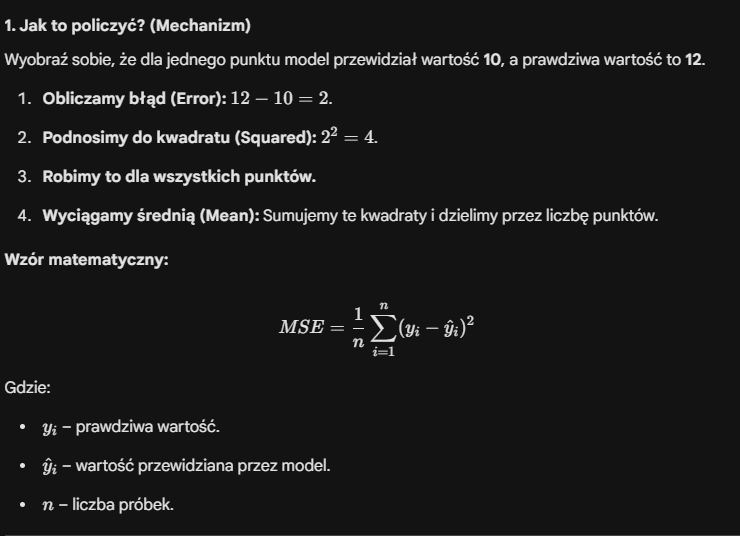

# Ciekawe zagadnienia bazując na labach z ML

### Po co as_frame = True

Domyślnie Scikit-learn zwraca dane w formacie tablic NumPy. Jeśli ustawisz True, dane zostaną załadowane jako pandas DataFrame.

Dlaczego to ważne? DataFrame jest znacznie czytelniejszy dla człowieka – ma nazwane kolumny i indeksy, co ułatwia analizę (zobaczysz to w następnym kroku).

### Po co robimy .values

Zamieniasz obiekt typu DataFrame (tabelę Pandas) na czystą tablicę NumPy (macierz liczb).

Po co? Większość algorytmów w bibliotece Scikit-learn preferuje surowe tablice liczbowe zamiast rozbudowanych obiektów Pandas. Usuwasz w ten sposób nagłówki i indeksy, zostawiając same dane do obliczeń.

### Czym jest LinearSVC

To klasyfikator, który próbuje narysować prostą linię (lub płaszczyznę) oddzielającą jedną grupę od drugiej.

Słowo "Linear" oznacza, że algorytm zakłada, iż dane da się rozdzielić linią prostą (w 2D), płaszczyzną (w 3D) lub hiperpłaszczyzną (w wielu wymiarach).

Zaleta: Jest bardzo szybki, nawet przy ogromnej liczbie danych.

Wada: Jeśli Twoje dane układają się np. w kształt koła (jedna klasa w środku drugiej), LinearSVC sobie z tym nie poradzi, bo nie potrafi "zginać" linii podziału.

### Różnica między SVC a SVR

O ile w klasyfikacji (SVC) szukaliśmy linii, która trzyma punkty jak najdalej od siebie, o tyle w regresji (SVR) szukamy linii, która trzyma punkty jak najbliżej siebie.

Wyobraź sobie, że Twoim zadaniem jest narysowanie prostej linii przez chmurę punktów.

- W zwykłej regresji liniowej każda odległość punktu od linii jest karana.

- W LinearSVR tworzymy wokół linii "bezpieczny korytarz" (tubę) o szerokości określanej przez parametr $\epsilon$ (epsilon). 

Dopóki punkty znajdują się wewnątrz tej tuby, model uznaje, że błąd wynosi zero. Nie przejmuje się nimi. Model zaczyna "cierpieć" (naliczać karę) dopiero wtedy, gdy punkty wypadają poza tubę.

Model LinearSVR próbuje zbalansować dwie rzeczy:

- Płaskość: Chce, aby linia była jak najmniej "stroma" (małe wagi $w$).

- Błędy: Chce, aby jak najwięcej punktów mieściło się w tubie. Te, które się nie mieszczą, są nazywane wektorami nośnymi (support vectors) i to one "wyginają" linię tak, by do nich pasowała.

### Czym jest loss i jakie ma opcje

Parametr loss określa funkcję straty, czyli matematyczny sposób karania modelu za błędy podczas nauki. W LinearSVC masz dwie główne opcje:

1. loss='hinge' (Strata zawiasowa)
To klasyczne podejście dla SVM.

Jak działa: Model dostaje "karę" tylko wtedy, gdy punkt danych znajdzie się po złej stronie marginesu lub wewnątrz niego. Jeśli punkt jest daleko po właściwej stronie, kara wynosi zero.

Kiedy stosować: Gdy zależy Ci na matematycznym "oryginale" SVM. Wymaga ona jednak użycia parametru dual=True w konfiguracji modelu (to techniczny wymóg biblioteki scikit-learn).

2. loss='squared_hinge' (Kwadratowa strata zawiasowa)
To jest opcja domyślna w LinearSVC.

Jak działa: To po prostu hinge podniesione do kwadratu. Kara za błędy rośnie tutaj kwadratowo, co oznacza, że model bardzo surowo traktuje punkty, które są ewidentnie po złej stronie.

Kiedy stosować: Zazwyczaj daje bardziej stabilne wyniki i szybciej się oblicza. Jest domyślnym wyborem w większości przypadków.

### Po co jest max_iter

max_iter=10000: Algorytm uczy się iteracyjnie (metodą prób i błędów). Czasami domyślna liczba kroków (zwykle 1000) to za mało, by znaleźć idealną linię, więc zwiększamy ją do 10 000, żeby dać mu "więcej czasu na myślenie".

### Czym jest Pipeline

W scikit-learn Pipeline to obiekt, który wiąże kilka kroków przetwarzania danych w jeden wspólny obiekt. Zazwyczaj składa się z:

Transformatorów (dowolna liczba): kroki, które czyszczą lub zmieniają dane (np. StandardScaler, uzupełnianie brakujących wartości, wybór cech).

Estymatora (tylko jeden, na końcu): czyli Twój właściwy model (np. LinearSVC, RandomForest).

Dlaczego stosujemy?

- Zapobieganie "wyciekowi danych" (Data Leakage)
    
    To najważniejszy, techniczny powód.

    - Problem: Jeśli przeskalujesz całe dane (używając średniej z całego zbioru) przed podziałem na testowe i treningowe, Twój model "podejrzy" informacje ze zbioru testowego. To tak, jakby uczeń przed egzaminem zobaczył średnią ocen z arkusza, którego jeszcze nie rozwiązywał – to oszustwo.

    - Rozwiązanie: Pipeline dba o to, by skaler uczył się parametrów (średniej i odchylenia) tylko na danych treningowych, a potem stosował te same parametry do danych testowych.

### Skalowanie - StandardScaler()

Co robi? Standaryzuje dane, czyli przekształca je tak, aby każda cecha miała średnią równą 0 i odchylenie standardowe 1.

Po co to tutaj jest? Pamiętasz, jak wspomniałem, że LinearSVC jest wrażliwy na skalę? mean area (duże liczby) i mean smoothness (małe ułamki) bez skalera "dezorientują" model. Skaler sprawia, że obie cechy są traktowane jako równie ważne.

### Jak liczymy metryke accuracy

### Czym jest mean_squared_error

### Co zwracają podwójne nawiasy `[[...]]`

W bibliotece Pandas nawiasy kwadratowe służą do wybierania danych, ale ich liczba zmienia to, co otrzymasz w wyniku:

- Pojedynczy nawias df['kolumna']: Zwraca obiekt typu Series (to po prostu jedna kolumna, coś jak lista).

- Podwójny nawias df[['kolumna1', 'kolumna2']]: Zwraca obiekt typu DataFrame (czyli mniejszą tabelę).

Modele uczenia maszynowego (jak Twój LinearSVC) zawsze oczekują danych wejściowych $X$ w formacie dwuwymiarowym (tabela z wierszami i kolumnami). Nawet gdybyś wybierał tylko jedną kolumnę, użycie podwójnego nawiasu df[['petal length (cm)']] gwarantuje, że wynik będzie "pionową tabelą", a nie "płaską listą".

### Jak działa reshape

Funkcja reshape przyjmuje argumenty w formacie (liczba_wierszy, liczba_kolumn).

1 (drugi argument): Mówisz programowi: "Chcę mieć dokładnie jedną kolumnę".

-1 (pierwszy argument): To jest "magiczny" znak zastępczy. Mówi on NumPy: "Oblicz resztę za mnie". NumPy patrzy, ile masz wszystkich elementów w danych i tak dobiera liczbę wierszy, żeby wszystko pasowało do tej jednej kolumny.

### Czym jest kernel='poly'

W standardowym modelu liniowym szukamy prostej linii. Jednak wiele danych w świecie rzeczywistym układa się w krzywe.

- Zamiast fizycznie dodawać nowe kolumny do tabeli (jak $x^2, x^3$), Kernel pozwala modelowi obliczyć matematyczne relacje między punktami tak, jakby znajdowały się one w przestrzeni o wielu wymiarach.

- Zaleta: Oszczędzasz pamięć RAM, bo nie tworzysz gigantycznej tabeli z nowymi cechami. Wszystko dzieje się "w locie" podczas obliczeń matematycznych.

### Parametry C i Coef0

C: To siła regularyzacji. Małe C oznacza szeroką, wybaczającą błędy "tubę". Duże C zmusza model do bardzo ciasnego trzymania się punktów (ryzyko overfittingu).

coef0: Kluczowy przy jądrze wielomianowym. Kontroluje, jak bardzo model ma być zdominowany przez wysokie potęgi (stopień 4) w stosunku do niższych. Pomaga kontrolować "wygięcie" krzywej.

### Dlaczego scoring='neg_mean_squared_error'

Używamy MSE (o którym rozmawialiśmy), ale w wersji negatywnej (neg_).

Po co? Scikit-learn zawsze próbuje zmaksymalizować wynik. Ponieważ w błędach chcemy, aby wynik był jak najniższy, biblioteka zamienia go na minus (np. błąd 5 staje się -5). Im "większa" liczba (bliższa zeru), tym lepszy model.

### Co robi parametr n_jobs

n_jobs=-1: To dopalacz. Mówi komputerowi: "użyj wszystkich dostępnych rdzeni procesora". Dzięki temu testowanie 9 kombinacji pójdzie znacznie szybciej, bo będą liczone równolegle.

### Co robi .best_params_

Przykład: best_C = gs.best_params_['svr__C']:
Obiekt gs (Twój GridSearchCV) po zakończeniu przeszukiwania przechowuje zwycięską kombinację w słowniku best_params_. Tutaj wyciągasz wartość C, która dała najniższy błąd (najmniejszy neg_mean_squared_error).

