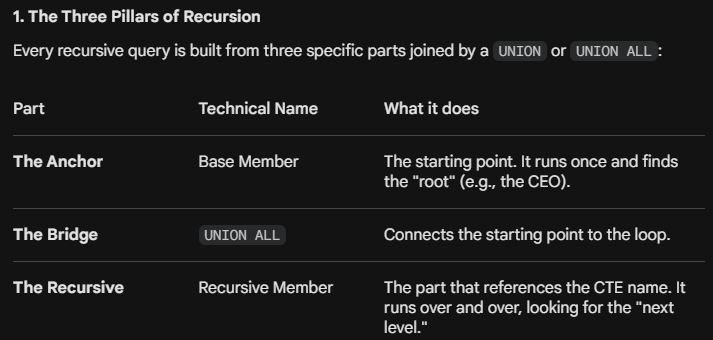

# MySQL Theory

## What is MySQL?

MySQL is a **database management system (DBMS)**, not strictly a database itself.

- **Database** — a structured set of computerized data with an accessible interface
- **SQL** — a query language used to interact with relational databases
- **MySQL** — a DBMS that *implements* the SQL language

---

## Tables

A table in MySQL is the main structure used to store data. Think of it like a spreadsheet:

- **Rows** → individual records (entries)
- **Columns** → attributes (fields of data)

Example:

| id | name | age |
|----|------|-----|
| 1  | John | 25  |
| 2  | Anna | 30  |

---

## Data Types

### Numeric
| Type | Description |
|------|-------------|
| `INT` | Whole numbers |
| `FLOAT`, `DOUBLE` | Decimal numbers |

### Text
| Type | Description |
|------|-------------|
| `VARCHAR(n)` | Variable-length string (max n characters) |
| `TEXT` | Long text |

### Date & Time
| Type | Description |
|------|-------------|
| `DATE` | Date only (YYYY-MM-DD) |
| `DATETIME` | Date and time |
| `TIMESTAMP` | Date and time, auto-updates |

---

## Keys

**Primary key** — uniquely identifies each row in a table:

```sql
id INT PRIMARY KEY
```

**Foreign key** — links a column to the primary key of another table:

```sql
FOREIGN KEY (user_id) REFERENCES users(id)
```

---

## Commands

### Databases

Display all databases:

```sql
SHOW DATABASES;
```

Create a database:

```sql
CREATE DATABASE database_name;
```

Drop a database:

```sql
DROP DATABASE database_name;
```

Select a database to use:

```sql
USE database_name;
```

---

### Tables

Create a table:

```sql
CREATE TABLE users (
    id   INT PRIMARY KEY,
    name VARCHAR(100),
    age  INT
);
```

View table structure:

```sql
SHOW COLUMNS FROM users;
-- or equivalently:
DESCRIBE users;
```

View all rows:

```sql
SELECT * FROM users;
```

Add a column:

```sql
ALTER TABLE users ADD email VARCHAR(100);
```

Drop a column:

```sql
ALTER TABLE users DROP COLUMN age;
```

---

### CRUD Operations

**Insert** — add a new row:

```sql
INSERT INTO users (id, name, age)
VALUES (1, 'John', 25);
```

**Update** — modify existing data:

```sql
UPDATE users
SET age = 26
WHERE id = 1;
```

**Delete** — remove a row:

```sql
DELETE FROM users
WHERE id = 1;
```

---

### INSERT ... ON DUPLICATE KEY UPDATE

The INSERT ... ON DUPLICATE KEY UPDATE statement is a MySQL-specific feature often referred to as an "Upsert" (a combination of Update and Insert).

It allows you to try and insert a new record into a table, but if that record already exists (based on a Primary Key or a Unique Index), the database will perform an UPDATE on the existing record instead of throwing an error.

```sql
INSERT INTO table_name (id, column1, column2)
VALUES (1, 'Data A', 'Data B')
ON DUPLICATE KEY UPDATE
    column1 = 'New Data A',
    column2 = 'New Data B';
```

### Indexes

Create an index to speed up queries on a specific column:

```sql
CREATE INDEX idx_name ON users(name);
```

Indexes improve read performance but add overhead on writes. Use them on columns you frequently filter or sort by.

## MySQL — SELECT & Table Modifications

### SELECT

Get all columns:

```sql
SELECT * FROM cats;
```

Get a specific column:

```sql
SELECT age FROM cats;
```

Get multiple specific columns:

```sql
SELECT name, breed FROM cats;
```

---

### WHERE

Filter rows by a condition:

```sql
SELECT * FROM cats WHERE age = 4;
```

```sql
SELECT * FROM cats WHERE name = 'Egg';
```

---

### Aliases (AS)

Use `AS` to rename a column in your results. It does **not** change the actual column name in the table.

```sql
SELECT cat_id AS id, name FROM cats;
```

---

### DEFAULT

A `DEFAULT` value is automatically used when no value is provided during `INSERT`.

Set a default value:

```sql
ALTER TABLE cats
MODIFY age INT DEFAULT 2;
```

Remove a default value:

```sql
ALTER TABLE cats
ALTER age DROP DEFAULT;
```

---

### AUTO_INCREMENT

`AUTO_INCREMENT` automatically increases the column value by 1 for each new row. Commonly used with primary keys.

```sql
CREATE TABLE cats (
    id   INT AUTO_INCREMENT PRIMARY KEY,
    name VARCHAR(50)
);
```

You don't need to provide a value for `id` during `INSERT` — MySQL handles it automatically.

## String operations

### Concat

Combines (joins) multiple strings into one.
(If any value is null then result is null)

```sql
SELECT CONCAT('Hello', ' ', 'World');
```

### Concat_WS

WS = With Separator

📌 What it does:

Joins strings

Adds a separator between them automatically
(Ignore null values)

```sql
SELECT CONCAT_WS('-', '2026', '03', '18');
```

### Substring

is used to extract part of a string.

```sql
--Syntax
SUBSTRING(string, start, length)

--Example
SELECT SUBSTRING('Hello World', 1, 5);

--Starting from a position only
SELECT SUBSTRING('Hello World', 7);

--Negative positions - result: World
SELECT SUBSTRING('Hello World', -5);
```

### Replace and Reverse

Replaces all occurrences of a substring in a string with another substring.

```sql
--Syntax
REPLACE(original_string, old_substring, new_substring)

--Example
SELECT REPLACE('I love cats', 'cats', 'dogs');
```

Reverses the order of characters in a string.

```sql
--Syntax
REVERSE(string)

--Example
SELECT REVERSE('Hello');
```

### Char_length

is a string function that returns the number of characters in a string.

```sql
SELECT CHAR_LENGTH('Hello World');
```

### Upper and lower

Converts all letters in a string to uppercase/lowercase

```sql
--UPPER()
UPPER(string)

--LOWER()
LOWER(string)
```

### Left, Right

Returns the leftmost/rightmost characters of a string.

```sql
--LEFT()
LEFT(string, number_of_characters)

--RIGHT()
RIGHT(string, number_of_characters)
```

### Trim and Repeat

Removes leading and trailing spaces from a string.

```sql
--Syntax
TRIM([LEADING | TRAILING | BOTH] trim_character FROM string)

--Example
SELECT TRIM('*' FROM '***Hello***');
```

Repeats a string N times.

```sql
SELECT REPEAT('Ha', 3);
```

## Refining selections

### Distinct

Removes duplicate values from the query results.

```sql
SELECT DISTINCT column_name FROM table_name;
```

### Limit

Restricts the number of rows returned.

```sql
SELECT * FROM cats
LIMIT 3;
```

### Order by

Sorts the results of a query by one or more columns.

```sql
SELECT name, age FROM cats
ORDER BY age DESC;
```

### Like

Searches for a pattern in a string.

```sql
SELECT * FROM cats WHERE name LIKE 'M%';
```

### Wildcards

| Wildcard | Meaning                                   |
| -------- | ----------------------------------------- |
| `%`      | any number of characters (including zero) |
| `_`      | exactly one character                     |

### Count

Counts the number of rows or non-NULL values in a column.

```sql
SELECT COUNT(author_lname) FROM books;
```

### Min and Max

- MIN(column) → returns the smallest value in a column

- MAX(column) → returns the largest value in a column

```sql
MIN(column) → returns the smallest value in a column

MAX(column) → returns the largest value in a column
```

### Sum and Avg

Calculates the total sum of numeric values in a column.

```sql
SELECT SUM(stock_quantity) FROM books;
```

Calculates the average value of numeric values in a column.

```sql
SELECT AVG(pages) FROM books;
```

### SUM/AVG OVER, ROWS BETWEEN, moving average, running total

1. Running Total (Cumulative Sum)
A Running Total adds up values progressively as you move down the list. Each row's result is the sum of itself plus every row that came before it.

- Real-world use: Tracking your bank balance as transactions occur.

- SQL Syntax:

```sql
SUM(amount) OVER (ORDER BY date)
```

2. Moving Average
A Moving Average calculates the average of a "sliding window" of a specific size (e.g., the last 3 days). As you move to the next row, the window "slides" down, dropping the oldest value and adding the newest one.

- Real-world use: Smoothing out stock market volatility or daily website traffic to see a trend.

- SQL Syntax (3-day moving average):

```sql
AVG(price) OVER (ORDER BY date ROWS BETWEEN 2 PRECEDING AND CURRENT ROW)
```

3. ROWS BETWEEN (The Frame Clause)
This is the "GPS" for your calculation. It tells the database exactly which rows to include in the math for the current row.

Key Keywords:

- UNBOUNDED PRECEDING: Every row from the very beginning of the partition.

- n PRECEDING: Exactly n rows before the current one.

- CURRENT ROW: The row you are currently on.

- n FOLLOWING: Exactly n rows after the current one.

- UNBOUNDED FOLLOWING: Every row until the very end of the partition.


## What is CTE and why do we use it

Before CTEs, developers used subqueries (queries inside parentheses in the FROM or WHERE clause). While subqueries work, CTEs are generally preferred for three reasons:

- Readability: CTEs allow you to read your logic from top to bottom. Subqueries often feel "inside-out," making them hard to follow.

- Organization: You can break a massive, 200-line query into small, manageable chunks.

- Reusability: You can reference the same CTE multiple times in your main query without writing the logic twice.

```sql
WITH MyTemporaryTable AS (
    -- This is your "inner" query
    SELECT name, salary 
    FROM employees 
    WHERE department = 'Sales'
)
-- This is your "main" query
SELECT * FROM MyTemporaryTable
WHERE salary > 50000;
```

## What are subqueries

A query inside another query.

- Can be in SELECT, FROM, or WHERE clauses.

```sql
SELECT title, pages
FROM books
WHERE pages = (SELECT MAX(pages) FROM books);
```

### With Recursive

WITH RECURSIVE is SQL’s version of "Inception." It allows a query to call itself, creating a loop that is perfect for dealing with data that has layers, like an organizational chart, a folder structure, or a family tree.

Standard CTEs are like a single recipe. A Recursive CTE is like a recipe that says, "Repeat these steps until you run out of ingredients."



```sql
--counting to 5
WITH RECURSIVE counter AS (
    -- ANCHOR: Start at 1
    SELECT 1 AS n
    
    UNION ALL
    
    -- RECURSIVE: Take the previous 'n' and add 1
    SELECT n + 1 
    FROM counter 
    WHERE n < 5 -- TERMINATION: Stop when we reach 5
)
SELECT * FROM counter;
```

## Data Types

| Category   | Type         | Storage  | Range / Size                 | Precision     | Use Case                         | Key Notes               |
| ---------- | ------------ | -------- | ---------------------------- | ------------- | -------------------------------- | ----------------------- |
| 🔤 String  | CHAR(n)      | Fixed    | 0–255 chars                  | Exact         | Fixed-length data (codes, flags) | Pads with spaces        |
| 🔤 String  | VARCHAR(n)   | Variable | 0–65,535 chars               | Exact         | Names, emails, text              | Saves space             |
| 🔢 Integer | TINYINT      | 1 byte   | -128 to 127                  | Exact         | Boolean (0/1), small values      | Very small              |
| 🔢 Integer | INT          | 4 bytes  | ~±2 billion                  | Exact         | IDs, counts                      | Most common             |
| 🔢 Integer | BIGINT       | 8 bytes  | Very large (~±9 quintillion) | Exact         | Large systems, big IDs           | Uses more memory        |
| 💰 Decimal | DECIMAL(p,s) | Variable | Defined by (p,s)             | Exact ✅       | Money, finance                   | No rounding errors      |
| 🔬 Float   | FLOAT        | 4 bytes  | Approximate                  | Approx ❌      | Scientific data                  | Less precise            |
| 🔬 Float   | DOUBLE       | 8 bytes  | Approximate                  | Better approx | Scientific calculations          | More precise than FLOAT |

## All needed about data and time format

| Type        | Format                | Example             | Use Case      |
| ----------- | --------------------- | ------------------- | ------------- |
| `DATE`      | `YYYY-MM-DD`          | 2026-03-18          | Only date     |
| `TIME`      | `HH:MM:SS`            | 14:30:00            | Only time     |
| `DATETIME`  | `YYYY-MM-DD HH:MM:SS` | 2026-03-18 14:30:00 | Date + time   |
| `TIMESTAMP` | Same as DATETIME      | 2026-03-18 14:30:00 | Auto tracking |

### Curdate, curtime

Get current date/time

```sql
SELECT CURDATE();

SELECT CURTIME();
```

### Now

Get both of them

```sql
SELECT NOW();
```

### Timestamp

- Stores date + time

- Can auto-update

```sql
updated_at TIMESTAMP 
DEFAULT CURRENT_TIMESTAMP 
ON UPDATE CURRENT_TIMESTAMP
```

### Extracting Parts of Dates

```sql
SELECT YEAR(NOW());
SELECT MONTH(NOW());
SELECT DAY(NOW());
SELECT HOUR(NOW());
SELECT MINUTE(NOW());
SELECT SECOND(NOW());
```

or more overall way

```sql
EXTRACT(YEAR FROM date_format_variable)
```

### Date Formatting

DATE_FORMAT function:

```sql
SELECT DATE_FORMAT(NOW(), '%W, %M %d %Y');
--output: Wednesday, March 18 2026
```

The DATE_ADD function is a standard SQL tool (primarily used in MySQL and MariaDB) that allows you to add a specific time interval—such as days, months, or hours—to a starting date.It is the go-to function whenever you need to calculate "what will the date be $X$ days from now?"

```sql
DATE_ADD(start_date, INTERVAL value unit)
```

- start_date: The date or datetime you are starting from (e.g., '2026-03-22').

- INTERVAL: A required keyword.

- value: The number of units you want to add (e.g., 7, 30, -5).

- unit: The type of time you are adding (e.g., DAY, MONTH, YEAR).

### Date Math

```sql
--add time
SELECT DATE_ADD(NOW(), INTERVAL 5 DAY);

--substract time
SELECT DATE_SUB(NOW(), INTERVAL 1 YEAR);

--difference between dates
SELECT DATEDIFF('2026-03-18', '2026-03-10');
```

## Comparision and Logical Operations

### Not Like

Finds values that do NOT match a pattern

```sql
SELECT * FROM cats
WHERE name NOT LIKE 'M%';
```

### Between

Checks if value is within a range (inclusive)

```sql
SELECT * FROM books
WHERE pages BETWEEN 200 AND 400;
```

### Cast

Converts one data type to another

```sql
SELECT CAST(price AS CHAR) FROM products;
```

### If and NullIf 

The **IF** function (common in MySQL) is a simple way to perform "if-then-else" logic in a single line.

Syntax:

- IF(condition, value_if_true, value_if_false)

How it works:

- It looks at a condition (e.g., price > 100).

- If that condition is True, it returns the first value.

- If that condition is False, it returns the second value.

**NULLIF** is a specialized function used to compare two values and turn them into NULL if they are identical.

Syntax:

- NULLIF(value1, value2)

How it works:

- If value1 is equal to value2, it returns NULL.

- If they are different, it returns value1.

The "Killer" Use Case: Preventing Division by Zero
This is why almost everyone uses NULLIF. In SQL, dividing by zero causes a crash. If you use NULLIF to turn a zero into a NULL, the result of the division becomes NULL instead of an error.

### Case

Works like IF / ELSE logic

```sql
SELECT 
    title,
    CASE
        WHEN pages < 200 THEN 'Short'
        WHEN pages BETWEEN 200 AND 400 THEN 'Medium'
        ELSE 'Long'
    END AS book_length
FROM books;
```

## Relationships and joins

### One-to-Many Relationship

One record in Table A → can be related to many records in Table B

### Many-to-Many Relationship

- One record in Table A → relates to many records in Table B

- One record in Table B → relates to many records in Table A

### Cross Join

Combines every row from table A with every row from table B

```sql
SELECT * FROM customers
CROSS JOIN orders;
```

### Inner Join

Returns only matching rows

```sql
SELECT * FROM customers
INNER JOIN orders
ON customers.id = orders.customer_id;
```

### Left Join

Returns:

- all rows from left table

- matching rows from right table

- if no match → NULL

```sql
SELECT * FROM customers
LEFT JOIN orders
ON customers.id = orders.customer_id;
```

### Right Join

Returns:

- all rows from right table

- matching rows from left

```sql
SELECT * FROM customers
RIGHT JOIN orders
ON customers.id = orders.customer_id;
```

### On Delete Cascade

Automatically deletes related rows in child table

```sql
CREATE TABLE orders (
    id INT,
    customer_id INT,
    FOREIGN KEY (customer_id)
    REFERENCES customers(id)
    ON DELETE CASCADE
);
```

## Views and modes in MySQL

### View

A VIEW is a virtual table based on a query.

👉 It does NOT store data — it stores a query.

```sql
CREATE VIEW book_summary AS
SELECT title, author_lname, released_year
FROM books;
```

### Create or Replace view

Creates a new view OR updates it if it already exists

```sql
CREATE OR REPLACE VIEW book_summary AS
SELECT title, released_year FROM books;
```

### Altering a View

Changes the query behind the view

```sql
ALTER VIEW book_summary AS
SELECT title, author_lname FROM books;
```

### Dropping a View

Deletes the view (not the actual table)

```sql
DROP VIEW book_summary;
```

### Having

Filters grouped data (after GROUP BY)

```sql
SELECT author_lname, COUNT(*) AS books_written
FROM books
GROUP BY author_lname
HAVING COUNT(*) > 2;
```

### With Rollup

Adds summary totals to grouped results

```sql
SELECT released_year, COUNT(*) 
FROM books
GROUP BY released_year WITH ROLLUP;
```

Result:

| year | count |
| ---- | ----- |
| 2000 | 3     |
| 2001 | 5     |
| NULL | 8     |

## SQL Modes

They control how MySQL behaves

```sql
SELECT @@sql_mode;
```

Common modes:

- 🔒 STRICT_TRANS_TABLES

    - Prevents invalid data inserts

    - Example: inserting text into INT → ❌ error

- ⚠️ NO_ZERO_DATE

    - Disallows invalid dates like 0000-00-00

- 🔤 ONLY_FULL_GROUP_BY

    - Forces correct GROUP BY usage

Set Mode

```sql
SET sql_mode = 'STRICT_TRANS_TABLES';
```

## Window Functions

### Over

The OVER() clause defines a window for functions like SUM(), AVG(), RANK(), etc.

A “window” = the set of rows used for the calculation

```sql
<window_function>() OVER (
    [PARTITION BY column]
    [ORDER BY column]
)
```

### Partition by

Divides rows into groups (like a mini GROUP BY)

Window functions are applied within each partition

```sql
SELECT 
    author_lname,
    title,
    ROW_NUMBER() OVER(PARTITION BY author_lname ORDER BY released_year) AS rn
FROM books;
```

### Order by (inside over)

Defines order within the partition

```sql
RANK() OVER(PARTITION BY author_lname ORDER BY pages DESC)
```

### Rank

- Assigns a rank based on order

- Same value → same rank

- Leaves gaps after duplicates

| pages | rank |
| ----- | ---- |
| 500   | 1    |
| 500   | 1    |
| 450   | 3    |

### Dense_Rank

- Similar to RANK()

- No gaps between ranks

| pages | dense_rank |
| ----- | ---------- |
| 500   | 1          |
| 500   | 1          |
| 450   | 2          |

### Row_Number

Unique number for each row, even if values are the same

| pages | row_number |
| ----- | ---------- |
| 500   | 1          |
| 500   | 2          |
| 450   | 3          |

### Ntile

Divides rows into n buckets, numbers them

```sql
SELECT title, NTILE(4) OVER(ORDER BY pages DESC) AS quartile
FROM books;
```

### First_Value and Last_Value

1. FIRST_VALUE
This function returns the value of a specified column from the first row of the window frame.

Use Case: Identifying the very first product a customer ever bought, or the opening price of a stock for the day.

```sql
SELECT 
    title,
    FIRST_VALUE(title) OVER(PARTITION BY author_lname ORDER BY released_year) AS first_book
FROM books;
```

2. LAST_VALUE
This function returns the value from the last row of the window frame.

WARNING: This is the most "misunderstood" function in SQL because of how window frames work by default.

The "Trap":
By default, when you use ORDER BY, the window frame is set to:
ROWS BETWEEN UNBOUNDED PRECEDING AND CURRENT ROW.

This means for LAST_VALUE, the "last" row is the row you are currently on. Therefore, LAST_VALUE will often just return the current row's value, which feels "broken."

How to fix LAST_VALUE
To make LAST_VALUE actually return the last value of the entire group, you must manually expand the frame to include everything until the end of the partition:

```sql
SELECT 
    sale_date, 
    product_name, 
    price,
    LAST_VALUE(product_name) OVER (
        ORDER BY sale_date 
        ROWS BETWEEN UNBOUNDED PRECEDING AND UNBOUNDED FOLLOWING
    ) as actual_last_purchase
FROM sales;
```

### Lead and Lag

- LEAD() → next row’s value

- LAG() → previous row’s value

```sql
SELECT
    title,
    LAG(title) OVER(PARTITION BY author_lname ORDER BY released_year) AS prev_book,
    LEAD(title) OVER(PARTITION BY author_lname ORDER BY released_year) AS next_book
FROM books;
```

## Triggers

A trigger is a special procedure in MySQL that runs automatically in response to certain events on a table.

- Think of it as “automatic reaction code” for table changes.

- You don’t call it manually; MySQL runs it for you.

```sql
CREATE TRIGGER trigger_name
BEFORE|AFTER INSERT|UPDATE|DELETE
ON table_name
FOR EACH ROW
BEGIN
    -- trigger logic here
END;
```

- NEW → access new data (INSERT, UPDATE)

- OLD → access old data (UPDATE, DELETE)

```sql
CREATE TRIGGER before_book_insert
BEFORE INSERT ON books
FOR EACH ROW
BEGIN
    IF NEW.pages < 0 THEN
        SET NEW.pages = 0;
    END IF;
END;
```

✅ Explanation:

- Ensures no book has negative pages

- Runs before insert

### AFTER INSERT Example

```sql
CREATE TRIGGER after_order_insert
AFTER INSERT ON orders
FOR EACH ROW
BEGIN
    INSERT INTO order_log(order_id, created_at)
    VALUES(NEW.id, NOW());
END;
```

✅ Explanation:

- Every time an order is inserted, log it automatically

### AFTER DELETE Example

```sql
CREATE TRIGGER after_book_delete
AFTER DELETE ON books
FOR EACH ROW
BEGIN
    INSERT INTO deleted_books_log(book_id, deleted_at)
    VALUES(OLD.id, NOW());
END;
```

✅ Explanation:

- Logs every deleted book

### DROPPING a Trigger

```sql
DROP TRIGGER trigger_name;
```

### Full Example

```sql
CREATE TABLE books (
    id INT AUTO_INCREMENT PRIMARY KEY,
    title VARCHAR(100),
    pages INT,
    created_at DATETIME DEFAULT NOW(),
    updated_at DATETIME
);

CREATE TRIGGER before_book_update
BEFORE UPDATE ON books
FOR EACH ROW
BEGIN
    SET NEW.updated_at = NOW();
END;
```

# Theory and Commands from Exercises in LeetCode

### Offset

How many rows skip before printing results

```sql
SELECT * FROM table
LIMIT liczba_wierszy OFFSET liczba_do_pominięcia;
```

### How to check weather pair of columns are unique

```sql
SELECT *
FROM MyTable
WHERE (column1, column2) IN (
    SELECT column1, column2
    FROM MyTable
    GROUP BY column1, column2
    HAVING COUNT(*) = 1
    -- not unique: HAVING COUNT(*) > 1
);
```

### What if I want to count purchase of a buyers

```sql
SELECT 
    customer_id
FROM 
    Orders
GROUP BY 
    customer_id
ORDER BY 
    COUNT(*) DESC;
    --already sorted
```

### Union and Union All

1. UNION (The "Distinct" Version)
UNION combines the result sets and then removes all duplicate rows. It ensures that every row in the final output is unique.

- How it works: It performs a DISTINCT operation across the entire combined set.

- Performance: Slower, because the database has to sort and compare every row to find and delete duplicates.

- Use Case: When you want a clean list of unique items from multiple sources.

This command joins results from few queries into one result table

```sql
SELECT column1 FROM table1
UNION
SELECT column1 FROM table2;
```

2. UNION ALL (The "Raw" Version)
UNION ALL combines the result sets and keeps everything, including duplicates. If a row exists in both Table A and Table B, it will appear twice in the result.

- How it works: It simply appends the second result set to the end of the first one.

- Performance: Faster, because the database does no extra work—it just "pastes" the data together.

- Use Case: When you know there are no duplicates, or when you specifically need to see every single occurrence of a record.

```sql
SELECT column1 FROM table1
UNION ALL
SELECT column1 FROM table2;
```

```sql
(
    select u.name as results
    from Users u
    join MovieRating m on m.user_id = u.user_id
    group by u.user_id
    order by count(u.user_id) desc, u.name asc
    limit 1
)
union all
(
    select m.title as results
    from Movies m
    join MovieRating mo on mo.movie_id = m.movie_id
    where mo.created_at between '2020-02-01' and '2020-02-29'
    group by mo.movie_id
    order by avg(mo.rating) desc, m.title asc
    limit 1
);
```

### Checking some condition after `group by`

```sql
select
    p.product_id,
    p.product_name
from Product p
inner join Sales s on s.product_id = p.product_id
group by p.product_id
having min(s.sale_date) >= '2019-01-01' and max(s.sale_date) <= '2019-03-31
```

### Coalesce and filtering products and dates

```sql
select
    product_id,
    coalesce(
        (
            select new_price
            from Product p2
            where p.product_id = p2.product_id
            and change_date <= '2019-08-16'
            order by change_date desc
            limit 1
        ),
        10
    ) as price
from (select distinct product_id from Products) p;
```

### Important terms connected with window functions

| Core Vocabulary | Term       | Meaning in Plain English |
|-----------------|------------|-------------------------|
| ROW             |            | Tells SQL to count the frame by the physical number of rows (not by values). |
| CURRENT ROW     |            | The specific row the "cursor" is currently pointing at. It is your reference point. |
| PRECEDING       |            | "Before" or "Above." It looks at rows that came earlier in the sorted list. |
| FOLLOWING       |            | "After" or "Below." It looks at rows that come later in the sorted list. |
| UNBOUNDED       |            | "Limitless." Used to say "from the very beginning" or "until the very end." |

### Group_concat

In MySQL, GROUP_CONCAT() is an aggregate function—just like SUM() or COUNT()—but instead of doing math on numbers, it "squashes" text from multiple rows into a single string.

Think of it as a blender for your data: you throw in several rows of individual items, and it pours out one smooth, comma-separated list.

```sql
select
    sell_date,
    count(distinct product) as num_sold,
    group_concat(distinct product order by product asc separator ',') as products
from Activities
group by sell_date
order by sell_date;
```

### How the regexp works

```sql
select * from Users
where mail regexp '^[a-zA-Z][a-zA-Z0-9_.-]*@leetcode[.]com$'
and mail like binary '%@leetcode.com'
```

| Symbol            | Name               | Instruction for the Database |
|------------------|--------------------|------------------------------|
| ^                | Caret              | "Start exactly at the beginning of the string. No spaces allowed before this." |
| [a-zA-Z]         | Character Class    | "The very first character must be a letter (A-Z or a-z)." |
| [a-zA-Z0-9_.-]*  | Quantified Class   | "After the first letter, allow any number (including zero) of letters, digits, underscores, dots, or dashes." |
| @leetcode        | Literal String     | "Exactly after the prefix, the text must match this domain name." |
| [.]              | Escaped Dot        | "This must be a literal period . (not the regex wildcard that means 'any character')." |
| com              | Literal String     | "The domain extension must be exactly 'com'." |
| $                | Dollar Sign        | "End exactly here. Nothing else is allowed to follow." |
| +                | Plus Sign          | "At least one repetition (one or more) of a string." |
| *                | Star Sign          | "Zero or more repetition (may be zero!) of a string." |

### Regexp_like

#### Syntax:

The function typically takes three main arguments (though the third is optional):

- REGEXP_LIKE(source_string, pattern, [match_parameter])

- source_string: The column or text you want to search (e.g., description).

- pattern: The regex rules you defined (e.g., 'SN[0-9]{4}-[0-9]{4}').

- match_parameter: Optional "flags" that change how the search behaves (like making it case-insensitive).

```sql
SELECT product_name 
FROM products 
WHERE REGEXP_LIKE(description, 'SN[0-9]{4}-[0-9]{4}', 'c');
```

#### Explanation

- The engine looks for the literal letters SN.

- The 'c' parameter ensures it is case-sensitive (it won't match sn).

- [0-9]{4} tells the engine: "Stop here and make sure the next four characters are all digits."

- If it finds SN1234-5678, REGEXP_LIKE returns True, and that product appears in your results.

### How self-join works

```sql
select
    e.employee_id,
    e.name,
    count(e1.employee_id) as reports_count,
    round(avg(e1.age)) as average_age
from Employees e
join Employees e1 on e.employee_id = e1.reports_to
group by employee_id, e.name
order by employee_id;
```

### Pivoting table

A Pivot Table is a data summarization tool that lets you reorganize and "rotate" a large, messy dataset into a clean, readable report. Its name comes from the fact that you can pivot (turn) the data to look at it from different angles.At its core, a pivot table converts Long Data (many rows) into Wide Data (summary columns).

A. The Manual Way (CASE WHEN)
This works in every database (MySQL, PostgreSQL, etc.). You manually create columns for each category you want to pivot.

```sql
SELECT 
    category,
    SUM(CASE WHEN month = 1 THEN quantity ELSE 0 END) AS Jan_Sales,
    SUM(CASE WHEN month = 2 THEN quantity ELSE 0 END) AS Feb_Sales,
    SUM(CASE WHEN month = 3 THEN quantity ELSE 0 END) AS Mar_Sales
FROM sales
GROUP BY category;
```

B. The Native PIVOT Clause
Some databases (SQL Server, Oracle) have a built-in PIVOT command to make this cleaner:

```sql
SELECT * FROM (
    SELECT category, month, quantity FROM sales
) AS SourceTable
PIVOT (
    SUM(quantity)
    FOR month IN ([1], [2], [3])
) AS PivotTable;
```

### What if some categories have to be in column no matter what

```sql
select 'Low Salary' as category, count(*) as accounts_count
from Accounts
where income < 20000

union

...
```

### What is ACID

ACID is an acronym for the four traits that every reliable database transaction must have. Think of it as the "Contract of Trust" between you and the database.

- Atomicity ("All or Nothing"): A transaction is a single unit. If you are transferring money, the "Subtract from A" and "Add to B" steps must both happen. If one fails, the whole thing fails.

- Consistency ("Valid State"): A transaction must take the database from one valid state to another, following all rules (like "Balance cannot be negative").

- Isolation ("No Peeking"): Transactions running at the same time shouldn't see each other's "half-finished" work.

- Durability ("Permanent"): Once the database says "Success," the data is safe, even if the server explodes a second later.

### Commit vs Rollback

These are the two ways a transaction can end. Imagine you are writing a letter in pencil:

- COMMIT (The "Ink" Button): This makes your changes permanent. Once you COMMIT, other users can see your changes, and you can no longer "undo" them using database commands.

- ROLLBACK (The "Eraser" Button): This cancels everything you just did in that transaction. It returns the data to exactly how it looked before you typed BEGIN TRANSACTION.

Analogy: COMMIT is like clicking "Place Order" on Amazon. ROLLBACK is like closing the browser tab while your cart is full—nothing actually happens to your bank account.

### Isolation Level

Isolation is the "I" in ACID, but it’s the only one you can usually "turn up" or "turn down." Why? Because perfect isolation is slow. Database engines allow you to trade some "safety" for "speed."

To understand the levels, you first need to know the 3 Problems they prevent:

-Dirty Read: Reading data that hasn't been committed yet (it might be rolled back later!).

- Non-repeatable Read: You read a row twice and get different values because someone else updated it in between.

- Phantom Read: You run a search (e.g., "all users in NY") twice and get different numbers of rows because someone added a new user.