# Wykłady – notatki

## **Wykład 03.03.2026** (Wykłady 01 i 02)

## Sieć komputerowa

**Sieć komputerowa** – zbiór komputerów i innych urządzeń komputerowych połączonych ze sobą kanałami komunikacyjnymi.  
Sieć komputerowa umożliwia wzajemne przekazywanie informacji oraz udostępnianie zasobów (np. plików, drukarek, usług).

---

## Węzeł sieci komputerowej

**Węzeł (node)** – jednostka w sieci komputerowej, która może wysyłać lub odbierać dane.  
Węzły są połączone z innymi węzłami za pomocą mediów komunikacyjnych.

Przykłady węzłów:
- komputer
- serwer
- router
- drukarka sieciowa
- smartfon

---

## Medium transmisyjne, sieć transmisyjna i segment sieci

**Medium transmisyjne** – nośnik umożliwiający przekazywanie informacji w postaci:
- impulsów elektrycznych
- fal elektromagnetycznych
- światła
- fal radiowych

Przykłady:
- kabel miedziany
- światłowód
- sieć bezprzewodowa (Wi-Fi)

**Sieć transmisyjna** – system umożliwiający komunikację wielu urządzeń poprzez medium transmisyjne z wykorzystaniem określonych protokołów komunikacyjnych.

**Segment sieci komputerowej** – fragment sieci komputerowej oddzielony przez urządzenie sieciowe (np. router, przełącznik) lub logicznie wydzielony.

Ruch w sieci można podzielić na:
- **wewnątrzsegmentowy** – odbywający się w obrębie jednego segmentu
- **międzysegmentowy** – odbywający się pomiędzy różnymi segmentami

---

## Internetwork a Internet

| Pojęcie | Znaczenie |
|---|---|
| **Internetwork** | dowolne połączenie wielu sieci |
| **Internet** | największa na świecie internetwork |

**Internetwork** – dowolna sieć złożona z wielu połączonych sieci komputerowych.

**Internet** – globalna publiczna sieć komputerowa łącząca miliony sieci na całym świecie.

---

## Broadcast domain – domena rozgłoszeniowa

**Domena rozgłoszeniowa (broadcast domain)** – fragment sieci, w którym urządzenie może wysłać pakiet rozgłoszeniowy (broadcast), który zostanie odebrany przez wszystkie urządzenia w tej samej domenie.

---

## Domena kolizyjna

**Domena kolizyjna (collision domain)** – fragment sieci, w którym jednoczesna transmisja danych przez dwa urządzenia może spowodować kolizję sygnałów.

W nowoczesnych sieciach domeny kolizyjne są ograniczane przez urządzenia takie jak przełączniki (switch).

---

## Protokoły – definicje

**Protokół komunikacyjny** – zbiór reguł określających zasady nawiązywania komunikacji oraz wymiany danych pomiędzy urządzeniami w sieci komputerowej.

### Protocol suite (zestaw protokołów)

Model opisujący reguły komunikacji w sieci komputerowej wraz z zestawem współpracujących protokołów.

Przykład:
- **:contentReference[oaicite:0]{index=0}**

### Protocol stack (stos protokołów)

Implementacja protocol suite w konkretnej technologii.  
Protokoły w stosie są ułożone warstwowo i współpracują ze sobą, a działanie jednego protokołu często wymaga działania innego.

---

## Pakiety w sieci komputerowej

**Pakiet** – jednostka informacji przesyłana w sieci komputerowej.

Pakiet zawiera:
- **dane (payload)** – właściwą treść przesyłanej informacji
- **informacje sterujące** – potrzebne do przesłania danych

### Elementy pakietu

**Nagłówek (header)**  
Informacje znajdujące się na początku pakietu, np.:
- adres nadawcy
- adres odbiorcy
- typ danych
- numer pakietu

**Trailer**  
Informacje znajdujące się na końcu pakietu, często używane do:
- kontroli błędów
- weryfikacji poprawności transmisji

---

## Datagram

**Datagram** – blok danych przesyłany w sieci komputerowej, który zawiera wszystkie informacje potrzebne do jego dostarczenia.

Nie wymaga wcześniejszego ustanowienia połączenia między nadawcą a odbiorcą.

W niektórych przypadkach datagram jest równoważny pakietowi.

---

## Ramka (frame)

**Ramka** – jednostka danych używana w warstwie łącza danych.  
Jeżeli datagram nie jest umieszczony w innym datagramie, bywa określany jako ramka.

---

## Payload

**Payload** – właściwa część pakietu zawierająca przesyłane dane użytkownika (np. fragment pliku, wiadomość, dane strony internetowej).

Nie obejmuje nagłówków ani informacji sterujących protokołów.

---

## Usługi w sieci komputerowej

**Usługa** – zbiór funkcji udostępnianych użytkownikom lub komponentom systemów informatycznych.

Usługi umożliwiają np.:
- przesyłanie danych
- dostęp do plików
- komunikację między aplikacjami

Usługa między jednostkami jest realizowana poprzez **interfejsy**.

Protokół komunikacyjny stanowi podstawę działania usługi, ale jest **niewidoczny dla użytkownika**, który korzysta jedynie z udostępnionych funkcji.

---

## Czym jest funkcja elementarna?

**Funkcja elementarna** – podstawowa operacja wykonywana przez usługę sieciową.

Przykłady:
- wysłanie danych
- odebranie danych
- nawiązanie połączenia
- zakończenie połączenia

---

## Czym jest jednostka w sieci komputerowej?

**Jednostka (entity)** – element systemu informatycznego uczestniczący w komunikacji sieciowej.

Może to być:
- program
- proces
- moduł systemu operacyjnego
- aplikacja sieciowa

Jednostki komunikują się ze sobą przy użyciu usług i protokołów.

---

## Czym jest interfejs w sieciach komputerowych?

**Interfejs** – zestaw reguł i metod umożliwiających komunikację między różnymi komponentami systemu.

Interfejs określa:
- jakie operacje można wykonać
- w jaki sposób można z nich korzystać

Przykład:
- aplikacja korzysta z interfejsu systemu operacyjnego do wysyłania danych przez sieć.

## Kontrola poprawności datagramów - CRC

- CRC (Cyclic Redundancy Code) w Polsce zwana sumą kontrolną CRC

- Powszechny algorytm liczenia sum kontrolnych dla bloku danych

- Trywialna alternatywa stosowana wcześniej suma bajtów

- CRC jest odporny na zmianę kolejności bajtów, nie wykrywaną przez 
sumę

- Rozmiar sumy kontrolnej zaleŜy od stopnia wielomianu generacyjnego 
(generatora)

- Przeznaczenie wykrywanie błędów pojedynczych przekłamań bitów, 
błędów serii duŜa skuteczność

- Stosuje się takŜe tzw. ramkowanie CRC (CRC framing), umoŜliwiające 
identyfikację początku i końca ramki w ciągu odebranych bajtów (przy 
znanej długości ramki oblicza się CRC rutynowo po odebraniu kaŜdego 
bajtu – aŜ do uzyskania poprawnego wyniku, co świadczy o trafieniu w 
ramkę)

## CRC - popularne wersje

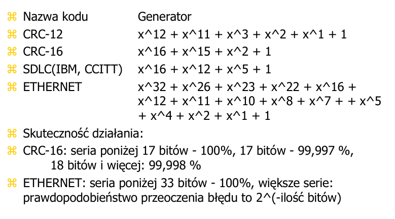

## CRC technika obliczania

- Dane do kodowania przesuwane są przez bufor bitowy o wielkości 
równej stopniowi wielomianu

- Przesuwanie następuje w kierunku najstarszego bitu, po jednym 
bicie na cykl

- Najmłodszy bit uzupełniają następne dane kodowane

- Gdy bufor opuszcza bit o wartości 1 wykonywana jest operacja XOR 
na pozostałych bitach bufora zgodnie z wartością generatora 
cykliczność kodu

- Po wyczerpaniu danych w buforze pozostaje wynik CRC

## Strumień komunikacyjny

- Komunikacja szerokopasmowa polega na przesyłaniu przez jedno 
łącze fizyczne wielu kanałów logicznych, łączonych przez podział 
czasowy lub częstotliwościowy. 

- Komunikacja wąskopasmowa- polega na przesyłaniu przez jedno 
łącze fizyczne tylko jednego sygnału, zajmującego cały kanał. 

- Komunikacja asynchroniczna - forma komunikacji między 
urządzeniami, w której dane cyfrowe są przesyłane w ramkach 
bitowych o skończonej długości i oddzielane specjalnymi znacznikami 
początku ramki (gwarantującymi chwilowe zsynchronizowanie). Nie 
jest przesyłana ciągła informacja synchronizująca odbiornik i nadajnik. 

- Komunikacja synchroniczna - ma charakter ciągu bitów przesyłanych 
między urządzeniami. Ponieważ znaki przybywają w sposób ciągły i 
nie są oddzielone znakami początku i końca, to musi istnieć sposób 
ciągłego synchronizowania zegarów odbiorcy i nadawcy. W tym celu w 
przesyłanym sygnale oprócz ciągu bitów umieszcza się dodatkową 
informację zegarującą lub koduje się tą informację w przesyłanym 
ciągu bitów.

- Komunikacja równoległa (Pararell communication) przekazywanie 
bitów informacji wieloma liniami jednocześnie:

- Transmisja łatwa w implementacji w urządzeniu końcowym 
wymaga jedynie zatrzasku (latch) synchronizowanego zegarem

- Kosztowna w przypadku dużej odległości – wymaga wielu linii

- Najczęściej synchroniczna – koszt dodania kolejnej linii 
zegarującej jest juŜ niewielki

- Parametry: prędkość transmisji (bps), szerokość (bits) 

- Komunikacja szeregowa (Serial communication) – przekazywanie 
bitów informacji kolejno w jednej linii:

- Niskie koszty w przypadku duŜej odległości – jedna linia

- Często asynchroniczna (brak osobnej linii zegarującej)

- Przykładowe parametry: prędkość transmisji (bps), ilość bitów 
na bajt (np. 8), bit stopu, bit kontroli parzystości itp..

## Tryby transmisji

- Simplex – transmisja jest moŜliwa tylko w jedną stronę (analogia: ulica jednokierunkowa)

- Halfduplex – transmisja w obie strony, ale w danym czasie tylko w jedną (analogia: ruch wahadłowy na odcinku drogi)

- Duplex – równoczesna transmisja (analogia: ulica dwukierunkowa)

## Kodowanie przesyłanej wartości logicznej

- Klasyczne (NRZ NonReturn to Zero): stan wysoki: 1; stan niski: 0

- Manchester – w połowie czasu przeznaczonego na przekaz kodowanego 
bitu zmiana ze stanu L > H oznacza 1, zmiana z H > L oznacza 0. Pod 
koniec czasu przeznaczonego na przekaz kodowanego bitu – przejście 
stanu umożliwiające wyrażenie odpowiedniej zmiany w następnym bicie. 
Ponadto (dla uzyskania pełnej samosynchronizacji): zawsze zmiana 
stanu na przeciwległy w połowie czasu przeznaczonego na przekaz 
kodowanego bitu. Konieczne jest użycie dwukrotnie wyŜszej 
częstotliwości zegarowania.

- Wariant Manchester różnicowy (NRZI NRZ Invert ) – zmiana stanu na 
przeciwległy jeżeli wartością kodowanego bitu jest 1, brak zmiany gdy 0. 
Ten wariant czasem występuje w implementacjach > wtedy ryzyko 
rozsynchronizowania serią zer

- Cecha pożądana w systemie kodowania: własność samo-synchronizacji 
systemu kodowania.

## Modulacja sygnału

- Kodowanie dwuróżnicowe (bipolar encoding, a w instalacjach 
telekomunikacyjnych: AMI – Alternate Mark Inversion) – dla 0 stan niski, 
lecz gdy 1 – stan naprzemiennie wysoki dodatni i wysoki ujemny. W 
konsekwencji powstaje tzw. sygnał zbalansowany (balanced signal)
posiadający wypadkowy potencjał elektryczny równy 0.

- Modulacje sygnału, umożliwiające przesłanie bitu informacji:

    - ASK (Amplitude Shift Keying), Modulacja amplitudy – gdy dwie lub 
    więcej amplitudy sygnału są wykorzystywane do reprezentowania 
    wartości przesyłanych bitów

    - FSK (Frequency Shift Keying), Modulacja częstotliwości, w danej chwili 
    czasowej dwie lub więcej częstotliwości sygnału są wykorzystywane do 
    reprezentowania wartości przesyłanych bitów

    - BPSK (Binary Phase Shift Keying), poniewaŜ faza sygnału moŜe się 
    zmienić lub nie, wartość jednego bitu moŜe być reprezentowana zmianą 
    fazy (zmiana fazy oznacza zazwyczaj zmianę wartości następnego bitu)

Typowe użytkowe systemy kodowania na bazie constellation diagrams:

- QAM16 (Quadrature Amplitude Modulation) – 4*4 = 16 możliwości 
(wartości 4 bitów zakodowane w kaŜdej chwili czasowej)

- QAM64 –8*8 = 64 możliwości (16 bitów w kaŜdej chwili czasowej)

## Kodowanie serii bitów

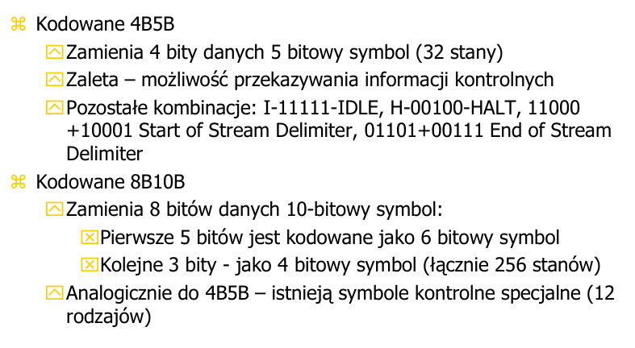

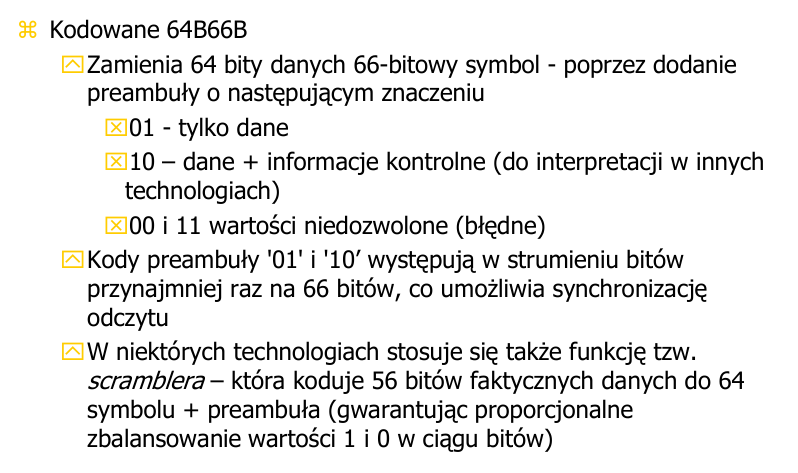

## Szerokość pasma transmisji a przepustowość

- Szerokość pasma (bandwidth) – wyraŜa maksymalną teoretyczną 
przepustowość sieci. Jednostka bps (bits per second).

Zależy od:

- Stosowanych technologii (głównie dotyczących medium)

- Przepustowość (throughput) wyraża aktualne możliwości sieci (lub 
medium) w zakresie pomyślnie zakończonego przesyłania danych. Jest 
mniejsza lub równa teoretycznej (bandwidth). Jednostka: bps. 

Dodatkowo zależy od:

- Użytych technik formatowania i kontroli przekazywanych danych

- Zjawisk występujących w sieci w konsekwencji uŜytych 
technologii (np. w spadek przepustowości w sytuacji duŜego 
obciążenia sieci)

- Goodput przepustowość uŜyteczna na poziomie aplikacji (bez 
uwzględnienia powtórzeń danych czy danych przeterminowanych)

## ISO OSI Reference Model

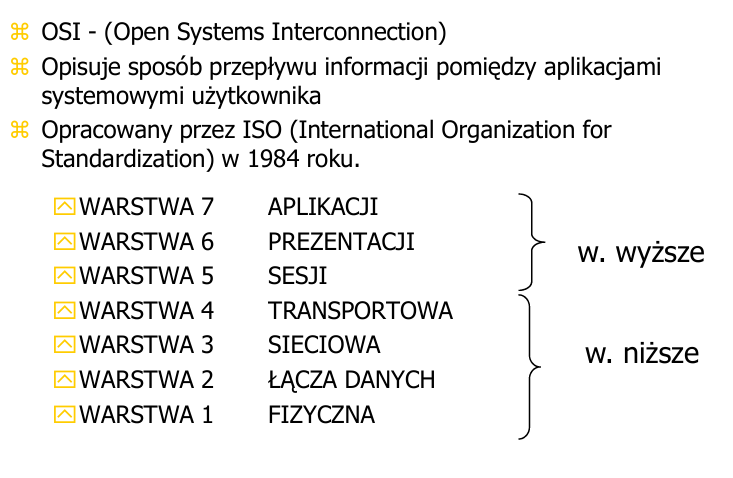

- Numer warstwy: 1

- Definiuje fizyczne właściwości medium (poziomy sygnału, okablowanie, 
właściwości mechaniczne elementów itp.)

- Często, jako składniki konkretnej technologii, określana skrótem „PHY”

- Składa się z czterech obszarów funkcjonalnych:

    - Mechanicznego właściwości mechaniczne urządzeń (stacje 
    nadawczoodbiorcze, okablowanie)

    - Elektrycznego/optycznego/radiowego charakterystyka sygnału 
    przesyłanego w medium,

    - Funkcjonalnego techniki przesyłu informacji w medium

    - Proceduralnego techniki interpretowania przesyłanej informacji

- Numer warstwy: 2

- Określa sposoby kontroli elementów fizycznych łącza sieciowego, 
wykrywania i korekcji błędów, rozstrzygania o kolejności dostępu do 
łącza.

- Dwie podwarstwy

    - LLC (Logical Link Control) – określa reguły poprawności 
    transmisji i zasady współpracy z warstwą sieciową w obsłudze 
    usług połączeniowych i bezpołączeniowych

    - MAC (Media Access Control) – gwarantuje sterowanie dostępem 
    do medium i zapewnia współpracę z warstwą fizyczną

- Numer warstwy: 3

- Określa i utrzymuje drogi komunikacji między róŜnymi sieciami.

- Na poziomie lokalnej sieci Interpretuje adresację datagramów i 
kierujące je do celu w sieci lokalnej lub do sieci sąsiedniej

- Jednostka danych dla tej warstwy oznaczana jest jako NPDU 
(Network Protocol Data Unit)

- Realizuje procesy trasowania datagramów poprzez rutery

- Numer warstwy: 4

- W zaleŜności od stosowanego protokołu realizuje podstawowe 
funkcje kontrolne w sieci: kontrolę błędów, rozpoznaje kolejność 
pakietów, żąda przesłania brakujących pakietów i usuwa duplikaty 
pakietów, dopisuje do pakietu informacje pozwalające odbiorcy na 
wykonanie tych samych czynności kontrolnych. 
Z warstwie transportowej ustala się logiczne połączenie typu 
nadawca/odbiorca. 

- Transportowy protokół połączeniowy w tej warstwie: TCP 

- Transportowy protokół bezpołączeniowy tej warstwie: UDP

- Numer warstwy: 5

- SłuŜy do określania parametrów sesji połączeniowej między 
stronami komunikacji. 

- Obsługuje przypadki utraty połączenia

- Implementowana jest w ramach funkcjonalności systemów 
operacyjnych stron komunikacji

- Zawiera funkcje ochrony prowadzące do określenia czy strony 
komunikacji mają uprawnienia uŜytkowania sieci

- Dostarcza funkcje ochrony prowadzące do określenia czy stacje 
mają uprawnienia do komunikacji przez sieć

- Odpowiada takŜe za synchronizację wiedzy o połączeniu między 
stronami komunikacji

- Numer warstwy: 6

- Niweluje róŜnice w interpretowaniu danych w róŜnych systemach 
operacyjnych stron komunikacji 

- Zajmuje się konwersją pomiędzy róŜnymi standardami kodowania 
znaków i danych binarnych, sposobami reprezentacji liczb, prowadzi 
procesy szyfrowania/odszyfrowania przesyłanych danych, ich 
kompresji i dekompresji.

- Przetwarza przesyłane dane do postaci kanonicznej (Canonical 
Representation) zgodnej ze specyfikacją OSIRM, oraz w 
przeciwnym kierunku na zgodny z wewnętrzną reprezentacją 
systemu docelowego przeciwległej strony komunikacji

- Numer warstwy: 7

- Definiuje aplikacje korzystające z pozostałych warstw

- Usytuowana najbliŜej uŜytkownika

- Opisuje specyfikę interfejsu uŜytkownika wykorzystywanego do 
komunikowania w sieci komputerowej

- Określa specyfikację interfejsów uŜytkownika przeznaczonych do 
przesyłu danych przez sieć komputerową

- Tworzy abstrakcyjne połączenia pomiędzy aplikacjami uŜytkownika

## Zalety modelu warstwowego

- UmoŜliwia niezaleŜny rozwój warstw modelu 

- Zmniejsza złoŜoność projektowanych systemów 
wspomagających transmisję informacji

- Standaryzuje interfejsy

- Przyspiesza rozwój technologii sieciowych

- Ułatwia budowę i eksploatację urządzeń będących 
fizycznymi składnikami sieci komputerowych

## Warstwy OSI a protokoły

- Protokół operujący w danej warstwie protokół definiujący reguły 
wymiany informacji dotyczącej funkcjonowania danej warstwy. W 
konsekwencji: protokół wspierający funkcjonalność dostarczaną w 
danej warstwie.

- Uwaga na niejednoznaczność określenia „protokół warstwy X”: 
datagramy definiowane regułami danego protokołu mogą być 
przenoszone w warstwie innej niŜ ta, w której operuje protokół. 

- Protocol suite moŜe obejmować kilka warstw. Przykładowo: 
„Internet protocol suite” obejmuje warstwy Aplikacji, Transportową, 
Sieci (zwaną tu potocznie: „Internetu”) i Łącza danych. Protocol 
suite moŜne takŜe:
    - pomijać niektóre warstwy oznacza to, Ŝe nie wnosi do nich 
    nowej funkcjonalności

    - łączyć funkcjonalność warstw

- Mogą równieŜ istnieć protokoły operujące w kilku (najczęściej 
sąsiednich) warstwach np. ARP, operujący w jednocześnie 
warstwach 2 (adresacja MAC) i 3 (adresacja IP).

- W niektórych przypadkach moŜna mówić o protokołach podwarstwy 
gdy konieczne jest wprowadzenie dodatkowej funkcjonalności 
koniecznej do dostarczenia do warstwy wyŜszej, lecz nie 
udostępnionej bezpośrednio warstwie niŜszej (tzw. SubLayer 
Protocol). Przykład SNAP (SubNetwork Access Protocol)

- W innym przypadku tworzone są dodatkowe warstwy i w nich 
osadzane są protokoły. Przykład: MPLS (Multi Protocol Label 
Switching) warstwa 2.5

## Czym jest enkapsulacja

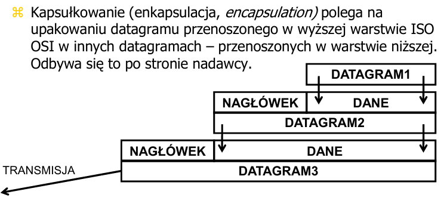

## Frgamentacja

Gdy pakiet danych jest zbyt długi, aby mógł być przesłany przez 
następne przewidziane dla niego łącze – musi być podzielony. Proces 
ten nazywamy fragmentacją. Proces kapsułkowania wspiera 
fragmentację – umoŜliwiając dodanie (kolejnych nagłówkach 
datagramów) informacji pozwalającej na złoŜenie podzielonego pakietu

Do przeprowadzenia procesu fragmentacji bezpośrednio u nadawcy 
konieczne jest poznanie **MTU** (Maximum Transmission Unit) ścieŜki 
wiodącej przez wiele sieci i zaplanowanej do przekazu pakietów (proces 
jest implementowany dla większości sieci wielosegmentowych i nosi 
nazwę path MTU discovery)

MoŜliwe są dwa warianty fragmentacji:

- Transparent fragmentation – gdy pakiety są składane w dowolnym 
miejscu na ścieŜce

- Nontransparent fragmentation – gdy pakiety są składane tylko w 
hoście docelowym

## Topologia sieci komputerowej

- Topologia sieci komputerowej model układu połączeń węzłów sieci 
komputerowej

- Model określa strukturę rozplanowania i połączeń interfejsów 
sieciowych w urządzeniach pośredniczących w transmisji danych 
będących ich odbiorcami/nadawcami

- Dwie kategorie topologii:
    - Topologia logiczna – określa sposoby komunikowania się 
    punktów sieci za pomocą urządzeń topologii fizycznej
    - Topologia fizyczna – określa fizyczną budowę sieci 
    komputerowej, w tym konieczne urządzenia i sposób ich 
    łączenia

Popularne topologie sieci:

- Liniowa (sygnały biegną fizycznie przez kolejne stacje)

- Magistrali (stacje są jedynie podłączone do magistrali 
przekazującej sygnały)

- Gwiazdy (oparta na koncentratorze)

- Gwiazdy rozszerzonej (oparta o wiele koncentratorów)

- Drzewa lub hierarchiczna (oparta o wiele koncentratorów i 
dodatkowo mogąca zawierać magistrale)

- Pierścienia

- Podwójnego pierścienia

- Siatki/Mesh

Topologia logiczna określa głównie techniki rywalizacji o wolne 
medium (zarządzania dostępem do medium), w tym:

- Rozgłaszanie – technika rywalizacji first come, first serve. Punkt 
sieci posiada ciągły dostęp do medium. Nadawana informacja 
jest rozgłaszana do wszystkich punktów sieci podłączonych do 
medium. Przykład – Ethernet

- ִPrzekazywanie żetonu (tokenu) – polega na kontrolowaniu 
dostępu do sieci poprzez przekazywanie unikatowej sygnatury, 
której posiadanie oznacza posiadanie wyłącznego zezwolenia na 
nadawanie. Przykład – FDDI, Token Ring

### Topologia liniowa

- Odcinki medium łączone przez węzły sieci

- Węzeł sieci (jego sterownik) decyduje czy przesłać informacje dalej 
(do kolejnego węzła)

- Spore opóźnienia w propagacji sygnału

- Połączenie punktpunkt (najczęściej duplex) pomiędzy węzłami

- Brak rywalizacji o dostęp do medium 

 -Uszkodzenie odcinka medium powoduje podzielenie węzła sieci na 
dwa mniejsze – kaŜdy o topologii liniowej

- Możliwość ustanowienia logicznej kolejności węzłów sieci 
i wprowadzenia topologii logicznej tzw. daisy chain

### Topologia magistrali

- Wszystkie stacje są w identyczny sposób podłączone do medium 
transmisyjnego i są równoprawne

- Kady słyszy wszystko (kaŜdego)

- Zjawiska w medium fizycznym (gdy nośnikiem informacji jest impuls 
elektryczny) mają charakter falowy

- Awaria jednego ze złącz dzieli sieć na dwie niezaleŜne podsieci lub 
powoduje awarię sieci

- Współdzielenie medium wymaga jednoczesnego nadawania 
i nasłuchu sygnału w medium wykrywanie kolizji

- Skomplikowane algorytmy komunikacji implementowane 
w sterownikach

- Technologia nakłada ograniczenia na maksymalną rozpiętość 
jednego segmentu medium

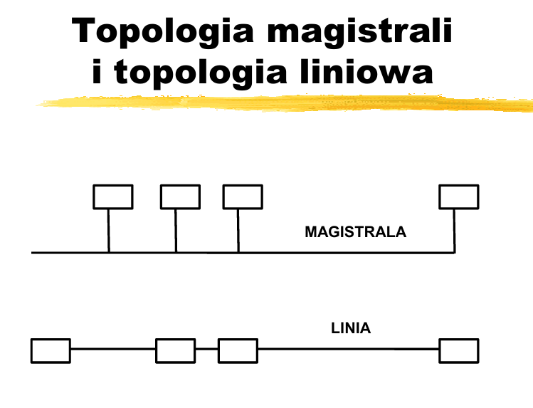

### Topologia gwiazdy

- Jeden punkt centralny, w którym mieści się większość sprzętu i 
oprogramowania

- Uproszczone centralne zarządzanie

- KaŜda stacja posiada dokładnie zdefiniowany i jedyny styk 
z centrum

- Awaria pojedynczej stacji nie wpływa na pracę pozostałych stacji

- Awaria centrum powoduje wyłączenie całej sieci

- Brak możliwości podziału sieci na kawałki o różnym stopniu 
zaawansowania technologicznego

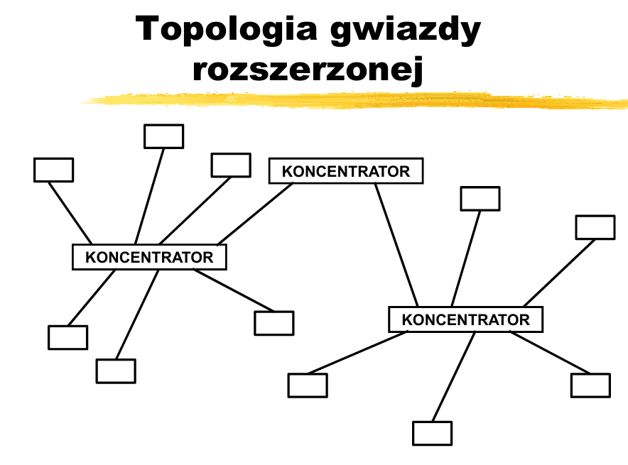

### Topologia hierarchiczna - topologia drzewa

- Zawiera wiele punktów centralnych (koncentratorów). Dodatkowo 
może zawierać węzły o topologii magistrali połaczone z 
koncentratorami

- Możliwość realizacji sieci bez ograniczeń technologicznych, 
geometrycznych

- Możliwość realizacji każdego poziomu hierarchii w innej technologii
Względnie niższa cena

- Możliwość stosowania urządzeń o względnie niższej liczbie portów
Rozproszone zarządzanie

- Różnorodność sprzętu powoduje konieczność utrzymywania dużego 
zapasu części

### Topolgia pierścienia 

- Odcinki medium komponowane w zamknięty pierścień i łączone 
przez węzły sieci

- Możliwość ustanowienia logicznej kolejności węzłów sieci 
i wprowadzenia topologii logicznej tzw. daisy chain

- Potencjalna moŜliwość dojścia do kadej stacji z dwóch kierunków

- Równoprawność stacji

- Możliwość realizacji połączeń wieloprzewodowych

- Implementacje topologii logicznej pierścienia często są oparte o 
koncentrator 

- Przekazywanie tokenu w topologii logicznej

- Skomplikowany mechanizm obsługi tokenu

- Średnio skomplikowany sprzęt

### Topologia podwójnego pierścienia

- Istnienie dwóch niezaleŜnych dróg transmisji

- Dwa warianty:

    - Pracują oba pierścienie, lecz w przeciwnych kierunkach

    - Pracuje tylko jeden pierścień – drugi stanowi gotową rezerwę

- Realizacja dynamicznej rekonfiguracji

- Sieć odporna na uszkodzenia medium i węzła:

    - Awaria medium – aktywacja pierścienia rezerwowego lub 
    redukcja topologii tylko do jednego pierścienia „wraping” 
    pierścienia w punkcie sieci, obok którego wystąpiła awaria

    - Awaria węzła realizacja bypass’u poprzez uŜycie dodatkowego 
    urządzenia monitorującego sprawność punktu sieci i 
    odcinającego go fizycznie od pierścienia w przypadku 
    stwierdzenia jego awarii

## Szczególne przypadki topologii fizycznych

- Point-to-point– istnieją dokładnie dwa węzły w sieci. Połączenie 
moŜe istnieć trwale (dedicated lub permanent point topoint) lub 
być zestawiane chwilowo (switched)

- Point-to-multipoint – hybryda wielu łącz point topoint z 
wykorzystaniem jednego węzła wspólnego. Komunikacja jest 
moŜliwa tylko za pośrednictwem tego węzła. Określa się go wtedy 
mianem hub-and-spoke lub hub-on-spoke

- Fully connected network lub Fully connected mesh topology -
topologia zakładająca istnienie bezpośredniego łącza pomiędzy 
każdymi dwoma węzłami sieci (point-to-point). Umożliwia łatwe 
wprowadzenie funkcjonalności broadcast

- Partially connected mesh topology – połączenia pomiędzy węzłami 
mogą istnieć dowolnie

## Tryby dostępu do medium transmisji

- Tryb deterministyczny - ustalony czas oczekiwania na dostęp i czas 
użytkowania do medium 

- Tryb rywalizacyjny - brak ustalonych odgórnie czasów przewaŜnie 
medium przydziela arbiter, np. poprzez przepytywanie (polling) 
stacji przed przydzieleniem im łącza do transmisji. Inna metoda 
przesyłanie żetonu zezwalającego jego posiadaczowi na transmisję.

## Typy sieci według rodzaju komutacji

- Sieci z komutacją łączy (circuit switching) informacja o 
przeznaczeniu danych znajduje się wyłącznie w jednostkach 
rozlokowanych na trasie ich przypływu
    - POTS (Plan Old Telephone Service)

- Sieci z komutacją pakietów (packet switching) informacja o 
przeznaczeniu danych znajduje się wyłącznie w jednostkach 
przekazywanych (pakietach)
    - IP

- Sieci z komutacją komórek/celek (cell switching) informacja o 
przeznaczeniu danych jest podzielona pomiędzy jednostki 
rozlokowanych na trasie jej przypływu oraz jednostki przekazywane 
(celki)
    - ATM (Asynchronous Transfer Mode)

## Rodzaje sieci według ich rozległości

### LAN Local Area Network 

- Umożliwiają wymianę zbiorów informacji, 
wspólne uŜytkowanie zasobów oraz
komunikatów między uŜytkownikami
znajdującymi się na niewielkim obszarze
geograficznym.

- Cechą LAN jest nie zbalansowany ruch,
zapotrzebowanie jest chwilowe, ale duŜej 
przepustowości.

### MAN Metropolitan Area Network 

- Umożliwiają wymianę zbiorów informacji, 
wspólne uŜytkowanie zasobów oraz
komunikatów między uŜytkownikami
znajdującymi się na obszarze geograficznym
o średnicy do około 50 km.

- Z reguły oparta na pętli światłowodowej i ATM lub Metro 
Ethernet

- Szybkość transmisji: kilka Mb/s setki Gb/s

### WAN Wide Area Network

- Sieci rozległe o zasięgu globalnym łączą ze sobą 
oddzielne sieci innych kategorii

- Używają róŜnorodnych rodzajów mediów 
transportowych: zwykłych sieci telefonicznych, łącz 
satelitarnych, magistral światłowodowych, miejscami 
mediów opracowanych dla innych kategorii sieci.

### PAN i SAN

- PAN (Personal Area Network) — osobiste sieci prywatne, 
są tworzonymi doraźnie sieciami o małym zasięgu, które 
pracują niezaleŜnie od sieci stacjonarnej lub 
bezprzewodowej. 

- SAN (Storage Area Network) – sieci przeznaczone do 
obsługi składowania danych dla serwerów na 
urządzeniach zewnętrznych w datacenter. Zasięg 
lokalny, choć istnieje moŜliwość jej tunelowania.

## Klasyfikacja urządzeń a rozległość sieci

Klasyfikacja definiująca „segmenty” rynku urządzeń zaleŜne od 
stopnia rozległości otaczającej sieci:

- SOHO –urządzenia o przeznaczeniu dla domu i małych biur 
(najczęściej w obudowach nie standaryzowanych lub rack 10’’)

- EDGE – urządzenia koncentrujące rozwiązania ruch z SOHO 
(przeznaczone do szaf krosowniczych rack 19’’)

- CORE – wysokowydajne urządzenia szkieletu sieci

Inne określenia dla urządzeń powiązane z rozległością sieci:

- PROVIDER lub „P”– urządzenia przeznaczone dla dostawców usług

- PROVIDER EDGE lub „PE” urządzenia przeznaczone do kontaktowania 
sieci dostawcy z klientem

- BRANCH OFFICE – urządzenie przeznaczone do przekazywania ruchu z 
niewielkiego oddziału organizacji

- CENTRAL OFFICE – urządzenie przeznaczone do przekazywania ruchu z 
niewielkiego oddziału organizacji

---

## Realizacja LAN przy uŜyciu Ethernet i medium TP

- Ethernet = różne media fizyczne od archaicznych kabli 
koncentrycznych, przez skrętkę po światłowody

- Skrętka (TP Twisted Pair) para miedziana, linie fizycznie 
skręcane w kablu, róŜne wyposaŜenia kabli (izolacje), róŜne 
kategorie (wpływają na max. częstotliwość transmisji) i pośrednio na 
dopuszczony wariant Ethernet 10/100/1000/10G/40G/100G BASET(X)

- Stosowany wtyk: 8P8C 8 Position 8 Contact (równieŜ, choć formalnie 
błędnie nazywanym RJ45), różne wyposażenia wtyku

- Problem asymetrii linii w łączu, nomenklatura:
    - DTE Data Terminal Equipment czyli urządzenia końcowe, np. stacje 
    PC, rutery

    - DCE Data Communications Equipment czyli urządzenia 
    pośredniczące w komunikacji, np. przełączniki, hub’y 

- Gdy łączymy DTE z DCE stosujemy kabel „bez przeplotu” (bez zamiany 
linii), w innym przypadku z przeplotem (1,2 <> 3,6)

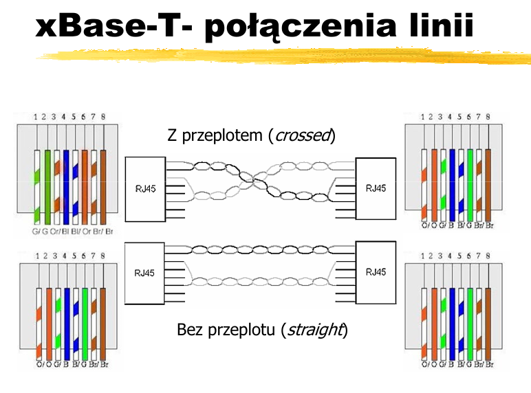

## Ethernet - realizacja w topologii

Urządzenia DCE: koncentratory

- Switch (przełącznik)

- Hub

Urządzenia DTE:

- Stacje (hosty)

- Interfejsy ruterów

MoŜliwe jest uproszczenie topologii do połączenia punktpunkt bez 
koncentratora (DTEDTE, kabel z przeplotem)

Limit długości medium: 100m

MoŜliwość stosowania wielu koncentratorów w przypadku 
przełączników wprowadza się wtedy topologię drzewa

MoŜliwość realizacji kaŜdego segmentu sieci w innej technologii 
fizycznej. Konwersja medium: poprzez stosowanie róŜnych typów 
portów w przełącznikach lub poprzez uŜycie konwerterów medium

## Mechanizmy automatycznej negocjacji param. łącza

- Negocjowanie trybu pracy łącza ma na celu ustalenie lepszych 
wspólnie wspieranych parametrów pracy urządzeń 

- Sygnalizacja FLP (Fast Link Pulse) – umoŜliwia automatyczne 
ustalenie prędkości oraz trybu transmisji

- Funkcjonalność Auto MDIX (Medium Dependent Interface 
CrossOver) – automatyczny wybór MDI lub MDIX zaleŜnie od 
rodzaju wykrytego kabla łączącego interfejsy

---
---
---

## Budowa ramki IEEE 802.3 oraz Ethernet II 

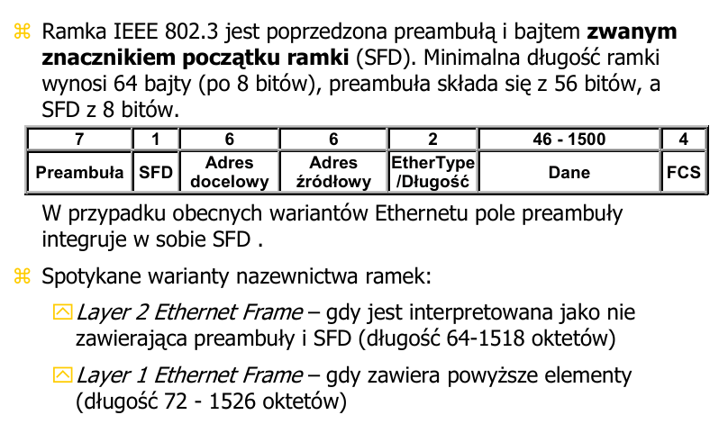

- Preambuła – naprzemienny ciąg bitów 1 i 0, informujący o 
nadchodzącej ramce. Najczęściej nie jest on włączany do wielkości 
ramki. Wymagany w procesie synchronizacji odbiornika.

- SFD – (Start of Frame Delimiter) – bajt kończący preambułę. Ma 
(wyraŜoną binarnie) wartość: '10101011' (standard IEEE 802.3) 
Dwa bity o wartości 1 to sygnał końca procesu synchronizacji 
odbiornika i rozpoczęcia faktycznej transmisji ramki. 

- Adresy – 6bajtowe adresy komunikujących się interfejsów 
sieciowych (MAC – Media Access Control).

- Ethertype/długość – Pole długości pakietu. MoŜe ono zmienić 
znaczenie (w wariancie Ethernet II) przenosząc zamiast długości 
identyfikator typu pakietu enkapsulowanego (tzw. Ethertype). Pole 
to posiada wówczas wartość większą niŜ 1536 (maksymalna 
długość danych w podstawowej ramce Ethernet). W przeciwległym 
przypadku pole posiada wartość mniejszą niŜ 1500 (MTU, czyli 
Maximum Transmission Unit dla Ethernet)

- Dane – jeśli ilość danych jest mniejsza od 46 bajtów, wprowadzane 
jest tzw. uzupełnienie PAD (padding) i dane są dopełniane 
jedynkami, tak aby ramka nie była mniejsza niŜ 512 bitów (slot time
dla sieci 10Mbps).

- FCS – Frame Check Sequence– zawiera 4 bajty kontrolne (cyclic 
redundancy check CRC) wygenerowane przez interfejs nadający i 
sprawdzane przez odbierający. Określają one czy traść ramki nie 
została uszkodzona.

## Adresy w ramce IEEE 802.3 i rozgłaszanie

- Każdy interfejs Ethernet urządzenia sieciowego posiada 
przydzielony przez producenta i teoretyczne niepowtarzalny 
identyfikator (adres) MAC (Media Access Control). 

- Długość adresu MAC dla Ethernet: 6 bajtów (48 bitów), gdzie 
pierwsze trzy bajty adresu identyfikują producenta karty, pozostałe 
są identyfikatorem egzemplarza.

- Adres docelowy w ramce Ethernet moŜe być adresem:

    - Pojedynczym (unicast) 

    - Rozgłoszeniowym (broadcast)  o wartości  0xff:ff:ff:ff:ff:ff. 
    Każdy host jest adresatem ramki broadcast. Z uwagi na 
    funkcjonowanie w warstwie łącza danych ramka Ethernet typu 
    broadcast nie opuści bieŜącej sieci

## Sieci wirtualne LAN (VLAN)

- Implementowane z reguły przez programowalne urządzenia typu 
switch lub router

- Cel: izolacja datagramów pomiędzy sieciami, ograniczanie obszarów 
rozgłaszania (broadcast)

- Podział (narzucony procesami konfigurowania przełączników 
Ethernet): 

- Portbased VLAN – polega na wyizolowaniu portów przełącznika, 
dzieląc go logicznie na kilka segmentów (wiec dzieląc takŜe 
sieci)

- Tagged VLAN – wprowadza nowy format ramek Ethernet, 
umoŜliwiających operowanie w róŜnych VLAN z uŜyciem tego 
samego portu fizycznego Ethernet przełącznika czy rutera. Jest 
rozszerzeniem standardu Ethernet II do IEEE 802.3ac 
określanym jako IEEE 802.1Q.

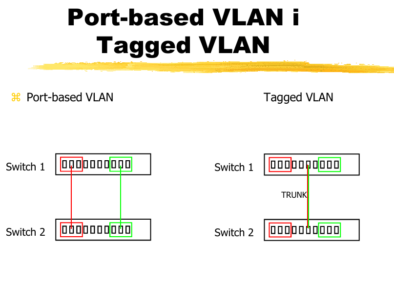

## IEEE 802.1Q VLAN TAG

- Pole zawierające VLAN Tag (określany takŜe terminem: STAG, 
ServiceTag) posiada następujące składowe:

    - 3 bity pozwalające na przydzielenie klasy priorytetu CoS dla 
    zawartości ramki Ethernet. Nazwa tej składowej to PCP (Priority 
    Code Point), jest ona definiowana standardem IEEE 802.1p

    - 1 bitowy Canonical Format Indicator wskazujący, czy jest 
    obecne dodatkowe pole RIF (Routing Information Field)

    - 12bitowy VLAN ID (VID) faktyczny identyfikator VLAN

### IEEE 802.1Q – VLAN Trunks

- Tworzone są łącza fizyczne obsługujące ruch ramek tagowanych 
pomiędzy wyróŜnionymi portami przełączników – tzw. VLAN Trunks

- Do portu przełącznika skonfigurowanego jako trunk moŜna 
podłączyć analogicznie skonfigurowany port w innym przełączniku 
(nie moŜna podłączyć zwykłego portu przełącznika lub portu DTE)

- Uwaga: W niektórych systemach operacyjnych dla przełączników 
sieciowych port typu VLAN Trunk określamy mianem portu 
tagowanego (tagged port), oraz zwykły – jako port nie tagowany
(untagged port)

- Port zdefiniowany jako VLAN Trunk nie musi tunelować wszystkich 
VLAN – VLAN są indywidualnie dopuszczane do tunelowania 
(decyduje o tym konfiguracja)

- Przełącznik moŜe posiadać wiele VLANTrunks

### Identyfikatory VLAN

- 12 bitowy VID pozwala na rozróŜnienie 4096 VLAN (maksymalna 
wartość VID konfigurowanych np. w przełącznikach). VLAN 0 nie 
istnieje, gdyŜ wartość 0 w polu VID oznacza brak VLAN (w 
konsekwencji umoŜliwia przesyłanie przez VLAN trunk danych 
nieklasyfikowanych jako przynaleŜne do VLAN)

- W większości zarządzalnych przełączników VLAN o ID = 1 jest 
wyróŜniony wykorzystywany jako domyślny dla portów 
przełącznika oraz słuŜący do zarządzania nim

- Konfigurowanie przełączników polega na definiowaniu VLAN, a 
następnie dodawaniu do VLAN portów. Porty nie tagowane mogą 
wtedy przynależeć tylko do jednej VLAN, porty tagowane – do wielu

- W przypadku ruterów technologię VLAN obsługuje mechanizm pod
interfejsów: każdy podinterfejs jest przypisany do innego VID 
Z każdą VLAN może być kojarzona osobna sieć IP z własną 
adresacją.

### Protokoły wspomagające zarządzanie VLAN - VTP

- VTP – Virtual LAN Trunking Protocol

- Zdefiniowany przez Cisco 

- Wymaga określenia zakresu działania poprzez zdefiniowanie 
unikatowej nazwy VTP Domain i nadania jej przełącznikom

- Przełączniki są konfigurowane jak pracujące w jednym z trzech 
trybów VTP:

    - Serwer – konfigurowany przez uŜytkownika przełącznik emituje 
    dane o swoich VLAN

    - Client – pobiera definicje sieci VLAN

    - Transparent – nie pobiera definicji VLAN do swojej konfiguracji, 
    ale przekazuje komunikaty VTP do następnych przełączników

- VTP przenosi informację o definicjach sieci VLAN, nie moŜe 
    przenosić informacji o przynaleŜności portów do VLAN (te są 
    specyficzne dla kaŜdego przełącznika)

- Serwer VTP wysyła rozgłoszenie dot. VLAN co 5 minut (VTP 
summary) oraz po kaŜdej rekonfiguracji VLAN. Komunikat ten 
zawiera numer CRN (Configuration Revision Number) umoŜliwiający 
ustalenie, czy odbiorca (przełącznik) ma do czynienia z najbardziej 
aktualnym komunikatem. Przełączniki pracujące w trybie VTP 
transparent rozgłaszają ten komunikat do wszystkich VLAN trunk.

- VTP Pruning umoŜliwia - odłączanie dostępu do VLAN Trunk dla 
tych VLAN, które nie są aktywne po przeciwległej stronie VLAN 
Trunk (ostatni port przełącznika odłączono). VTP Pruning uŜywa 
komunikatów VTP Join Message (zawierają listę aktywnych VLAN w 
przełączniku). VTP Pruning moŜna konfigurować w przełącznikach 
dla kaŜdego VLAN i w kaŜdym VLAN Trunk.

- Multiple VLAN Registration Protocol (MVRP)

- Zdefiniowany w dodatku IEEE 802.1ak do IEEE 802.1Q

- UmoŜliwia przenoszenie informacji o całych VLAN Trunks, 
zestawiając je automatycznie pomiędzy przełącznikami

- W konsekwencji moŜliwe jest automatyczne zestawianie VLAN 
Trunk, jeśli pośród przełączników pracujących pod kontrolą 
protokołu pojawi się nowy port zakwalifikowany do danego VLAN

- Funkcja Static VLAN Registration Entries jest takŜe moŜliwe zdalne 
konfigurowanie uczestnictwa przełącznika w VLAN

- Starsza (wyparta) wersja: Generic VLAN Registration Protocol 
(GVRP)

- Protokół wspomagający: MMRP Multiple MAC Registration 
Protocol, Protokół warstwy 2 zbiorczo katalogujący adresy MAC 
urządzeń podłączonych do wielu przełączników

- VMPS zakłada istnienie serwera, który będzie emitował informację 
dla przełączników Ethernet o przydzielaniu ich portów do 
poszczególnych VLAN

- Podstawą decyzji o przydzieleniu będzie treść adresu MAC 
urządzenia aktualnie podłączonego do portu przełącznika 
urządzenia aktualnie podłączonego do portu przełącznika 

- Gdy host przeniesie się do innego portu (zmiana w tablicy MAC 
przełącznika) – automatycznie port  jest przenoszony do innego 
VLAN. Skutkiem moŜe być takŜe zablokowanie portu, wyłączenie 
VLAN itp. – zaleŜnie od konfiguracji 

- VLAN Query Protocol (VQP) jest podstawą komunikowania się VMPS 
z klientami (na bazie UDP)

- Funkcjonalność VMPS dostępna tylko w przełącznikach CORE (np. 
Cisco 6500)

## Standrard IEEE 802.1Q-in-Q

- IEEE 802.Q-in-Q (inaczej nazywany Stacked VLAN lub Layer2 
Provider Bridging) zdefiniowany jest z pomocą standardu IEEE 
802.1ad (link aggregation)

- Technika umoŜliwiająca tunelowanie wielu VLAN Trunks w jednym 
łączu fizycznym

- Przydatny, gdy dostawca usług sieciowych chce udostępnić swoim 
klientom (instytucjom) moŜliwość samodzielnego konfigurowania 
VLAN o dowolnych VID z przekazywaniem ruchu izolowanego 
pomiędzy ich oddziałami.

 Dwie instytucje mogą wtedy zdefiniować taki sam VID dla swoich 
rozproszonych sieci – mimo to ruch będzie bezkolizyjnie (z 
odpowiednią izolacją VLAN) tunelowany przez szkielet dostawcy.

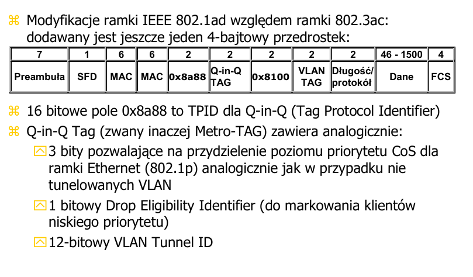

- Identyfikator Q-in-Q określamy mianem PE VLAN ID (ProvierEdge 
VLAN ID)

- PrzewaŜnie do obsługi Q-in-Q w urządzeniach definiowany jest typ 
portu: Provider tunnel Q-in-Q

- Para dwóch tagów 802.1Q (Q-in-Q TAG i VLAN TAG) przenoszących 
dane w sieciach VLAN klientów (nazywanych odpowiednio SVLAN i 
CVLAN) daje moŜliwość zdefiniowania 16 769 025 róŜnych wartości 
identyfikujących sieci VLAN i rozróŜnienia pełnej puli VID dla 
kaŜdego tunelu Q-in-Q 
(SVLAN to skrót od Service VLAN, CVLAN od Customer VLAN)

- Maksymalna długość ramki Ethernet rośnie do 1526 oktetów – jest 
to istotne wobec (ewentualnej) konieczności ręcznego 
konfigurowania MTU w interfejsach Ethernet urządzeń

## Inny wariant VLAN - Private VLANS

- Private VLANS są przydatne gdy w sieci istnieje wiele stacji, które 
muszą się komunikować z konkretnym wybranym portem 
przełącznika (np. z wyjściem na zewnątrz), lecz powinny być 
izolowane wzajemnie od siebie lub grupowane i izolowane grupach.
Rodzaje portów przełącznika określane w ramach private VLANS: 

    - Promiscuous – publiczny, wyjście na zewnątrz
    
    - Isolated – dla stacji mającej jedynie kontakt z Promiscuous
    (pojedynczy port izolowany)

    - Community - dla stacji w grupie, mającej kontakt z Promiscuous
    i ze sobą wzajemnie (grupa izolowana)

### Private VLANS - rodzaje sieci

- W konsekwencji istnieją następujące rodzaje sieci Private VLAN:

    - Primary VLAN — przekazuje ruch publiczny do innych Private 
    VLAN (obejmuje wszystkie porty zaangaŜowane w jakiekolwiek 
    sieci Private VLAN).

    - Isolated VLAN – port może się komunikować wyłącznie z 
    Primary VLAN

    - Community VLAN – porty mogą się komunikować w ramach 
    tego samego community VLAN oraz z Primary VLAN

- Ruch broadcast (rozgłoszenie) w Private VLAN jest dozwolony w 
kierunkach:

    - Z Promiscuous do wszystkich portów w Primary VLAN

    - Z Isolated tylko do przypisanych Promiscuous

    - Z Community do innych portów w danym Community VLAN oraz 
    do przypisanych portów Promiscuous

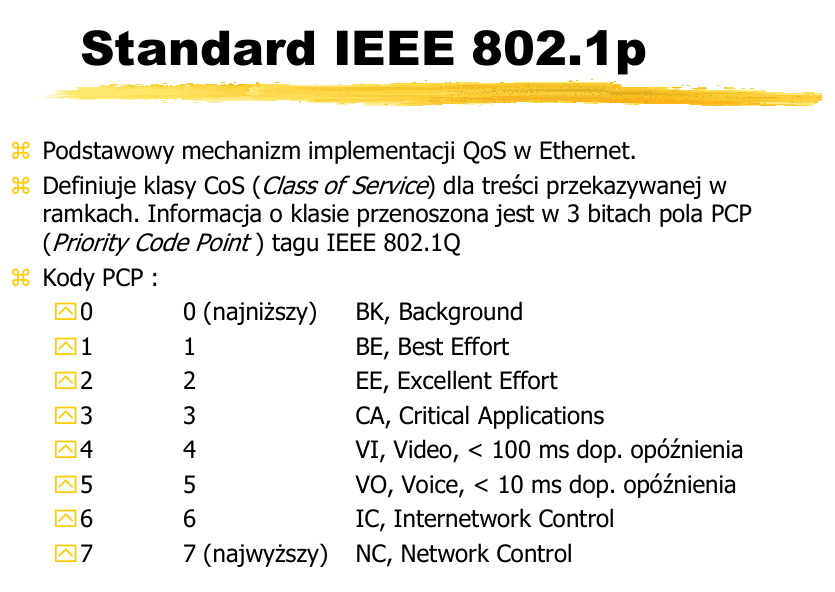

## Spanning Tree Protocol (STP)

- Topologia gwiazdy/drzewa wyklucza istnienie pętli dopuszczenie nie 
kontrolowanej pętli spowoduje zablokowanie sieci rozgłaszanymi po 
trasie pętli ramkami (broadcast storm)

- STP (Spanning Tree Protocol) realizowany jest przez przełączniki 
i mostki sieciowe w warstwie drugiej ISO OSI. Graf połączeń 
fizycznych po deaktywacji niektórych z nich przekształcany jest do 
postaci drzewa (bez pętli)

- Korzeniem drzewa jest jeden z przełączników root bridge (zwany 
potocznie po prostu rootem). Pozostałe urządzenia obliczają i 
aktywują najkrótsze ścieŜki do niego.

- Standaryzowane warianty protokołu STP:

    - SPB, IEEE 802.1aq (Shortest Path Bridging) 

    - RSTP, IEEE 802.1w (Rapid Spanning Tree Protocol)

    - MSTP, IEEE 802.1s (Multiple Spanning Tree Protocol)

- Wszystkie przełączniki pracujące w ramach danej instancji STP (często 
instancji jest wiele i są realizowane osobno dla poszczególnych sieci 
VLAN) posiadają unikatowe identyfikatory: BID (BridgeID)
najniŜszą wartość BID

- Funkcję root bridge otrzymuje urządzenie posiadające aktualnie 
najniŜszą wartość BID

- BID zawiera dwubajtowy kod priorytetu (16 bitów, starsza część) 
uzupełniony adresem MAC przełącznika (48 bitów, młodsza część) 
łącznie 8 bajtów

- Kod priorytetu (dla wariantu STP uwzględniającego współpracę z VLAN) 
jest generowany z konfigurowalnych wartości 4 najstarszych bitów 
uzupełnionych numerem VLAN (12 młodszych). Dlatego moŜliwe jest 
definiowanie priorytetu przełącznika tylko jako wielokrotności liczby 
4096 (zostanie ona uzupełniona 12 bitowym identyfikatorem VLAN). 

- Domyślna wartość priorytetu to 32768 + numer VLAN, w którym dana 
instancja STP operuj

- Ramka BPDU przenosi informacje na temat:
    - BID aktualnego root bridge (root bridge ID)

    - Kosztu skumulowany trasy do root bridge (Root Path Cost)

    - BID nadawcy (gdyŜ to niekoniecznie root bridge)

    - Numeru portu w przełącznikunadawcy i jego priorytet

    - Informacje o czasach waŜności i wygenerowania przesłanej 
    informacji (umoŜliwia jej dezaktualizację w przypadku braku jej 
    ponowienia kolejną ramką BPDU)

- Gdy ramka BPDU przychodzi do przełącznika zawierając informację 
wskazującą, Ŝe droga do root bridge przez którą przyszła jest 
LEPSZA niŜ inne juŜ znane – określamy ją mianem Superior BPDU. Gdy GORSZA – mianem Inferior BPDU. 

- Przyjście ramki Superior BPDU do root bridge oznacza utratę funkcji 
root bridge (istnieje przełącznik z niŜszym BID)

### Protokół STP – znaczenie portów

- Każdy przełącznik za wyjątkiem root bridge posiada jeden tzw. root 
port  (ozn. Root) odbierający Superior BPDU, czyli prowadzący do 
root bridge

- Gdy kilka portów róŜnych urządzeń podłączone jest do tego samego 
segmentu sieci jeden z nich jest wybierany jako droga do root bridge – nazywa się designated port (ozn. Desg). Zatem przełącznik moŜe 
mieć wiele designated port (odbierając ruch w kierunku root bridge z 
wielu segmentów sieci), ale maksymalnie jeden root port.

- Czas adaptacji drzewa do nowej topologii to około 3060 sekund (w 
wersjach rapid – mniej)

- Uwaga w większości przełączników moŜliwe jest wyłączenie STP 
(opcja najczęściej nosi nazwę portfast lub podobne). Trzeba jednak 
pamiętać, Ŝe wówczas w przypadku wystąpienia pętli nie istnieje już
żaden inny mechanizm zabezpieczający (ramki będą wirowały w pętli 
blokując sieć)

- W ramach pracy protokołu STP przełączniki rozgłaszają ramki BPDU 
(Bridge Protocol Data Unit) w wariantach Configuration (rutynowa 
wymiana informacji między przełącznikami) i Topology Change (wykryto 
zmianę w topologii sieci)

- W większości systemów operacyjnych dla przełączniczków istnieją 
dodatkowe moŜliwości ingerowania w ruch ramek BPDU, np.:

- Portfast – wykluczenie portu z STP (port jest przeznaczony dla stacji 
końcowej)

- Bpduguard– awaryjne wyłączanie portu nie uczestniczącego w STP 
(portfast) gdy otrzyma od ramkę BPDU (nie powinna nigdy nadejść)

- Bpdufilter– automatyczna deaktywacja trybu portfast dla portu, gdy 
otrzyma on ramkę BPDU (automatyczny powrót do STP)

- Guard root – blokada moŜliwości oddania funkcji root bridge – gdy 
nadejdzie Superior BPDU port przechodzi w stan Broken

- Guard loop– wykrywanie i awaryjne wyłączenie portów unidirectional

## Problem istnienia tzw. unidirectional links

- STP nie posiada środków umoŜliwiających wykrycie łącza 
jednokierunkowego (powstającego gdy jedna z linii łącza duplex 
pomiędzy przełącznikami uległa uszkodzeniu). Guard loop umoŜliwia 
jedynie wykrycie sytuacji, w której w chwili obecnej powstaje 
uszkodzenie (wcześniej łącze działało poprawnie, jednak ramki BPDU 
przestały napływać przy ciągłości stanu linkup). Nie wykryje jednak 
nowo podłączonego łącza juŜ wcześniej uszkodzonego (unidirectional).

- Cisco dostarcza protokół wspomagający STP o nazwie UDLD 
(Unidirectional Link Detection Protocol) działający poprzez identyfikację 
echa z własnego portu (ramka jest wysyłana z prośbą o jej odesłanie, co 
jest sprawdzane). W przypadku błędów – port jest oznaczany dla STP 
jako unidirectional (udld normal mode), lub automatycznie wyłączany 

## Protokół STP

### Parametr Cost

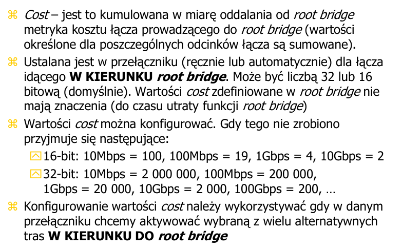

### Parametr Port priority

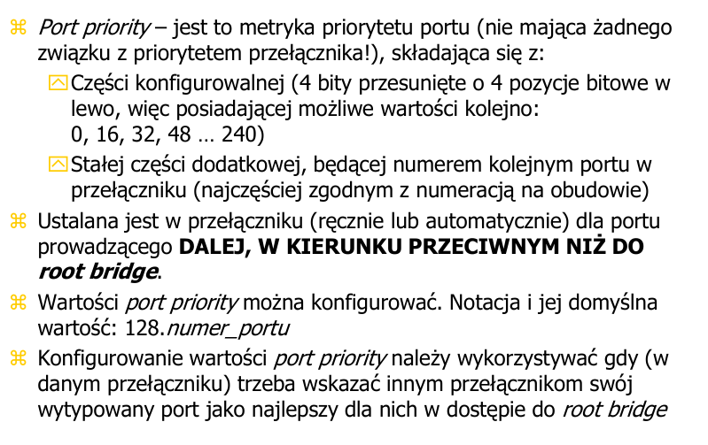

### Wyznaczanie trasy

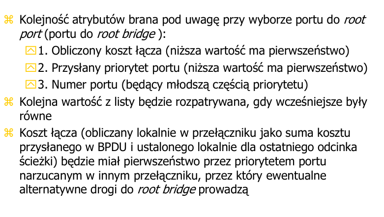

### Stany portów

- W ramach pracy STP wyróŜnia się następujące stany portów:

    - Listening, ozn. LIS  port odbierający BPDU lecz nie wysyłający 
    Ŝadnych ramek, stan startowy po włączeniu portu

    - Learning , ozn. LRN  port uczestniczący tylko w wymianie BPDU i 
    adresów MAC

    - Forwarding , ozn. FWD  port przekazujący takŜe inne ramki 
    normalna praca

    - 9Blocking , ozn. BLK  port zablokowany, gdy powoduje pętlę

- Dodatkowo:    

    - Discarding, ozn. DIS  wstrzymanie pracy portu, uŜywane jako 
    hybryda i substytut Listening i Blocking w wariantach rapid 
    protokołu STP

    - Broken, ozn. BKN  port zepsuty, chwilowo zablokowany w wyniku 
    wykrycia błędów STP (np. Root Bridge Inconsistency)

### Rozszerzenia funkcjonalności

- Istnieje wariant STP o nazwie Rapid (RSTP, Rapid Spanning 
Tree Protocol) oznaczony jako IEEE 802.1w. RSTP redukuje czas 
przywracania sprawności połączeń po awarii. Zdefiniowano tu takŜe 
dodatkowy stan portu w przełączniku: discarding (wstrzymany), 
umoŜliwiający pasywne nasłuchiwanie ruchu. Jego status pozwala 
na szybkie przejście do forwarding po awarii innego portu. 

- W PVST i RSTP wyróżnia się ponadto dwa rodzaje portów 
zapasowych w stanie discarding:

    - Alternate Port (ozn. Altn) wstrzymany w wyniku otrzymania 
    Superior BPDU z innego przełącznika na  drodze do root bridge
    („do root bridge jest lepsza od tej droga przez inny przełącznik”)

    - Backup Port (ozn. Back) wstrzymany w wyniku otrzymania 
    własnego BPDU z tego samego przełącznika („inny port tego 
    przełącznika też jest podłączony do segmentu sieci i to przez 
    niego jest lepsza droga”)

### STP – implementacje Cisco

- CST (Common Spanning Tree) – wersja podstawowa, zakładająca 
istnienie tylko jednego drzewa dla wszystkich VLAN. Ramki BPDU są tu 
przekazywane przez trunk za pośrednictwem Native VLAN (bez kolizji z  
ramkowaniem IEE 802.1Q). Dziś rzadko implementowana.

- PVST (PerVLAN Spanning Tree) – zakłada jedną instancję drzewa dla 
kaŜdego VLAN. W konsekwencji w przypadku łącz redundantnych 
umoŜliwia ich proporcjonalne wykorzystanie dla róŜnych VLAN. W 
Cisco IOS aktywowany domyślnie, występuje pod nazwą ieee lub pvst.

- Rapid PVST+ (Rapid PerVLAN Spanning Tree Plus) – rozszerzony 
protokół STP implementowany w urządzeniach Cisco dla każdej sieci 
VLAN. W Cisco IOS występuje pod nazwą rapidpvst. UmoŜliwia 
jednoczesne integrowanie urządzeń wspierających CST i PVST 

## IEEE 802.1s - Multiple Spanning Tree Protocol

- MSTP (lub MST) wariant STP przeznaczony do obsługi duŜej liczby 
VLAN (Virtual LAN) poprzez agregowanie tych sieci w grupy. 

- Budowany jest system mapujący numerowane Instancje MST do 
konfigurowanych przez administratora zbiorów VLAN (instancja 0 
przejmuje wszystkie nie przypisane VLAN). Instancje MST zawarte są 
w tzw. regionie STP

- W kaŜdym regionie budowane są więc kolejne drzewa STP dla 
wybranych zbiorów VLAN (wykluczające pętle). Root bridge będzie 
definiowany dla kaŜdego z tych drzew indywidualnie

- Implementacja Cisco dla MSTP (która była tworzona jeszcze przed 
wprowadzeniem standardu MSTP IEEE 802.1s) nosi nazwę MISTP 
(Multiple Instances Spanning Tree Protocol) 

## EtherChannel

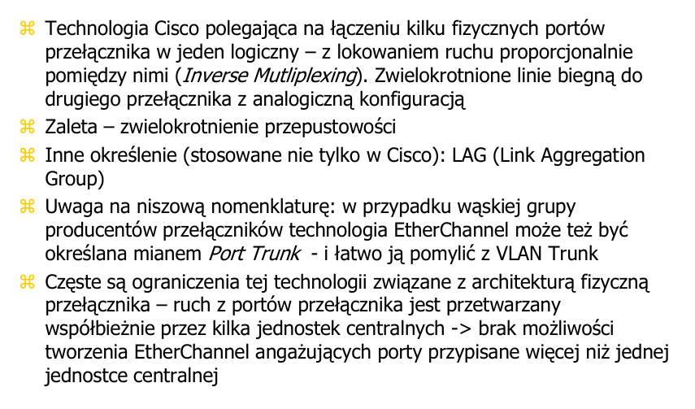

## Protokół ARP

- Każdy interfejs IP ma przypisany 32bitowy adres jednoznacznie 
identyfikujący go w sieci IP, lecz dwie maszyny w sieci Ethernet 
mogą się komunikować tylko wtedy gdy dodatkowo znają 
nawzajem swoje adresy MAC

- Istnieje potrzeba przekształcenia adresu IP na adres MAC tak, gdyż
adres MAC nie jest przypisany na stałe do IP (IP moŜna zmieniać)

- Nie ma sposobu na zakodowanie 48bitowego adresu Ethernet w 
32bitowym adresie IP (zbyt mała długość)

- Zapytanie ARP to broadcast w warstwie drugiej, odpowiedź jest 
wysyłana już w trybie unicast

- Przełącznik LAN i każda stacja DTE archiwizuje w swojej tablicy 
MAC dane o adresach MAC innych interfejsów i odpowiadających im 
adresach IP

## Adresownie IPv4

- IPv4 Internet Protocol (wersja 4)

- Pakiet IPv4 często trzeba fragmentować na datagramy – aby datagramy 
te umieścić w ramkach Ethernet (maksymalna długość pakietu IP to 
64kB, zaś MTU dla Ethernetu to tylko 1500 bajtów). Proces taki 
nazywamy kapsułkowaniem (enkapsulacją). Datagramy IP (fragmenty 
pakietów IP) także posiadają swoje nagłówki, a w nich adresy IP.

- Notacja CIDR (Classless InterDomain Routing ) dla adresu IP: 
XXX.XXX.XXX.XXX/YY gdzie YY to liczba bitów o wartości 1 w masce 
tego adresu IP 

- Każdy adres można podzielić na dwie części: 

    - Część identyfikującą daną sieć w Internecie (adres sieci)

    - Część identyfikującą konkretny komputer w tej sieci (adres hosta)

- Istnieje adresacja klasowa (classfull) i bezklasowa (classless) IP.

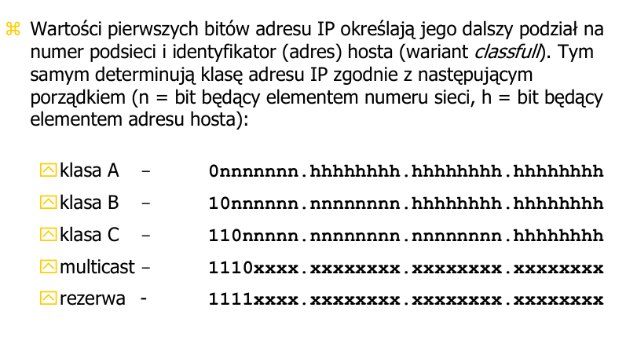

### Pierwotne klasy adresów IPv4

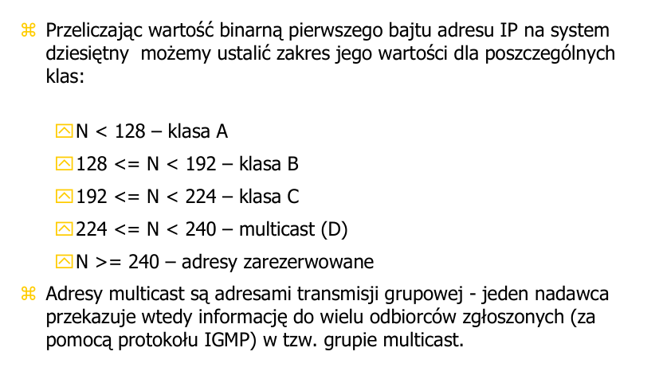

## Maska sieci w IPv4

- Maska składa się podobnie jak adres IP z 4 bajtów. Używana jest do 
dalszego wydzielenia części adresu odpowiadającej za identyfikację 
sieci czy hosta. Usprawnia trasowanie (rutowanie) datagramów IP.

- Adres sieci (z danego adresu IP) tworzymy przepisując te wszystkie 
wartości bitów w adresie, dla których odpowiednie bity maski mają 
wartość jeden. Resztę bitów uzupełniamy zerami.

- Adres rozgłoszeniowy w podsieci (broadcast) jest tworzony poprzez 
wypełnienie reszty jedynkami zamiast zer.

- Reguła przynależności dwóch adresów do tej samej sieci:

    - W dwóch porównywanych adresach mogą róŜnić się 
    wartości wyłącznie tych bitów, które odpowiadają 
    kolejnością bitom o wartości 0 w masce.

## Diagnostyka sieci

### Diagnostyka sieci IP - ping

- Wysłanie pakietu ECHO_REQUEST (ICMP) do zadanych hostów 
sieciowych

- W pakiecie wysyłane są dane testowane które muszą być zwrócone 
w takiej samej postaci

- Przychodzący z ustalanym opóźnieniem pakiet zwrotny 
ECHO_RESPONSE

- Diagnostyka odległości (wysyłany wiele pakietów i analizujemy 
czasy powrotu) lub połączenia (jedynie stwierdzenie działania łącza 
komunikat host is alive)

- Możliwość wysyłania pakietów ICMP w datagramach IP opatrzonych 
wybraną wartością DSCP

### Diagnostyka sieci IP - traceroute

- Technika bazuje na prowadzeniu diagnostyki z wielokrotnym uŜyciem 
datagramów UDP (User Datagram Protocol) i testów ICMP (ewentualnie 
tylko ICMP)

- Wykorzystanie pola TTL w datagramie IP wysyłanie pakietów z 
rosnącym TTL (od 1 w górę) tak, aby były zatrzymywane jako 
przeterminowane przez poszczególne routery na drodze do celu

- Zatrzymanie pakietu powoduje wysłanie zwrotnego pakietu 
ICMPTIME_EXCEEDED, które dostarczają teraz informacji diagnostycznej

- Ponieważ wysyłany datagram UDP nie ma zdefiniowanego poprawnego 
portu, ostatecznie zostanie przesłany pakiet ICMP PORT_UNREACHABLE 
z osiągniętego hosta docelowego

- Dla każdego TTL wykonywane są domyślnie trzy próby dające trzy 
komplety wyników czasowych

- Domyślny czas oczekiwania na pakiet trzy sekundy (sygnalizacja 
standardowa ‘*’)

## Diagnostyka sieci - zarządzanie tablicą ARP

- Narzędzie do kontroli systemowej tablicy par odpowiedników 
adresów IP i MAC

- Możliwość modyfikacji tej tablicy (kasowanie, tworzenie przypisań 
statycznych)

### Diagnostyka sieci - nslookup

- Narzędzie wysyła zapytania do serwerów nazw (DNS)

- Dwa tryby działania:

    - nieinteraktywny - pobiera parametry z linii komend

    - interaktywny – ma własny interpreter komend

## Sesje monitorowania ruchu w przełącznikach Ethernet

- SPAN (Switch Port Analyzer) monitorowanie portów lub sieci VLAN 
w bieŜącym przełączniku – z przekierowaniem tego ruchu z 
portu/portów źródłowych do docelowego.

- RSPAN (Remote SPAN) – monitorowanie ramek w zdalnym 
przełączniku (w celu przekazania go tworzona jest specjalna VLAN w 
łączu trunk pomiędzy przełącznikami). W niektórych przełącznikach 
monitorowanie w zdalnym przełączniku  (z przekierowaniem ruchu do 
VLAN) wymaga zaangaŜowania jednego z portów fizycznych 
(skonfigurowanego jako loopback i wyłączonego wtedy z innego 
uŜytkowania). Ten port stanowi fizyczny pomost do VLAN (jest 
odpowiednikiem portu docelowego)

- ERSPAN (Encapsulated remote SPAN) – monitorowanie ruchu w obcej 
sieci IP (tworzony jest tunel GRE w celu transmisji ruchu pomiędzy 
dwoma sieciami IP)

---
---
---

## Konfigurowanie routerów

- Dokonywane za pośrednictwem:
    - terminali systemów operacyjnych (lokalnie poprzez konsole,
    poprzez dial-up, telnet, ssh, modem itp.),

    - sieciowych usług konfiguracji zdalnej,

    - interfejsów WWW,

    - dedykowanego oprogramowania zarządzającego

- Konfiguracja „minimum”:

    - Konfigurowanie adresacji i trybów pracy interfejsów

    - Definiowanie reguł aktywności interfejsów

    - Określenie reguł bezpieczeństwa

    - Zarządzanie procesem rutowania

    - Zapis wyników sesji w pamięci trwałej

## Konfigurowanie interfejsów w routerach

- Adresacja IP – tworzenie adresacji dla tzw. sieci bezpośrednio
podłączonych do rutera (czasem nazywanych „ościennymi”)

- Aktywacja interfejsu i wpływ na funkcjonalność usług warstw wyższych: administrative up/down

- Monitorowanie stanu interfejsu: line/protocol up/down

-Pod-interfejsy (sub-interface), np.: fa 0/1.1, agregacja interfejsów.

- Interfejsy loopback w ruterach i przełącznikach.

- Specyfika interfejsów wymagających konfigurowania parametrów
warstwy drugiej ISO OSI (np. serial). Definiowanie częstotliwości zegara taktującego linę, typu ramkowania, kodowania strumienia bitów itp..

- Czynności diagnostyczne dla interfejsów

- Interfejs rutera, a kontroler interfejsu. Monitorowanie pracy interfejsu

### Przydatne polecenia:

- wyłączenie klienta DNS: Router(config)#no ip domain-lookup

- Wyłączenie pobierania konfiguracji przez TFTP: Router(config)#no service config

- Wyłączenie stronicowania przy wypisywaniu dłuższych raportów na
konsoli: Router#terminal length 0

- Zapisywanie ustawień: Router#write mem, Router#copy running-config startup-config

### Adresowanie interfejsów w routerach:

- Podstawą liczbową adresowania interfejsów jest 0 (a nie 1 jak w
przypadku portów warstwy drugiej OSI w przełącznikach Ethernet)

- Gdy w ruterze zainstalowane są moduły – adres interfejsu
poprzedzamy numerem gniazda: FastEthernet 2/0 (pierwszy port w
module 2). Gdy w modułach są kolejne moduły – dodajemy jeszcze
jeden przedrostek, np.: Serial 2/0/0

- Interfejsy fizyczne osadzone bezpośrednio w obudowie rutera (w
tzw. chassis rutera) są interpretowane jako znajdujące się w
module 0: FastEthernet 0/0 (pierwszy port w chassis)

- Gdy w module lub chassis zainstalowane są interfejsy różnych
typów (np. FastEthernet, Serial, ATM, TokenRing) – ich numeracja
dla każdego typu zaczyna się od 0

- Typ interfejsu jest rozróżniany na poziomie warstwy łącza danych OSI, a nie fizycznej - czyli przykładowo interfejsy OC3/ATM i DS3/ATM w rozumieniu powyższej adresacji będą tego samego typu

Przydatne pojęcia cd.:

- Konfigurowanie adresu IPv4 interfejsu FastEthernet 0/0: Router(config)#interface FastEthernet 0/0, Router(config-if)#ip address 192.168.123.100 255.255.255.0, Router(config-if)#no shutdown

- Konfigurowanie adresu IPv4 domyślnej bramki i sieci: Router(config)#ip default-network 192.168.1.0, Router(config)#ip default-gateway 192.168.1.1

Sprawdzenie konfiguracji i podstawowa diagnostyka: Router#show ip int fa 0/0, Router#show controllers fa 0/0, Router#show run,ping...

## Ruter vs Mostek

- Ruter domyślnie skonfigurowany przekazuje datagramy IP
pomiędzy bezpośrednio podłączonymi sieciami IP

- Istnieje możliwość konfigurowania ruterów do pracy jako mostki.
Funkcjonalność związana z rutowaniem IP jest wówczas
nieaktywna, ewentualnie ograniczona do wybranych interfejsów

- Mostek operuje w warstwie 2 ISO OSI (łącza danych). W przypadku
technologii Ethernet – kolekcjonuje adresy MAC i przekazuje ramki
Ethernet do innych swoich interfejsów fizycznych (pobodnie jak to
robi przełącznik Ethernet, który pełni funkcję właśnie mostka)

- Interfejsy fizyczne rutera zaangażowane do mostka nie potrzebują
adresów IP (nie są widoczne w warstwie trzeciej ISO OSI)

- Możliwe jest tworzenie zarówno mostka jak i rutera IP w ramach
jednego urządzenia (rutera fizycznego) – także z połączeniem ich
„wewnątrz” specjalnym wirtualnym interfejsem IP

### Rodzaje mostków

Trzy konfiguracje mostkowania rutera (Cisco):

- Legacy bridging – w tym trybie rutowanie IP jest całkowicie
wyłączone, ruter funkcjonuje jako mostek

- CRB (Concurrent Routing and Bridging) - wybrane interfejsy rutera
pracują w mostku, a pomiędzy innymi interfejsami prowadzone jest
rutowanie IP (lecz nie ma możliwości przekazywania treści pomiędzy
mostkiem i interfejsami podlegającymi rutowaniu IP)

- IRB (Integrated Routing and Bridging) - dodatkowo (w porównaniu z
CRB) istnieje możliwość rutowania do sieci mostkowanej za
pośrednictwem specjalnych wirtualnych interfejsów mostka (BVI -
Bridge Virtual Interface). Adres IP takiego interfejsu istnieje i jest
zgodny z siecią IP, w której leży mostek (zgodny z interfejsami IP
urządzeń podłączonych fizycznie do tych segmentów sieci, do
których podłączone są także interfejsy rutera należące do mostka)

### Przydatne polecenia cd.:

- Wyłączenie rutowania IP: outer(config)#no ip routing

- Przypisanie interfejsów do mostka: Router(config)#int fa 0/0, Router(config-if)#brigde-group 1, Router(config)#int fa 0/1, Router(config-if)#brigde-group 1

- Konfigurowanie mostka (zezwolenie na ruch ramek Ethernet): Router(config)#bridge 1 protocol ieee

- Włączenie trybu mostka IRB (tu rutowanie IP jest włączone): Router(config)#bridge irb

- Przypisanie interfejsów do mostka: Router(config)#int fa 0/0, Router(config-if)#brigde-group 1, Router(config)#int fa 0/1, Router(config-if)#brigde-group 1

- Stworzenie wirtualnego interfejsu IP do mostka (numer interfejsu to jednocześnie numer mostka): Router(config)#int BVI 1, Router(config-if)#ip addr 200.200.200.1 255.255.255.0, Interfejs BVI jest dostępny zarówno w mostku jak i w procesie rutowania IP – łączy sieć mostkowaną z ruterem IP.

- Zezwolenie na użytkowanie protokołów rutowania dynamicznego nad
łączem serial async: Router(config-if)#async default routing

## Listy kontrole - ACL:

- ACL (Access Controll Lists) służą do kontroli i blokowania ruchu lub
czynności

- Rodzaje ACL (Cisco): Standardowe\Rozszerzone\Nazwane

- ACL posiadają numery, których (mieszcząca się w danym
przedziale) określa typ ACL. Reguły w ACL „od szczegółu do ogółu”

- Listy (zwane już wtedy grupami – Access group) przypisujemy do
obiektu, który ma być kontrolowany (np. interfejs lub linia)

- Istnieje też wewnętrzna numeracja w grupie - umożliwiająca
określanie kolejności dopasowania ACL

- Każda ACL definiuje akcje, jakie należy podjąć po dopasowaniu. Są
to deny (zakaz), permit (zezwolenie ) i remark (komentarz)

- Aby czynność w była dozwolona w ramach Access-group potrzebna
jest permit (np. stawiamy na końcu regułę permit, a wcześniej
określające sytuacje szczegółowe reguły deny).

### Standard ACL

- Standardowe listy dostępu (access-lists) posiadają identyfikatory z przedziału 1-99. Wartość samego identyfikatora w momencie definiowania wpisów listy wpływa na jej rodzaj.

- Listy są uproszczone i pozwalają na blokowanie ruchu dotyczącego specyficznych adresów IP lub ich grup bez możliwości rozróżniania osobno cech nadawcy od odbiorcy (uwzględnia tylko źródło datagramu).

- Przykład:
Router(config)#access-list 70 deny host 10.10.10.1
Router(config)#access-list 70 permit any

- Mimo braku rozróżnienia „źródła i celu” możemy grupę ACL przypisać do ruchu wchodzącego lub wychodzącego przez interfejs (choć lista standard służy bardziej do blokowania ruchu w ramach protokołów niż interfejsów fizycznych), np.:
Router(config)#int fa 0/0
Router(config-if)#ip access-group 70 in

### Extended ACL

- Rozszerzone listy rejestrowane są w przedziale identyfikatorów 100
-199

- Pozwalają na wyszczególnienie osobno cech odbiorcy i nadawcy – w
ramach protokołu IP

- Pozwalają na określenie szczegółowych kryteriów filtrowania
wiązanych z wieloma protokołami warstwy 3 i 4

- Przykład:
Router(config)#access-list 190 deny tcp 200.200.200.0 0.0.0.3 eq
1234 10.10.10.0 0.0.0.255 eq 23

- wykluczenie ruchu miedzy hostami 200.200.200.1-200.200.200.3
na porcie TCP 1234, a całą siecią 10.10.10.0/24 na porcie TCP 23

- Przypisanie listy do interfejsu odbywa się analogicznie, np.:
Router(config)#int fa 0/0
Router(config-if)#ip access-group 190 in

### Named ACL

- ACL można nazywać. Podczas deklarowania (brak numeru listy)
określamy rodzaj listy (standard lub extended):
Router(config)#IP access-list standard lista
Ruter (config-std-nacl)#deny 10.10.10.1 0.0.0.0
Ruter (config-std-nacl)#permit 10.10.10.2 0.0.0.0

Router(config)#IP access-list extended lista2
Ruter (config-ext-nacl)#deny TCP 10.10.10.1 0.0.0.0 20.10.10.1
0.0.0.0 eq www

Przypisanie listy do interfejsu, np.:
Router(config-line)#access-group lista2 in

## Protokoły łącz szeregowych

### SLIP

- SLIP - Serial Line Internet Protocol

- Protokół umożliwiający połączenie poprzez linie, które wymuszają
transmisję szeregową

- Zaprojektowany w związku z koniecznością prostej obsługi łącz
point-to-point, na poziomie alternatywnym do IEEE 802.3
(Ethernet) i 802.5 (Token Ring) czy X.25

- Transmisja prostych pakietów do przeciwległej stacji

- Obecnie zastąpiony przez PPP ale stosowany dalej w
komunikujących się przez sieć urządzeniach o niewielkiej mocy
obliczeniowej (np. opartych o proste mikrokontrolery)

- Dwa znaki specjalne pakietu:
    - END (192) - koniec pakietu

    - ESC (219) - stosowany gdy trzeba nadać znak o wartości 192
    (END) jako dane

- SLIP obsługuje wyłącznie transmisję datagramów protokołu IP (z
próbami adaptacji dla BlueCore Serial Protocol w Bluetooth)

- Maksymalna długość serii danych: 1006 bajtów

- Brak kontroli błędów transmisji

### PPP

- PPP - Point-to-Point Protocol

- Rozwinięcie wcześniejszego protokołu SLIP

- Przeznaczony dla prostych połączeń, które transportują pakiety
pomiędzy dwoma końcowymi stacjami roboczymi

- Hermetyzacja/enkapsulacja PPP pozwala łączyć ze sobą różnego
rodzaju protokoły (nagłówek pakietu - do 8 oktetów)

- Wyposażony w Link Control Protocol (Protokół Kontroli Połączenia) 
przeznaczony do automatycznego uzgadniania opcji transmisji,
detekcji obecności drugiej strony komunikacji, zmiany ograniczeń
wielkości pakietów, uwierzytelnienia czy ograniczania
przepustowości połączenia

#### PPP - protokół

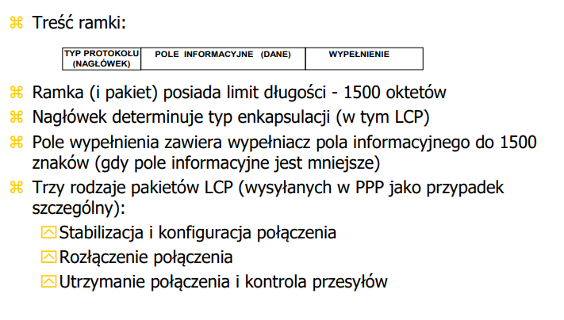

#### Uwieerzytelnianie PPP

- PAP (Password Authentication Protocol) – klient wysyła hasło i
nazwę (najczęściej hosta), serwer wysyła accept lub reject po
porównaniu z treścią posiadanej tablicy

- CHAP (Challenge Handshake Authentication Protocol), wykorzystuje
MD5 i jest bardziej bezpieczny/preferowany. Serwer wysyła
challenge, klient wytwarza na podstawie treści challenge skrót MD5
hash (przy użyciu znanego sobie hasła) i przekazuje go do
sprawdzenia. Procedura jest powtarzana w losowych odstępach
(zabezpieczenie przed podszyciem po uwierzytelnieniu)

- Uwaga – w konfiguracjach systemów operacyjnych dla ruterów
często uwierzytelnianie jest dwukierunkowe (ruter A musi
uwierzytelnić B i odwrotnie)

#### Przydatnie pojęcia:

- Określenie zegara, rodzaju enkapsulacji i adresu IP:
Router(config-if)#ip address 192.168.1.1 255.255.255.0
Router(config-if)#clock rate 8000000
Router(config-if)#encapsulation PPP
Router(config-if)#no shutdown

- Przykład konfigurowania PAP w PPP:

    - Po stronie uwierzytelniającej zakładamy w tym celu konto
    użytkownika systemowego i wymagamy PPP PAP w interfejsie:
    Router(config)#username uzytkownik password haslo
    Router(config-if)#PPP authentication PAP

    - Po stronie uwierzytelnianej wysyłamy dane do autentyfikacji:
    Router(config-if)#PPP PAP sent-username
    uzytkownik password haslo

- Włączenie trybu debug dla PAP: Router#debug ppp authentication.

#### Multilink PPP (MLPPP)

- Służy do agregowania wielu równoległych łącz szeregowych w
jedno logiczne (analogicznie do EtherChannel / LAG w technologii
Ethernet)

- Może także agregować kanały czasowe w łączach szeregowych z
multipleksowaniem w czasie

- Umożliwia wprowadzenie kontrolowanej konfiguracją fragmentacji
przesyłanych ramek – z rozproszeniem fragmentów w
poszczególnych łączach składowych, co znacznie redukuje
opóźnienia transmisji dużych ramek

- Możliwe jest wprowadzenie rozszerzenia Multiclass Multilink PPP
(MCML PPP) – umożliwiającego klasyfikowanie ruchu w
zagregowanym łączu i wprowadzanie mechanizmów QoS

- Tworzenie i konfigurowanie interfejsu Multilink:
Router(config)#interface multilink 1
Router(config-if)# ip address 200.200.205.1 255.255.255.0
Router(config-if)# ppp multilink fragment size 100

gdzie fragment size 100 określa długość maksymalną fragmentu

- Zakwalifikowanie składowego interfejsu serial do multilink (należy
zakwalifikować kolejno wiele intefejsów):
Router(config)# int serial 0/3/0
Router(config-if)# encapsulation ppp
Router(config-if)# ppp multilink
Router(config-if)# ppp multilink group 1

gdzie group 1 oznacza przynależność do interfejsu multilink 1

### HDLC

- HDLC - High-Level Data Link Control

- Tryby pracy:

    - NRM (Normal Respond Mode) – stosowany gdy dostępny jest tylko
    wariant half-duplex łącza. Wówczas komunikacja opiera się na
    relacji master-slave, gdzie host master steruje przydziałem medium
    poprzez komendy zawarte w specjalnych ramkach nazywanych SFrame

    - ARM (Asynchronous Respond Mode) – dla full-duplex

- Wyróżniamy dwa typy urządzeń: primary terminal i secondary terminal.

- Ramka posiada 8 bitowe adresy stacji końcowej (dla trybu multipoint)
oraz kontrolę poprawności (CRC16)

- Cisco opracowało własny wariant tego protokołu

- Ramki HDLC można wykorzystywać zarówno nad łączem
synchronicznym jak i asynchronicznym

#### HDLC - protokól i warianty

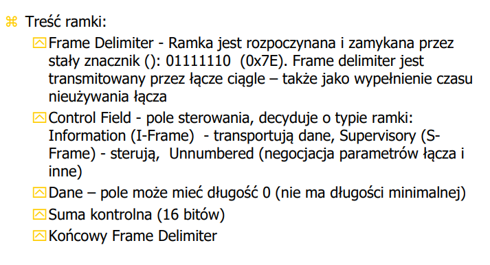

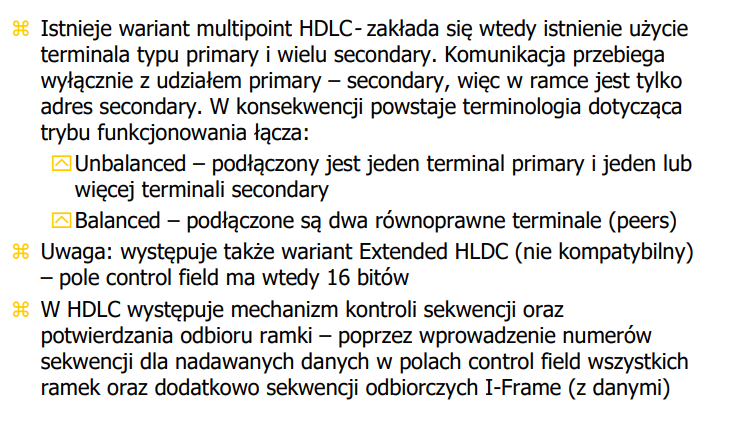

#### Przydatne pojęcia:

- Określenie zegara, rodzaju enkapsulacji i adresu IP:

Router(config-if)#ip address 192.168.1.1 255.255.255.0
Router(config-if)#clock rate 8000000
Router(config-if)#encapsulation hdlc
Router(config-if)#no shutdown

- Z większością interfejsów fizycznych powiązane są moduły ich
sprzętowych kontrolerów. Możliwe jest niskopoziomowe
monitorowanie stanu interfejsu oraz łącza poprzez użycie komendy
show controllers, np:

Router#show controllers serial 0/0

## Cisco - Wybrane techniki i protokoły wspomagające procesy konfigurowania sieci komputerowej

### Cisco IOS - Loopback, Cisco Discovery Protocol

#### Towrzenie interfejsu loopback

Router(config)#interface Loopback 0
Router(config-if)#ip address 10.0.0.1 255.255.255.0
Router(config-if)#no shutdown

- CDP (Cisco Discovery Protocol) umożliwia identyfikację sąsiadów.
Konfigurowanie i kontrola:

Router#sh cdp
Router#sh cdp neighbors
Router#sh cdp neighbors detail
Router(config)#cdp timer 10
Router(config)#cdp holdtime 90
Router#sh cdp interfaces

## ICMP

- ICMP (Internet Control Message Protocol)

- Jest częścią warstwy czwartej OSI,

- Do swojego transportu wykorzystuje datagramy IP

- Obsługuje większość sytuacji awaryjnych i informuje o nich
zainteresowane hosty

- Wykorzystywany do diagnostyki, między innymi przez komendy
ping i traceroute

- Wykorzystywany przez urządzenia sieciowe do raportowania o
awariach lub braku możliwości wykonania usługi.

- Implementacja protokołu w danym węźle sieci nie musi udostępniać
pełnej przewidzianej tym protokołem funkcjonalności (można
konfigurować urządzania aktywując wybrane funkcje)

### Przykłądy stosowania

- Wykrywanie nieosiągalnych miejsc przeznaczenia – jeśli komputer
docelowy nie odpowiada to system, który wykrył problem wysyła do
nadawcy komunikat Destination Unreachable:

    - Jeśli komunikat ten jest wysyłany przez ruter, oznacza, że ruter
    nie może wysyłać pakietów do danego komputera. Może to
    nastąpić w dwóch przypadkach:

        • gdy adres docelowy IP nie istnieje - Host-unreachable,

        • gdy ruter nie może dostarczyć datagramu do tej sieci -
        Network-unreachable.

    - W momencie, gdy komunikat ten jest wysyłany przez host,
    może to oznaczać, że:

        • dany komputer nie posiada wsparcia dla któregoś z
        protokołów - Protocol-unreachable,

        • port TCP/UDP jest nieosiągalny- Port-unreachable.

- Sterowanie przepływem danych – w przypadku, gdy odbiorca
datagramów IP nie nadąża za ich obróbką, wysyła do nadawcy
komunikat ICMP: Source Quench, po odebraniu którego nadawca
czasowo wstrzymuje transmisję.

- Przekierowywanie ścieżek – jeśli komputer, do którego dotarł
datagram IP uzna, że właściwszą bramką będzie inny komputer z
tej samej sieci, wysyła komunikat Redirect wskazujący na ten
właśnie komputer (musi znajdować się w tej samej sieci IP). Po
otrzymaniu takiego komunikatu nadawca aktualizuje swoją tablicę
rutingu

- Sterowanie przepływem danych – w przypadku, gdy odbiorca
datagramów IP nie nadąża za ich obróbką, wysyła do nadawcy
komunikat ICMP: Source Quench, po odebraniu którego nadawca
czasowo wstrzymuje transmisję.

- Przekierowywanie ścieżek – jeśli komputer, do którego dotarł
datagram IP uzna, że właściwszą bramką będzie inny komputer z
tej samej sieci, wysyła komunikat Redirect wskazujący na ten
właśnie komputer (musi znajdować się w tej samej sieci IP). Po
otrzymaniu takiego komunikatu nadawca aktualizuje swoją tablicę
rutingu

## DHCP

- DHCP(Dynamic Host Configuration Protocol)

- Standard umożliwiający automatyczną konfigurację adresów IP na
komputerach pracujących w sieciach TCP/IP

- Podstawowa usługa przekazuje: właściwe numery adresów IP,
właściwe wartości “masek” podsieci, adres domyślnej bramki

- Podstawowa zaleta: zredukowanie kosztów i ułatwienie
administracji systemów TCP/IP.

- Serwer DHCP bazuje na zakresach IP przyznanych dla każdej
podsieci, standardowej konfiguracji IP, polityce przyznawania IP

- Zasada działania DHCP:

    - Procedura uzgodnienia nowego klienta:
        
        - klient: DHCP Discover
        
        - server: DHCP Offer
        
        - klient: DHCP Request
        
        - server: DHCP ACK

    - Procedura uzgodnienia klienta po jego restarcie (klient chciałby
    zapewne otrzymać ten sam adres IP co poprzednio – jeśli
    aktualnie jest wolny):

        - klient: DHCP Offer (swój poprzedni adres)

        - server: DHCP ACK lub DHCP NACK 

### Cisco IOS - konfigurowanie serwera DHCP

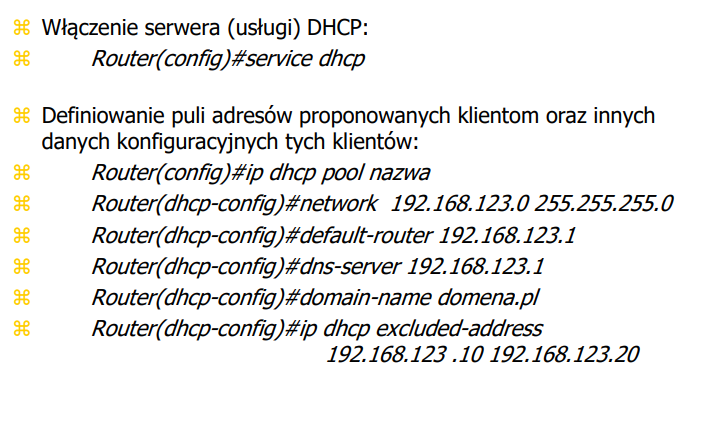

## SNMP

- SNMP (Simple Network Management Protocol) - prosty protokół
zarządzania siecią

- Protokół stosowany do zarządzania urządzeniami sieci, takimi jak
routery, drukarki, stacje robocze, terminalne urządzenia
monitorujące (np. czujniki) itp

- Protokół przewiduje istnienie jednostek-zarządców sieci oraz zbioru
rozproszonych agentów (najczęściej urządzeń) pod kontrolą
zarządcy

- Zarządzanie polega na monitorowaniu i powodowaniu zmian treści
zmiennych (obiektów), reprezentujących poszczególne zasoby
urządzenia konfigurowanego zdalnie

- Agent SNMP - udostępnia posiadane bazy zmiennych w postaci
komponentów MIB (Management Information Base)

- Zarządca (SNMP Manager) - monitoruje sieć wysyłając zapytania do
urządzeń

- Wersje SNMP:

    - W wersji I dostępne są zapytania MIB i pułapki
    
    - W wersji II dostępne są dodatkowo: możliwość komunikacji w trybie
    bulk (import całej kolekcji ustawień) oraz rozróżnianie użytkowników
    
    - W wersji III: dodano identyfikację użytkownika (Authentication) i
    szyfrowanie (Privacy) i w konsekwencji warianty SNMPv3: AuthPriv,
    noAuthPriv, AuthnoPriv. Ponadto urządzenie aktywujące pułapkę
    SNMP musi się autoryzować u zarządcy - czyli „w przeciwnym
    kierunku”

- PDU (Protocol Data Units) - pięć typów ogólnych poleceń:
    
    - GetRequest - wysyłane od zarządcy do agenta w celu odczytania
    wartości wybranej zmiennej
    
    - GetNextRequest - wysyłane od zarządcy do agenta w celu
    odczytania wartości kolejnej zmiennej
    
    - SetRequest - wysyłane od zarządcy do agenta w celu przypisania
    zmiennej określonej wartości
    
    - GetResponse - uzyskanie od agenta odpowiedzi po wysłaniu
    pytania
    
    - Trap - meldunek przesyłany przez agenta, gdy zaistnieje sytuacja
    wyjątkowa w sieci. 

### Przydatne konfiguracje

- Włączenie agenta SNMP i zdefiniowanie nazwy SNMP community
jednocześnie dla zapisu i odczytu:

Switch(config)# snmp-server community public rw

- Tworzenie pułapki:

Switch(config)#snmp-server host 192.168.123.100 version 1 cisco
Switch(config)#snmp-server enable traps config
Switch(config)#snmp-server enable traps flash removal
Switch(config)#snmp-server enable traps snmp linkup

- Sprawdzanie ustawień:

Switch#show snmp host

## Symulatory sieci kompuetrwpych

- GNS3

- GNS3 Dynamips

- OPNET

- Cisco Packet Tracer

---
---
---

## Rutowanie datagramów IP

- Rutowanie , trasowanie (routing) datagramów IP:

    - Statyczne – informacja na temat reguł rutowania jest
    utrzymywana w ręcznie konfigurowanych w ruterach tablicach

    - Dynamiczne – informacja ta jest pozyskiwana z użyciem
    protokołów rutowania, następnie umieszczana w tablicach

- „Protokół rutowania” (Routing protocol) - protokół zajmujący się
zdobywaniem informacji umożliwiającej rutowanie datagramów IP
na temat (poszukiwaniem ścieżek, optymalizacja tras dla
datagramów IP)

- „Protokół rutowalny” – protokół definiujące dane (datagramy),
które mogą być przesyłane przez ruter (np. IP, IPX, Apple Talk)

- Typy trasowania (rutowania) ze względu na charakter adresata:

    - Anycast – datagram zostanie przekazany jednego z wyróżnionych
    aktywnych odbiorców (np. najbliższego)

    - Broadcast – nastąpi rozgłoszenie do wszystkich odbiorców
    dostępnych w ramach danej adresacji

    - Multicast - nastąpi rozgłoszenie do ściśle określonej puli
    zarejestrowanych odbiorców

    - Unicast - nastąpi przekazanie do ściśle określonego odbiorcy

    - Geocast - nastąpi rozgłoszenie do puli odbiorców klasyfikowanych
    geograficznie lub według topologii sieci

## Wyprowadzanie datagramów IP z segmentu sieci

- Bramka (gateway) - zapewnia łączność pomiędzy sieciami IP (tworząc
z nich internet). Podłączona jest do przynajmniej dwóch różnych sieci
IP i otrzymując datagramy z jednej z nich podejmuje decyzję, czy
przesłać je do następnej.

- Ruter (router) - urządzenie analizujące treść datagramów IP i
przekazujące te datagramy do następnych interfejsów sieciowych
zgodnie z zadaną polityką. Może także pełnić funkcję bramki.

- Jeżeli adres IP przeznaczenia datagramu IP nie należy bieżącej sieci
IP, nadawca przesyła pakiet na znany mu adres lokalnej bramki.

- Może istnieć kilka różnych wyjść (bramek) wyprowadzających ruch z
danej sieci IP (multihoming)

- Ruter może podjąć decyzję o wpuszczeniu datagramu IP z powrotem
do tej samej sieci, z której go otrzymał – np. z przekierowaniem do
innego rutera

## Tablica rutowania IP

- Tablica rutowania IP (Routing table, Routing information base - RIB) - tablica, na bazie której ruter będzie tworzył informację dla procesu
rutowania (trasowania) datagramów IP (Forwarding process).

- Typowy wpis w tablicy składa się z następujących pozycji:
    
    - Destination - wzorzec adresu docelowego w nadchodzącym
    datagramie
    
    - Genmask - maska wzorca (maska IP)
    
    - Gateway - adres IP hosta-celu dla datagramu (np. następny ruter)
    
    - Interface - fizyczny interfejs docelowy, przez który należy wysłać
    datagram po dopasowaniu do wzorca

    - Metrics - flagi i metryki
    
    - Określenie mechanizmu, dzięki któremu pozyskano wpis (protokół
    rutowania dynamicznego, wpis dokonany przez administratora itp.)

## Forwarding table

- Informacja dla procesu rutowania jest zapisywana w tzw.
forwarding table:

    - w wyniku wprowadzania danych przez administratora systemu
    (routera). Tu definiowana jest tzw. Tablica statycznych reguł
    rutowania, której treść jest uwzględniana w forwarding table.
    
    - przez procesy korzystające z protokołów rutujących w drodze
    obliczania tras do odległych sieci
    
    - w wyniku wystąpienia zdarzeń systemowych - np. związanych z
    aktywnością (up/down) interfejsów, przez które przesyłane są
    datagramy IP

- W forwarding table może się także znajdować informacja dotycząca
interfejsów wirtualnych (np. loopback), pod-interfejsów IP,
czynności podejmowanych domyślnie itp.

### Forwarding table - administrative distances

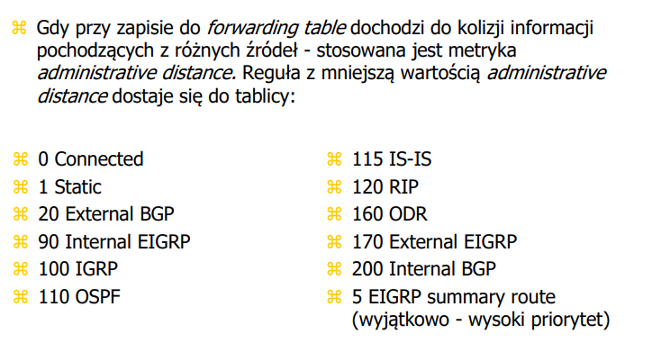

## CIDR

- CIDR - wprowadzony w 1993 roku przez Internet Engineering Task
Force

- Zaadoptowany także do protokołu IPv6

- Pozwala na używanie masek sieciowych różnej długości dla adresów
z dowolnej podsieci

- Umożliwia wydajniejszy przydział przestrzeni adresowej IPv4

- Każda część informacji o rutowaniu jest rozgłaszana wraz z maską
sieci

- Definiuje notację: XX.XX.XX.XX/YY o dowolnej ilości bitów „1” w
masce (0-32) branych pod uwagę przy dopasowywaniu reguł
rutowania

- Włączenie rutowania:

Ruter(config)#ip routing
Ruter(config)#ip classless

- Definiowanie reguł statycznych:
Ruter(config)#ip route 100.100.100.0 255.255.255.0 100.100.102.1
gdzie 100.100.100.0 to sieć docelowa dla pakietu, 255.255.255.0 to
maska tej sieci, a 100.100.102.1 to interfejs następnego rutera w sieci
bezpośrednio podłączonej, na który należy wysłać pakiet do sieci
100.100.100.0

- Usuwanie reguły:

Ruter(config)#no ip route 100.100.100.0 255.255.255.0 100.100.102.1

- Kasowanie zawartości wygenerowanej forwarding table
(treść zostanie wygenerowana ponownie) :

Ruter#clear ip route *

- W konfiguracji interfejsu rutera należy usunąć adres IP, ale włączyć
ten interfejs:

Router(config)#int f0/0
Router (config-if)#no ip address
Router (config-if)#no shutdown
Router (config-if)#exit

- Należy zdefiniować pod-interfejsy dla poszczególnych VLAN oraz
enkapsulację 802.1q dla tych pod-interfejsów:

Router(config)#int fa0/0.1
Router(config-subif)#encapsulation dot1q 10
gdzie 10 to VID odpowiedniego VLAN

- Następnie należy określić adres IP pod-interfejsu
Router(config-subif)#ip addr 10.1.1.1 255.255.255.0

## Rutowanie – longest prefix match

- Kolejny problem dotyczy kolizji dopasowania do dwóch reguł
jednocześnie

- Gdy reguły dopasowania i kosztów są identyczne (adres, maska i
metryka) – ruter rozdziela ruch proporcjonalnie pomiędzy interfejsy
docelowe wskazane tymi regułami (technika load balancing)

- Gdy różnią się maską – poszukiwany jest tzw. longest prefix match.
Jest to dopasowanie do reguły rutowania, której maska posiada
najwięcej bitów 1 (maskuje ona dłuższy prefiks adresu IP). Maskę taką
nazywamy też „najwyższą maską” (highest mask)

- Przykład: rozpatrujemy datagram IP o adresie docelowym
200.200.200.1, a w tablicy są reguły o wzorcach i maskach:

ִ200.200.200.0/24
ִ200.200.0.0/16
Obydwa wzorce pasują, jednak wybrany zostanie
200.200.200.0/24

## Route summarization

- Gdy do kilku sieci IP prowadzi taka sama ścieżka i dodatkowo
przedrostki ich adresów są bitowo identyczne – adres takich sieci
można uogólnić. Proces ten nosi nazwę Route summarization (inne
nazwy: prefix aggregation, supernetting, route aggregation)

- Sieć o uogólnionym adresie (będącą faktycznie złożeniem
przynajmniej dwóch węzłów sieci) określamy mianem supernetwork
lub supernet

- Zagrożenie: Route summarization generalizuje adresację sieci, lecz
być może dodając także sieci, które istnieją w innym miejscu.

- Przykład: 10.1.0.0/24, 10.1.1.0/24, 10.1.3.0/24 -> 10.1.0.0/22
w tym przypadku trzy sieci mają wspólny prefix (22 bity) i zostały
zgeneralizowane. Lecz dołączono także sieć 10.1.2.0/24 – być może
niesłusznie.

## Klasyfikacja routerów z uwagi na lokalizację

- Router wewnętrzny - router który ma podłączone do siebie tylko
podsieci należące do tego samego ogólnie rozumianego obszaru,
złożonego z kilku sieci

- Router brzegowy - router, który jest fizycznie podłączony do więcej
niż jednego obszaru. Pełni rolę „wyjścia na zewnątrz”.

- Router szkieletowy - router który posiada interfejs w sieci
szkieletowej. W to włączone są routery które posiadają interfejsy w
więcej niż jednym obszarze (routery brzegowe). Router sieci
szkieletowej nie musi być routerem brzegowym. Router który ma
wszystkie interfejsy w sieci szkieletowej jest traktowany jako router
zewnętrzny.

## Rutowanie dynamiczne

- Rutowanie dynamiczne zachodzi wówczas, gdy sąsiednie rutery
informują się wzajemnie na temat topologii sieci IP w których
operują

- Rutery komunikują się za pośrednictwem komunikatów
rozgłaszanych lub kierowanych do konkretnych odbiorców. W
niektórych protokołów przypadkach rutery tworzą między sobą
trwałe połączenia (tzw. asocjacje) w celu wymiany informacji o
sobie i o topologii sieci.

### Zasięg działania

- IGP, Interior (Intradomain) Gateway Protocol - wewnętrzny
protokół rutowania - obowiązujący w tym samym Systemie
Autonomicznym.

- EGP, Exterior (Interdmain) Gateway Protocol - protokół zewnętrzny,
który jest wykorzystywany do komunikacji pomiędzy urządzeniami
trasującymi w różnych Systemach Autonomicznych.

- Systemy autonomiczne uzyskują numery IP z tzw. puli niezależnej
od dostawców Internetu - PI (Provider Independent)

- Przykłady protokołów rutowania dynamicznego:

    - Wewnętrznych (Interior Gateway Protocol) - np. RIP, IGRP, OSPF

    - Zewnętrznych (Exterior Gateway Protocol) - np. BGP

- Protokół EGP przetwarza informację o trasach w sieci rozległej,
zawierającą głównie listy numerów Systemów Autonomicznych przez
jakie trasa prowadzi (więc ujmuje trasę abstrakcyjnie, bez ingerencji w
topologię wnętrza danego Systemu Autonomicznego). Nie rozwiązuje
jednocześnie problemu poszukiwania trasy wewnątrz Systemu
Autonomicznego i w konsekwencji często jest zależny od poprawnego
funkcjonowania IGP

- Protokoły typu Interior propagują dodatkowo informację o wyjściach
ze swojego Systemu Autonomicznego do systemów sąsiednich – co
jest wykorzystywane w protokole EGP.

## Techniki poszukiwania tras

Obliczanie trasy jest wiązane z ustaleniem wartości opisującej ją
metryki. Metryka może być wyrażona liczbą przeskoków, skalarnym
parametrem określającym możliwości łącza, trasy itp.

Techniki obliczania tras (które w konsekwencji stają się podstawą
klasyfikowania protokołów dynamicznego rutowania IP):

- Protokoły stanu łącza (Link-state) – ustalana jest informacja,
będąca kompletnym drzewem ścieżek do innych sieci w
obszarze działania danego protokołu. Przykład: OSPF
- Protokoły wektora odległości (Distance-vector) – ustalana jest
informacja, określająca jedynie metrykę do określonego celu i
kierunek (interfejs). Brak jest informacji o pełnej ścieżce. W tej
technice ruter bazuje na informacji preparowanej tylko przez
jego sąsiadów („routing by rumor”). Przykład: RIP, IGRP
- ִProtokoły hybrydowe (Balanced hybrid) - np. Path-vector stosują połączenie poprzednich technik. Przykład: BGP

## Problemy technik distance vector

- Pętle routingu - brak informacji o trasie do celu (jedynie o kierunku do
niego) może prowadzić do zapętleń w przekazywaniu informacji - gdy
istnieje wiele tras do innego rutera utworzonych z różnych sieci IP.
Chwilowe zapętlenie może być wynikiem zbyt wolnej propagacji
informacji (rutery nie będące jeszcze w stanie zbieżności przekazują ten
sam datagram IP do siebie nawzajem). Zjawisko zapętlenia jest
szczególnie groźne, gdy jedna z tras jest zależna od tej drugiej (np.
stanowi tunel prowadzony po drugiej trasie). Wówczas może nastąpić
oscylacja w wyborze trasy (gdy trasa zależna jest lepsza).

- Liczenie do nieskończoności – występuje gdy (podobnie jak w
poprzednim przypadku) istnieje wiele tras pomiędzy dwoma ruterami, a
dodatkowo jeden z nich utracił kontakt z jeszcze inną siecią (nie leżącą
na tych trasach). Wówczas nieaktualna już choć ciągle przez rutery
posiadana informacja o tej sieci jest propagowana dalej w pętli - z
ciągłym zwiększaniem wartości metryki odległości

- Środki zaradcze wobec zliczania do nieskończoności:

    - Wprowadzenie limitu odległości (np. maksymalnej liczby skoków)
    
    - Wprowadzenie licznika hold-down (wstrzymanie zmian na temat
    danej sieci po utracie kontaktu z nią przez określony czas)
    
    - Metoda Split Horizon (blokada ogłaszania wstecznego) polega na
    blokowaniu możliwości przekazania informacji o trasie do rutera, od
    którego ta informacja pierwotnie pochodzi (brak możliwości „uczenia
    nauczyciela”). Ważniejsze techniki Split Horizon:

        - Proste dzielenie horyzontu (Simple Split Horizon) – nie wysyła się
        informacji przez interfejs, z przez który wcześniej została ona
        otrzymana lub do rutera, z którego przyszła
        
        - Dzielenie horyzontu z zatruwaniem wstecznym (Split Horizon
        With Poisoned Reverse) - trasy nie są pomijane, lecz wysyłane z
        metryką „nieskończoność” lub większą niż dopuszczona w danej
        technologii – co oznacza nieosiągalność sieci docelowej

## RIP

- RIP - Routing Information Protocol

- Procesy RIP w ruterach realizują następującą funkcjonalność:
    
    - Żądają aktualnych informacji o routingu od innych routerów i na
    ich podstawie aktualizują tablice routingu.
    
    - Odpowiadają na podobne żądanie innych routerów.
    
    - W ściśle określonych przedziałach czasu (domyślnie: 30 sekund)
    rozsyłają informacje o swojej obecności, informując inne routery
    o aktualnej konfiguracji połączeń międzysieciowych.
    
    - W przypadku wykrycia zmian w konfiguracji sieci rozsyłają
    stosowną informację.

- RIP wykorzystuje protokół UDP i numer portu 520 by wymieniać
wiadomości między rout

### Cechy

- Administrative distance dla RIP: 120

- Dwa warianty funkcjonowania:
    
    - Klasowy (Classfull) – RIP w wersji 1
    
    - Bezklasowy (Classless) – RIP w wersji 2

- Rozgłaszanie następuje tylko do ruterów sąsiednich – w
konsekwencji bardzo duże opóźnienia w propagacji informacji (tzw.
wolny czas konwergencji - długi czas osiągania zbieżności)

- Bardzo prosta metryka – tylko liczba przeskoków

- Problemy z redystrybucją informacji o trasach do RIP – konieczna
konwersja metryki do akceptowalnej w RIP. Przeważnie w ruterze,
który dokonuje redystrybucji, wartość metryki dla tras dołączanych
do bazy RIP jest narzucana konfiguracją

- RIP stosuje technikę Distance-vector. Optymalizuje wybór trasy przy
kryterium najmniejszej liczby skoków przez rutery (hops) niezbędnych
do osiągnięcia miejsca przeznaczenia lub pod kątem kosztu ścieżki
prowadzącej do miejsca przeznaczenia.

- Ruter wysyła komunikaty RIP uaktualniające do sąsiadów - w
określonych, stałych przedziałach czasu (30 sekund) lub w
przypadku pojawienia się zmian w topologii sieci w segmentach
bezpośrednio podłączonych (triggered update, w wersji 2 RIP).

- Ruter, po przyjęciu uaktualnienia rutowania (które dotyczy zmian
odległej sieci) uaktualnia tablicę rutowania. Wartość miary
przypisanej danej odległej sieci docelowej wzrasta o jeden (jako
następny skok jest wskazany nadawca komunikatu RIP).

- Routery RIP utrzymują tylko kierunek najlepszej trasy (do miejsca
przeznaczenia) - czyli trasę z najmniejszą liczbą skoków.

- Liczba skoków jest ograniczona do 15 (zapobieganie pętlom).

### RIPv2, RIPng

- Druga wersja protokołu RIP (RIPv2 to nazwa oficjalna). Ulepszenia:
    
    - Transmisje multicast - RIPv2 może wysyłać między routerami RIPv2
    wiadomości multicast pod adres 224.0.0.9 zamiast poprzez tzw.
    pseudo-broadcast IP, gdzie adres docelowy wynosi 255.255.255.255

    - Możliwość określenia w pakiecie RIP maski sieci dla dowolnej zdalnej
    sieci IP, o której pakiet ten informuje (wsparcie dla VLSM, Variable
    Length Subnet Mask)

    - Technologia „Next Hop” - możliwe jest tu rozgłoszenie dalej innego
    niż lokalny adresu następnego skoku - maskując w ten sposób tzw.
    cichy router, czyli ruter nie używający RIP (np. rutujący statycznie).
    Przez ten ruter będzie przechodził ruch do dalszych segmentów sieci
    znów używającej RIP
    
    - Dodanie możliwości szyfrowania (MD5) przy wzajemnej identyfikacji
    (autentyfikacji) routerów

- RIPng (RIP next generation) to wariant RIP dla obsługi IPv6

## Problem maski przy rutowaniu dynamicznym – VLSM

- VLSM - Variable Length Subnet Mask – zakłada rozszerzenie
funkcjonalności niektórych protokołów rutowania dynamicznego,
polegające na uwzględnieniu różnej wielkości maski podsieci.

- W konsekwencji zakłada konieczność przekazywania informacji o masce
odległej sieci pomiędzy ruterami (tym samym - informacji o wielkości
podsieci wyrażonej treścią maski)

- Umożliwia w konsekwencji zastosowanie CIDR w rutowaniu (nie bazuje
się wtedy na masce o długości wymuszonej klasą adresu IP lecz
definiuje dowolne maski i przekazuje je razem z informacją o sieci)

- Przykładowe protokoły rutowania dynamicznego wspierające VLSM to
EIGRP, RIPv2, OSPF

- Możliwość kontrolowania procesu automatycznej generalizacji w
protokole rutowania (konfigurowalna cecha auto-summary, powodująca
iż przekazywana informacja o masce sieci korygowana do zgodnej z
klasą adresu IP tej sieci)

## IGRP

- IGRP - Interior Gateway Routing Protocol

- Umożliwia sterowanie ruchem na podstawie zadanych parametrów
mediów, takich jak przepustowość łącza, niezawodność, długość
pakietów w trybie automatycznym

- IGRP stosuje technikę Distance-vector. Oblicza dla trasy 24 bitową
metrykę odległości, bazując na ocenie trasy (cost to destination)

- Marszruta w przekazywaniu informacji o trasach między routerami -
przekaz co 90 sekund (IP multicast 224.0.0.10)

- Nieodebranie przekazu przez trzy kolejne okresy (270 sekund)
powoduje, że ruter unieważnia daną trasę, po kolejnych siedmiu
(630 sekund) – ruter odczekuje jeszcze dodatkowe 10 sekund i
usuwa trasę z tablicy rutowania

- IGRP jest klasowy (nie wspiera VLSM)

### Obliczanie metryk

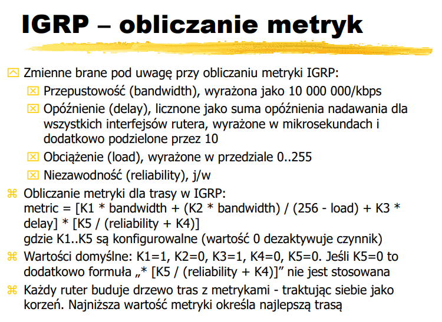

### IGRP a EIGRP

- Wariant EIGRP (Enhanced Interior Gateway Routing Protocol):
    
    - Jest bezklasowy (wspiera VLSM), limituje topologię do 50 routerów
    
    - Używa płaskiej struktury sieci z podziałem na systemy
    autonomiczne
    
    - Rozgłasza wiedzę opcjonalnie z użyciem IP multicast 224.0.0.10
    (jak w IGRP) lub unicast (gdy jawnie określono sąsiadów)
    
    - Używa bardziej złożonej (32 bitowej) metryki oceny jakości łącza,
    lecz także bazującej na analizie parametrów określających
    opóźnienie międzysieciowe, przepustowość, obciążenie i
    niezawodność łącza
    
    - Używa zastrzeżonych algorytmów obliczania trasy (zamiast Open
    Shortest Path First), w tym algorytmu DUAL (Diffusing Update
    Algorithm). Umożliwia on rozpoznanie i odrzucenie tras
    zapętlonych oraz pozwala na znalezienie alternatywnych tras bez
    czekania na aktualizacje pochodzące od innych

## EIGRP

- Dane przechowywane przez proces EIGRP:

- Tablica sąsiadów - sąsiadujące rutery EIGRP

- Tablica topologii - trasy rozgłaszane przez sąsiednie routery EIGRP

- Tablica rutowania EIGRP - informacje o najlepszych trasach do
znanych miejsc docelowych

- Klasyfikacja tras EIGRP:

    - Pod kątem statusu:

        - Trasa podstawowa
        
        - Trasa zastępcza (FS, Feasible Successor Route) - zapasowa

    - Pod kątem pochodzenia:

        - Trasa wewnętrzna – informacje o niej pochodzą z systemu
        autonomicznego i jednocześnie z EIGRP
        
        - Trasa zewnętrzna – informacje o niej pochodzą z innego
        protokołu, rutowania statycznego lub spoza AS

## OSPF

- OSPF - Open Shortest Path First, protokół stosuje technikę linkstate

- Bazuje na algorytmie Dijkstry poszukiwania najkrótszej ścieżki w
grafie

- Możliwość wprowadzenia obszarów sieci (net area) pozwalających
na hierarchizację sieci w ramach domeny

- Fazy działania po uruchomieniu:
    
    - Budowa tablic sąsiadów, na podstawie wysyłanych zwrotnych
    pakietów typu „Hello”
    
    - Dzielenie się informacją - poprzez wzajemne rozgłaszanie treści
    tablic (IP multicast 224.0.0.5, 224.0.0.6 lub unicast)
    
    - Typowanie najlepszych tras - na bazie algorytmu OSPF i
    wartości metryk kosztu (poprzez przeszukiwanie w głąb
    posiadanego grafu)

- Jest wewnętrznym protokołem rutowania (Interior Gateway Protocol
IGP). Przesyła dane pomiędzy ruterami należącymi do tej samej domeny
(domain) OSPF – w konsekwencji obszar pracy OSPF nazywamy domeną
OSPF (znajduje się ona wewnątrz Systemu Autonomicznego, czasem
pokrywa go w całości). W domenie może istnieć max. 500 węzłów

- Jeżeli istnieje kilka tras do jednego punktu przeznaczenia to OSPF
generuje wiedzę umożliwiającą rozprowadzenie ruchu IP po wszystkich
trasach równomiernie

- Ruter OSPF w trybie ciągłym buduje drzewo najkrótszych tras do
wszystkie innych ruterów (i w sieci z nimi połączonych w ramach
domeny OSPF). Nie każdy ruter posiada komplet informacji (w OSPF
wyróżniamy strefy – area, ograniczające obszar propagacji informacji)

- Uczestnicy wymiany informacji w ramach protokołu OSPF są
kontrolowani - tylko autoryzowane routery uczestniczą w budowie
drzewa

### Obszary

- Każdy obszar (area) OSPF musi być podłączony do area 0. Wyjątek
stanowi sytuacja, w której zdefiniowano tzw. Virtual Link pomiędzy
obszarami

- Istnieją identyfikatory liczbowe area podawane do konfiguracji
urządzeń. Często mają one notację analogiczną do IPv4: X.X.X.X .
Wtedy area 0 będzie miał ID = 0.0.0.0 (uwaga na ewentualne
pomyłki z adresacją IP interfejsów!)

- VC - Virtual Link (Circuit) - zdefiniowana sztucznie ścieżka
rozgłaszania komunikatów OSPF (najczęściej biegnąca przez kilka
area) – umożliwia tunelowanie komunikacji prowadzonej pomiędzy
ABR i dzięki temu - podłączenie obszaru nie kontaktującego się
bezpośrednio z area 

### Trasy

- Trasa lokalna (local) – prowadzi pomiędzy ruterami zlokalizowanymi
tym samym obszarze (area) OSPF

- Trasa internal – opisuje dojście z jednego obszaru (area) OSPF do
innego obszaru OSPF. Zawiera uogólnioną informację o sieciach IP
w zdalnym obszarze OSPF. Prowadzi przez Ruter ABR.

- Trasa external – prowadzi poza domenę OSPF (do innego Systemu
Autonomicznego zarządzanego przez protokół BGP) lub prowadzi do
innej domeny OSPF. Prowadzi przez ruter ASBR

### Rodzaje AREA

- Standard area – normalny obszar oddzielany od innych ruterami
ABR. Ruter w tym obszarze otrzymuje informację o lokalnych
trasach (komunikaty LSA 2) od innych ruterów w area
(wewnętrznych – Internal Router), o trasach internal (do innych
area) – od ABR (komunikaty LSA 3 z Area 0) oraz o trasach external
(komunikaty LSA 5).

- Backbone area (Area 0) – wyróżniony szkielet domeny OSPF. Jest
obowiązkowa, w domenie OSPF może istnieć tylko jedna area 0.
Area 0 także zawiera wiele ruterów OSPF i funkcjonuje normalnie

- Stub area – nie otrzymuje informacji o trasach external. Treść
komunikatu LSA 5 jest przed wysłaniem do Stub area konwertowana
przez ABR na adres domyślnej bramki. Stub area nie wysyła także
informacji o sieciach zewnętrznych względem domeny OSPF (nie
interpretuje posiadania rutera ASBR). Ruter w Stub area akceptuje
tylko LSA 1,2,3.

- Totally stub (Totally stubby) – obszar wyizolowany, gdzie ruter
akceptuje wyłącznie LSA 1,2 – czyli nie posiada tras generalizowanych
(no summary) z innych area, jedynie informacje o trasach do
lokalnych sieci i adres domyślnej bramki przysłany przez ABR

- Not-so-stubby area (NSSA) – obszar otrzymuje informacje o sieciach
spoza domeny OSPF, wysyła je dalej (do innego ABR), ale nie
otrzymuje informacji od innych area OSPF. Umożliwia to podłączenie
ASBR do Stub area i przekazywanie wiedzy o trasach.

### Rodzaje komunikatów

- Hello – używany do identyfikacji sąsiadów i obsługi ruchu technicznego
(nie wiązanego z wymianą wiedzy o trasach)

- Link State Advertisement (także: Link State Update) – komunikat o
trasie, opisany rosnącym numerem sekwencji oraz kosztem. Wysyłany
periodycznie oraz dodatkowo po utracie lub odzyskaniu jakiegokolwiek
łącza

- Link State Ack – potwierdzenie komunikatu Link State Update

- Database Description – seria numerów sekwencji wszystkich
komunikatów aktualnie posiadanych w bazie danych (pozwala sprawdzić
ich aktualność i sprawnie zsynchronizować bazę danych). Komunikat
stosowany po uruchomieniu łącza, przez które jest wysyłany.

- Link State Request – używany jako żądanie przesłania informacji z
określonym numerem sekwencji, wysyłany głównie w konsekwencji
otrzymania Database Description wskazującego na posiadanie przez inny
ruter bardziej aktualnych informacji

### Rodzaje LSA

- LSA - Link State Advertisements - komunikaty wysoko-poziomowe
rozgłaszane prze rutery OSPF w obrębie domeny OSPF

- 6 głównych typów komunikatów LSA:

    - Type 1 - reprezentuje inny ruter, który sąsiaduje z adresatem w
    tym samym obszarze OSPF
    
    - Type 2 - reprezentuje tzw. pseudonodes (listę ruterów
    przyłączonych do sieci), rozsyłany w obrębie area opisuje trasy
    tam wykryte (trasy lokalne)
    
    - Type 3 - reprezentuje tzw. Network link summary (trasa
    zbiorcza do obszaru OSPF), rozsyłany przez rutery brzegowe
    obszarów (ABR). Opisuje trasy do innych obszarów (area), ale
    wewnątrz systemu autonomicznego i domeny OSPF (trasy
    internal). Domena OSPF to obszar działania OSPF - jest zawarta
    w obszarze autonomicznym.

- Trzy pozostałe typy komunikatów LSA:

    - Type 4 – reprezentuje ruter ASBR (czyli informuje o wyjściu z
    domeny OSPF). Rozsyłany przez rutery brzegowe dla obszaru
    (ABR). Jest propagowany do całego obszaru (area).
    
    - Type 5 – reprezentuje trasę prowadzącą poza domenę OSPF
    (trasę external) – uzyskaną przez inne niż OSPF protokoły
    rutowania. Rozsyłany do domeny przez rutery brzegowe dla
    domeny (czyli ASBR). Komunikat ten, wchodząc do domeny
    OSPF jest propagowany do wszystkich ABR i dalej do area w
    całej domenie OSPF. Wyjątek stanowi tu stub area.

    - Type 7 – używany w obszarze NSSA zamiast typu 5 LSA
    (następuje konwersja treści komunikatu na granicy NSSA do
    typu 5). Konieczny do przekazania informacji do ABR o trasach
    zewnętrznych względem NSSA, gdy te przyszły do NSSA z sieci
    nie objętych OSPF.

### Podsumowanie terminologii

- ABR - Area Border Router - ruter łączący dwa obszary (area) wewnątrz
domeny OSPF

- ASBR - Autonomous System Border Router lub Autonomous System
Boundary Router - ruter prowadzający ruch poza domenę OSPF (do
innego protokołu rutowania dymanicznego lub innej domeny OSPF)

- Backbone router – ruten OSPF nie będący ruterem ABR lub ASBR i
znajdujący się wewnątrz Area 0 (backbone)

- Internal router – ruten OSPF nie będący ruterem ABR lub ASBR i
znajdujący się wewnątrz Area innej niż backbone

- Gdy dwa rutery OSPF wymieniają między sobą informację o trasach,
nazywamy je adjacentnymi

- Standard area – zbiór sieci IP łączonych ruterami. Zakres propagowania
informacji o trasach jest do niej ograniczany, zaś ABR generalizuje te
informacje i przekazuje do innych area

- Backbone area - główny obszar (area) domeny OSPF (numer 0) -
definiowany obowiązkowo w OSPF. Backbone Router - ruter w Area 0

- Stub area i jej warianty - obszar nie będący Area 0 i mający tylko jeden
ABR lub ASBR (jedno wyjście), co nie wymaga propagowania pełnej
informacji o domenie OSPF

- Equal Cost MultiPath (ECMP) – konstrukcja OSPF balansująca ruch
sieciowy proporcjonalnie pomiędzy wieloma ścieżkami, gdy ich koszty są
identyczne.

- LSA - Link State Advertisement - komunikat ogłoszenia OSPF wysyłany
przez rutery OSPF (istnieje 6 typów podstawowych), łącznie 11 typów

### OSPF – zachowanie w różnych wariantach sieci 

- W zależności od typu sieci i funkcjonalności udostępnionej przez
warstwę drugą ISO OSI, zachowanie OSPF oraz reguły jego
konfigurowania są odmienne. Generalny podział wygląda następująco:
    
    - Point-to-point - DR i BDR nie są potrzebne (nie ma sensu ich
    wybierać gdyż istnieją tylko dwa rutery OSPF w segmencie sieci).
    Rutery OSPF automatycznie identyfikują się jako sąsiedzi i
    nawiązują połączenia. Do komunikacji nadal użytkowany jest adres
    IP multicast 224.0.0.5
    
    - Point-to-multipoint - sieć składa się z wielu par Point-to-point,
    gdzie każda ma jeden węzeł wspólny z innymi (ten sam). Zasady
    konfigurowania są analogiczne jak poprzednio, lecz adresy innych
    ruterów OSPF należy podać w konfiguracji (gdyż nie ma możliwości
    automatycznego wykrycia ruterów)

    - NBMA (Non Broadcast Multiple Access) - sieć zbudowana w
    warstwie drugiej z wielu łącz Point-to-point (np. sieć Framerelay). Z uwagi na brak możliwości rozgłaszania - tu także
    konieczne jest manualne konfigurowanie adresów innych
    ruterów OSPF (neighbors). Występują dwa istotne warianty
    takiej sieci:
        
        - Full-mesh – gdy udostępniono połączenie „każdy z każdym”
        – wówczas położenie DR i BDR jest dowolne
        
        - Hub-and-spoke – gdy istnieje jeden wyróżniony węzeł,
        komunikujący jakiekolwiek inne. W tym przypadku ten
        właśnie węzeł (ruter OSPF) powinien otrzymać rolę DR
        (należy to wymusić przy użyciu parametru priority)
    ִ
    -Multiple Access – sieć z możliwością rozgłaszania (np. Ethernet)
    – obowiązuje standardowa procedura konfigurowania OSPF (DR
    i neighbors ustanawiane są automatycznie)

- Różne konfiguracje topologii sieci, do której podłączony jest interfejs
rutera (broadcast, non-broadcast, point-to-multipoint, point-to-point) –
można korygować, lecz za wyjątkiem point-to-multipoint typ sieci
ustalany jest automatycznie:
Router (config-if)#ip ospf network point-to-multipoint

- Uwaga: zależnie od rodzaju skonfigurowanej w OSPF sieci stosowane są
różne domyślne interwały czasowe dla pakietów Hello:
ִ10 sekund dla hello, 40 sekund dead timer w przypadku sieci
Multiple Access
ִ30 sekund dla hello, 120 sekund dead timer w przypadku sieci Pointto-point, NBMA, Point-to-multipoint
Konieczne jest wymuszenie identycznych wartości dla całej sieci OSPF
w przypadku niezgodności:
Router (config-if)#ip ospf hello-interval 15
Router (config-if)#ip ospf dead-interval 

### Metryki

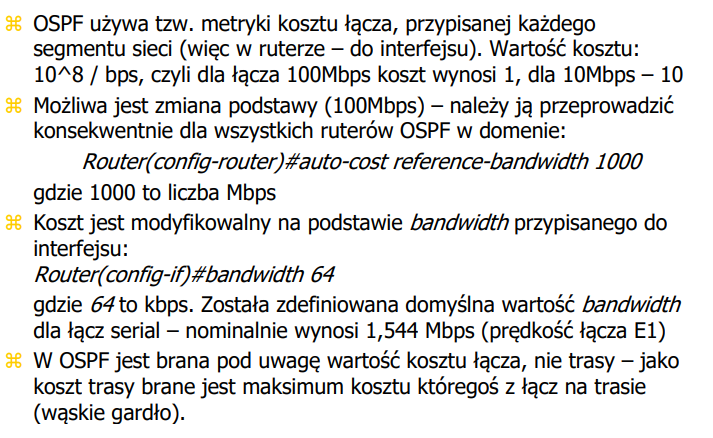

### Stany połączen w OSPF

- Analizowane podczas prowadzenia czynności diagnostycznych:
Router#show ip ospf neighbors
Router#debug ip ospf event

- Kolejne stany połączenia to:

- Down – właśnie zakończono, lub nie rozpoczęto jeszcze komunikacji

- Attempt – wysłano Hello do rutera określonego komenda neighbor (np.
w przypadku sieci NBMA), oczekiwanie na odpowiedź

- Init – przyszedł pakiet Hello od innego rutera, ale nie jest to odpowiedź

- 2-way – przyszła odpowiedź na pakiet Hello wysłany wcześniej

- Exstart – trwa procedura ustalania DR i BDR (nowy ruter włącza się do
sieci)

- Exchange + Loading – trwa procedura wymiany bazy wiedzy o ścieżkach
OSPF

- Full – bazy danych o ścieżkach są zsynchronizowane, adjacencja.

## IS-IS

- IS-IS - Intermediate System to Intermediate System

- Typ: Interior Gateway Protocol, link-state

- Alternatywa dla OSPF

- Jest użytkowany głównie przez dużych operatorów usług
internetowych

- Buduje drzewo najlepszych ścieżek z punktu widzenia każdego z
zaangażowanych ruterów

-Wprowadza hierarchię: obszary (area) podobnie jak OSPF, lecz
tylko w dwóch kategoriach. Area posiadają liczbowe identyfikatory
(24-bitowe)

- Nie operuje tylko nad IPv4 dlatego, więc jest adaptowalny dla
wsparcia IPv6 (nie trzeba wprowadzać nowych wersji, jak w
przypadku OSPF)

- Dwie klasy obszarów (przypisane do ruterów, które tworząc
topologię w tej samej klasie budują odpowiedniki area z OSPF):
    
    - Level 1, intra-area (traktowany jako backbone szkieletu sieci
    objętej protokołem, lecz formalnie IS-IS nie wymaga obszaru
    bazowego - odpowiednika OSPF area 0). Rutery Level 1
    komunikują się tylko z innymi ruterami Level 1.
    
    - Level 2 inter-area. Rutery Level 2 komunikują się tylko z
    ruterami Level 2
    
    - Występują także rutery Level 1+2 – tylko one mogą się łączyć z
    Level 1 i z Level 2. Komunikują rutery inter-area i intra-area

- Uwaga: w IS-IS granice obszarów przebiegają POMIĘDZY
RUTERAMI (w OSPF – PRZEZ RUTERY ABR). Nie przypisujemy
zatem różnych area do interfejsów tego samego rutera. Zamiast
tego rutery trzymają zamiennie dwie wersje bazy tras: ISIS Level-1
Link State Database, ISIS Level-2 Link State Database

### Adresacja IS-IS

- Komponenty adresu net 49.3456.2002.0020.0001.00 z
poprzedniego przykładu w sieciach rozległych będzą przybierały
następujące znaczenie:
    
    - Pierwszy bajt (49) będzie określał rodzinę adresów (AFI –
    Address Family Identifier) używanych do identyfikacji hostów
    biorących udział w procesie rutowania IS-IS (kolor zielony). W
    przypadku IPv4 musi mieć właśnie wartość 49
    
    - Dwa następne bajty (3456) to identyfikator area w IS-IS
    
    - Sześć kolejnych bajtów to adres pobrany z unikatowego adresu
    rutera (np. IP)
    
    - Ostatni bajt to tzw. NSEL (NET Selector) – w przypadku IS-IS
    musi on mieć wartość 0

## ODR

- ODR – On Demand Routing

- Rozwiązanie Cisco bazujące na protokole CDP (Cisco Discovery
Protocol), udostępniające uproszczone i szybkie do konfigurowania
rutowanie IP

- Umożliwia szybką lokalizację przez rutery wyjścia z sieci korporacyjnej
oraz pozwala na automatyczną propagację informacji o sieciach
bezpośrednio dołączonych.

- Architektura: jeden ruter centralny (tzw. ODR-HUB) i wiele ruterówklientów

- Zasada działania:
ִWraz z komunikatem CDP klienci przekazują do ODR-HUB informacje
o swoich sieciach bezpośrednio podłączonych
ִODR-HUB przekazuje w komunikatach CDP klientom informacje o
sobie, jako domyślnej bramce (co wystarcza, żeby wszystkie rutery
ODR miały możliwość wysyłania datagramów między sobą)

## Tunele dla systemów rutujących

- Gdy istnieje konieczność zbudowania rozproszonego systemu
rutowania dynamicznego IP (na przykład rozlokowanego w wielu
budynkach połączonych przez Internet) możliwe jest zastosowanie
tunelowania (tunelling).

- Istnieje możliwość szyfrowania danych przesyłanych przez tunel

- Tunele GRE (General Routing Encapsulation) są realizowane są
użyciem specjalnych interfejsów wirtualnych (o nazwie Tunnel).

- Technologia opracowana przez Cisco

- Tunele wspierają funkcjonalność warstwy trzeciej ISO OSI (więc
zakończenia tunelu posiadają adresy IP).

- Tunel może być prowadzony przez inne rutery (najczęściej w
Internecie) aż do swojego przeciwległego końca (na przykład w
innym budynku).

- Zakończenia tunelu posiadają własne adresy IP

- Konieczne jest udrożnienie rutowania IP pomiędzy zakończeniami
tunelu

- Tunel tworzony jest z użyciem dodatkowej enkapsulacji. W
datagramie IP zamieszczany jest nagłówek GRE (kod protokołu 47)

- Inne zastosowania tuneli:

    - Łączenie zdalnych sieci stosujących protokoły inne niż IP
    
    - Przesyłanie ruchu IPv6 poprzez sieć IPv4
    
    - Przesyłanie szyfrowanego ruchu multicast pomiędzy odległymi
    ruterami (ruch multicast nie jest wspierany przez IPSec, lecz
    istnieje możliwość przekazania ruchu multicast do tunelu, który
    będzie szyfrowany jako łącze punkt)

## Transmisje multicast w sieciach IP

- Większość z istniejących protokołów, które wykorzystują multicast,
działają na szczycie protokołu UDP (multicast nie jest mechanizmem
zorientowanym połączeniowo)

- Tworzone są tzw. grupy rutowania multicast, do których klasyfikowane
są hosty zainteresowane odbiorem strumienia multicast

- Aby stacja (oraz aplikacja na niej uruchomiona) mogła być odbiorcą
danej grupy – musi zarejestrować się jako taki odbiorca na bezpośrednio
podłączonym ruterze. Stosuje w tym celu protokół IGMP (Internet Group
Management Protocol). Ruter sprawdza, które jego interfejsy prowadzą
do zarejestrowanych odbiorców – i przez te rozsyła datagramy

- Ruch multicast jest w ruterze rozpatrywany jako ruch wysyłany – więc w
przeciwieństwie do unicast (gdzie o celu decydował adres odbiorcy) – w
multicast adres NADAWCY jest podstawą rutowania. W takim przypadku
funkcjonuje określenie „Reverse path forwarding” - transmisja danych
zestawiana w kierunku „od celu do źródła”

## Adresy IP Multicast

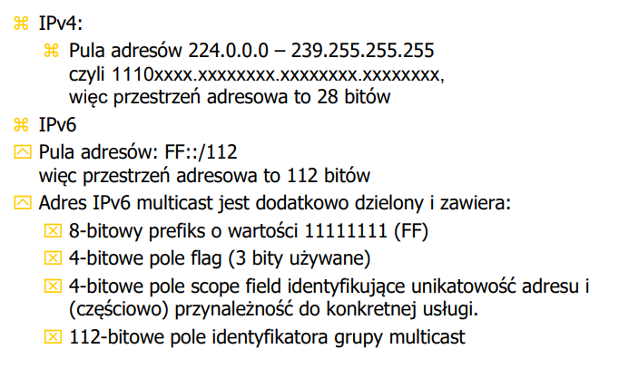

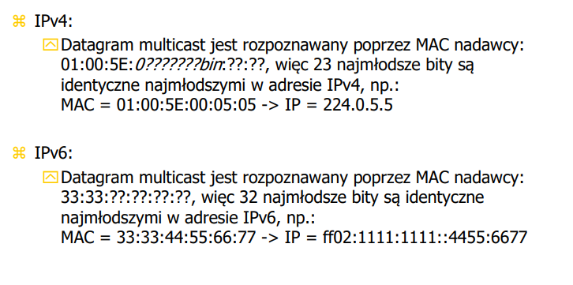

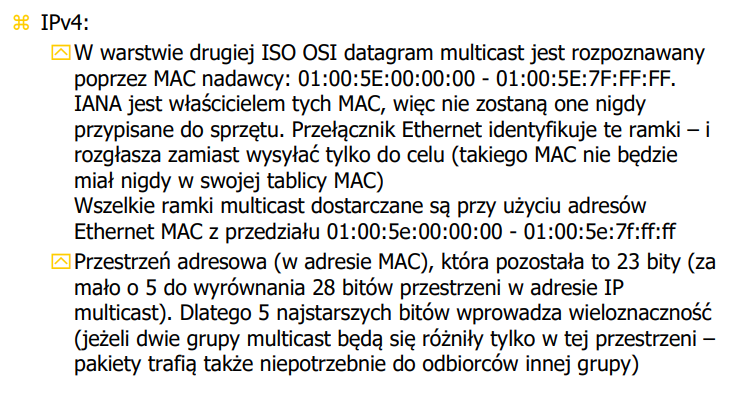

## IGMP i MLD

- IGMP (Internet Group Management Protocol)

- Protokół kontrolujący multicast dla sieci IPv4.
Wersje: IGMPv1, IGMPv2 i IGMPv3.

- Prosty system komunikatów (przykład dla IGMPv2): „Membership
Query”, „Membership Report”, „Leave Group”

- W IGMPv3 dodano do każdej grupy multicast dodatkowe filtry źródeł
w tej grupie (oraz komendy include i exclude). Możliwe jest od teraz
blokowanie źródeł z użyciem IGMP.

- MLD (Multicast Listener Discovery)

- Protokół kontrolujący multicast dla sieci IPv6.
ִWersje: MLDv1, MLDv2

- Działa analogicznie jak IGMP (konkretnie: MLDv1 jest
odpowiednikiem IGMPv2, MLDv2 jest odpowiednikiem IGMPv3).

- Protokół jest częścią ICMPv6 (nie jest specyfikowany indywidualnie)

### IGMP - zarządzanie grupami

- Zgłoszenie się hosta do grupy multicast – komunikatem
Membership Report wysyłanym do rutera

- Ruter (pełniąc funkcję Querier) może odpytywać hosty wysyłając
komunikat Membership Query. Gdy nie odpytuje – pracuje w trybie
Non-Querier.

- Host powtarza komunikat zgłoszenia z interwałem losowym z
przedziału 0..MaxRespTime po każdorazowym otrzymaniu żądania
od rutera. Zgłoszenie dotyczy GRUPY multicast, nie konkretnego
hosta i znaczy, że w segmencie sieci jest odbiorca danych
klasyfikowanych w tej grupie multicast.

- W segmencie sieci może (i powinien) być tylko jeden ruter pełniący
funkcję Querier. Gdy komunikaty Membership Query przestaną być
nadawane – inny ruter (jeśli jest) przechodzi ze stanu Non-Querier
do Querier i rozpoczyna odpytywanie.

- Dla każdej grupy multicast ruter utrzymuje licznik jej aktualności
(domyślnie: 260 sekund). Gdy nie otrzymuje Membership Report
od żadnego z hostów (członków danej grupy multicast) – usuwa ją.

- Host także sprawdza Membership Report dotyczące grup, do
których przynależy (nadawane przez inne hosty). Gdy chce opuścić
grupę jako ostatni (wie to) – wysyła komunikat Leave Group. Jeśli
nie jest ostatni i opuszcza – nic nie musi robić.

- IGMP operuje tylko w lokalnym segmencie sieci (służy tylko do
rejestrowania grup multicast w ruterze-bramce dla multicast). Ruch
na trasie od hosta-serwera strumienia multicast do rutera jest
organizowany z pomocą protokołów rutowania multicast.

### IGMP Snooping

- Przełączniki nie ingerujące w adresację multicast rozsyłają ramki
multicast do wszystkich odbiorców (na wszystkie aktywne porty) –
co obciąża hosty koniecznością rozpatrywania treści tych ramek

- Niektóre przełączniki posiadają funkcję IGMP snooping – polegającą
na wyłapywaniu raportów rejestracji w grupie multicast (IGMP
Report) i następnie używaniu zgromadzonej w ten sposób
informacji do przekazywania ramek multicast tylko do właściwych
portów. Alternatywnie – w IGMPv3 pakiety IGMP Report są
dodatkowo wysyłane pod dedykowany adres IP: 224.0.0.22
(przełącznik może z nich korzystać)

- W innym wariancie funkcjonowania przełączników możliwe jest
symulowanie komunikacji IGMP przez te przełączniki – w celu
całkowitego przejęcia procesu rejestrowania w grupie multicast i
następnie zarządzania ruchem multicast przez przełącznik (ruter
otrzymuje zgłoszenia IGMP zbiorczo od przełącznika)

## Adresy specjalne IP multicast

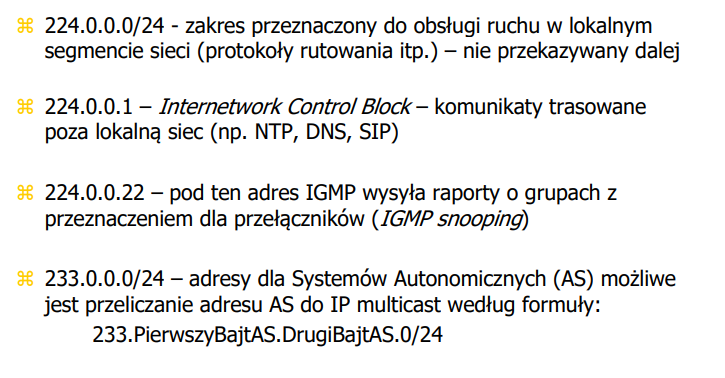

### Protokoły rutujące IP multicast - Interior

- PIM – Protocol Independent Multicast – korzysta z innych
protokołów do pozyskiwania tras. Buduje struktury opisujące ścieżki
IP multicast w kilku trybach:
    
    - PIM Sparse Mode (PIM-SM lub PIM pull-mode) – buduje drzewa
    odbiorców dla każdej grupy, opcjonalnie także wybiera shortest
    path. Różnica względem Dense Mode: odbiorca (ruter) musi
    czynnie wysłać żądanie zarejestrowania go jako potencjalnego
    odbiorcy multicast.
    Robi to w specjalnym ruterze o nazwie Rendezvous Point
    (RP)

W efekcie zmniejszony jest narzut na komunikację (strumienie
IP multicast nie są rozgłaszane niepotrzebnie), może jednak
powodować opóźnienia/braki w pokryciu sieci.

- Tryby PIM – ciąg dalszy:
    
    - PIM Dense Mode (PIM-DM lub PIM push-mode) – buduje pełne
    drzewa dla każdej grupy, potem usuwa te gałęzie, gdzie nie mają
    odbiorców. Różnica względem Sparse Mode: każdy ruter dostaje
    ruch IP Multicast, chyba ze czynnie zabroni wysyłania do niego
    takiego ruchu (wyśle komunikat prune , informujący, że nie jest
    zainteresowany dalszym otrzymywaniem strumienia IP multicast
    danej grupy)
    
    - PIM Sparse-Dense Mode - RP poszukiwany jest automatycznie
    (funkcjonalność autoRP) przez rutery PIM. Rutery PIM kandydujące
    do roli RP zgłaszają się do Mapping agenta - specjalnego rutera PIM,
    będącego arbitrem wybierającym RP. On rozsyła informacje o RP do
    wszystkich ruterów PIM. Do tej komunikacji służy specjalna grupa IP
    Multicast: 224.0.1.40 lub 224.0.1.49 pracująca w Dense Mode.
    Pozostałe grupy – gdy udało się ustalić adres RP – pracują w Sparse
    Mode

- Tryby PIM – ciąg dalszy:
    
    - Bidirectional PIM – buduje drzewa dla ruchu dwukierunkowego.
    W przypadku Cisco należy aktywować tryb jako rozszerzenie
    wcześniejszych (budowane są wtedy ścieżki dla Multicast
    prowadzące w obydwu kierunkach – do celu i do źródła):
    Router(config)#ip pim bidir-enable
    
    - PIM Source-Specific Multicast (PIM-SSM) – rozbudowuje drzewo
    w kierunku od hosta-nadawcy danego ruchu (a nie od
    odbiorców). Uwzględnia nie tylko identyfikator grupy IP
    multicast, w której nadaje źródło, ale także adres IP unicast
    tego źródła. Odbiorcom daje możliwość wyboru źródła na
    podstawie tego adresu – co jest istotne w sytuacji gdy wiele
    źródeł koliduje w tej samej grupie IP multicast. Para
    identyfikator IP multicast grupy + adres IP unicast źródła zwana
    jest kanałem multicast (Multicast channel).

## Drzewa rutowania IP multicast

- Tablica rutowania IP multicast zawiera wpisy składające się na drzewa
propagacji ruchu datagramów. W przypadku istnienia RP Dla każdej
zarejestrowanej grupy istnieją dwa drzewa:
    
    - Shared tree – gdzie wpisy mają przykładowy kształt: (*, 239.1.1.1).
    Drzewo to prowadzi do RP (przez Incoming interface) od odbiorców
    ruchu Outgoing interfaces list w kolejnych ruterach.
    
    - Source tree – gdzie wpis dotyczy konkretnego hosta unicast
    będącego źródłem datagramów: (200.200.200.1, 239.1.1.1). Drzewo
    prowadzi do źródła (przez Incoming interface) od odbiorców ruchu
    (Outgoing interfaces list)

- Outgoing interface list w każdym wpisie może mieć wiele pozycji
(datagramy są wtedy powielane). Gdy zawiera Null – ruter posiada
jedynie informację o źródle (brak zarejestrowanych odbiorców)

- Incoming interface dla Shared tree w przypadku RP zawierają Null (to
jest właśnie ten ruter)

## Protokoły rutujące IP

- DVMRP - Distance Vector Multicast Routing Protocol
ִDo wymiany datagramów używa protokołu IGMP

- Funkcjonuje w Dense-mode

- Funkcjonowanie: komunikaty Request/Response dotyczące trasy
przesyłane między ruterami

- Protokół ma możliwość tunelowania połączeń pomiędzy ruterami
DVMRP przez inne rutery, nie wspierające tego protokołu

- Protokół prowadzi optymalizację ruchu na bazie kosztów
przeskoku, definiowanych jako liczba całkowita (metryka)
przypisywana do urządzenia pośredniczącego w transmisji
(rutera)

- Bazuje na koncepcji RIP, ale zamiast tworzenia ścieżek z
przeskokami w przód (next-hop) – buduje drzewa
przeszukiwania do tyłu (tzw. previous-hop back to the source)

- MOSPF – Multicast Extensions to OSPF

- Rozszerzenie OSPF pozwalające ruterom na dzielenie się informacją o
grupach multicast. Używa IGMP do pobierania informacji o grupach
multicast.

- Nie kataloguje informacji o trasach lecz pary: źródło, grupa odbiorców
multicast. Na żądanie tworzone są drzewa shortest-path dla takich par.

- MOSPF analogicznie do OSPF stosuje podział na AS (System
autonomiczny, domenę OSPF) i AREA (obszar). W konsekwencji istnieje
intra-area routing, inter-area routing, inter-domain routing MOSPF

- Przetwarza dodatkowy rodzaj LSA – Group Membership LSA operujący
na parze (źródło, grupa multicast)

- ABR posiada dodatkowa funkcję: Inter-area Multicast Forwarder
– wysyłają uogólnione informacje o grupach multicast z przyległych area
do backbone area

- Analogicznie postępują AS Boundary Routers (ASBRs), posiadając
funkcję Inter-AS Multicast Forwarder

- MBGP – Multiprotocol Extensions of BGP

- Uniwersalny dla IPv4 i IPv6

- Poza MPLS VPN pozwala na rozgłaszanie topologii ruterów
obsługujących multicast (innej niż dla unicast). MBGP
redystrybuuje trasy do PIM i MOSPF

- Protokoły interior (opisane wcześniej) są także zaadaptowane do
pracy pomiędzy systemami autonomicznymi, więc posiadają
możliwość operowania jako Exterior

### Przykład globalnej sieci multicast - mBone

- mBone (multicast Backbone) jest siecią wirtualną IP multicast nad
IP unicast

- Tworzone są tzw. wyspy IP multicast (łączone tunelami nad siecią
nie obsługującą IP multicast). Konieczne jest tu tunelowanie IPover-IP.

- Obecnie mBone posiada kilka tysięcy wysp.

- W ramach mBone użytkowany jest protokół DVMRP (z niewielkim,
lokalnym wsparciem MOSPF)

- Tunele tworzone w ramach mBone są często zestawiane przez
dostawców internetu (dzięki nim można uporządkować ruch IP
multicast jako konkretną usługę w konkretnym tunelu)

## Mechanizmy wspierające procesy rutowania datagramów IP

### Policy Based Routing

- Możliwe jest definiowanie rozszerzonych kryteriów rutowania
datagramów – wychodzących poza treść forwading table

- W przypadku rutowania IP kryteria mogą być oparte na innej (niż
adres IP) informacji zawartej w datagramach IP (QoS, długość
datagramiu, flagi, inne pola adresowe itp.)

- Mechanizmy wspomagające PBR: zastosowanie wielu alternatywnych
tablic rutowania (np. w systemach operacyjnych Linux), wprowadzenie
tzw. Route Maps definiujących reguły filtrowania i akcje podejmowane
wobec dopasowanych do tych reguł datagramów

- Możliwe jest manipulowanie informacją, która definiuje reguły
dystrybucji ruchu IP w ruterze (np. wymiana adresu następnej bramki
dla datagramu). W konsekwencji - można nawet określać reguły
tworzenia tras przesyłanych pomiędzy ruterami w ramach protokołu
rutowania dynamicznego - ingerując w treść informacji o tych trasach.

### IP SLA

- IP SLA (Service Level Agreement) to zestaw mechanizmów
umożliwiających prowadzenie czynnego monitorowania infrastruktury
wykorzystywanej w procesach rutowania IP oraz podejmowanie
zaprogramowanych akcji po wykryciu określonego jej stanu

- IP SLA może być także wykorzystywane do ciągłego pobierania
informacji o stanie obciążenia sieci, prowadzenia analiz QoS i
automatyzowania innych podobnych czynności.

- Funkcjonalność IP SLA jest wbudowana w systemy operacyjne Cisco
IOS - jej użycie nie wymaga dodatkowego sprzętu czy
oprogramowania. Rejestrowana jest baza tzw. monitorów
aktywowanych zgodnie z ustalonymi kryteriami czasowymi i dającymi
automatycznie klasyfikowane wyniki pomiarów (co pozwala
zaprogramować reakcje na otrzymanie określonej ich treści)

### Rutery w trybie standby – HSRP, VRRP

- Protokoły Cisco HSRP (Hot Standby Routing Protocol) i VRRP (Virtual
Routing Redundancy Protocol) umożliwiają asekurowanie rutera
innymi ruterami, oczekującymi w gotowości aby przejąć ruch w
przypadku awarii tego pierwszego.

- Zasada działania: Rutery są łączone w logiczną grupę o ustalonym
numerze i współdzielą dodatkowy wirtualny adres IP (posiadając też
dodatkowe wirtualne adresy MAC). Jeden z ruterów jest w stanie
active i on aktualnie obsługuje wirtualny adres IP, odpowiadając na
wszelki ruch z nim związany. Gdy ruter ten ulegnie awarii - adres
wirtualny migruje do kolejnego rutera bez powodowania przerwy w
ruchu.

## Translacja adresów IP

### NAT

- Zastosowanie urządzeń konwertujących adresy IP (Network
Address Translation - NAT) dla sieci lub hostów

- Nazwa potoczna, związana z dostarczaną przez NAT
funkcjonalnością konwersji: masquerade - translacja adresów
pozwala między innymi na „ukrycie” sieci wyizolowanej

- Adresy hostów w podsieci, z której ruch wychodzący podlega
konwersji są konfigurowane z użyciem tradycyjnego ustawienia
domyślnej bramki – będącego jednocześnie adresem hosta IP
dokonującego translacji (ruter sprzętowy, serwer itp.).

- Bramka taka odbiera datagram i zmienia jego nagłówek IP wpisując
inny adres jako nadawcy (zmieniając też często numer portu TCP)

- Wadą są trudności z funkcjonowaniem niektórych usług warstw
wyższych – użytkujących połączenia ustanawiane w przeciwnym
kierunku niż wyjściowy z sieci lokalnej (serwer->klient TCP itp.)

### Bloki adresów IP

- NAT może dokonywać translacji w trybie:
    
    - Jeden adres IP <-> jeden adres
    
    - Wiele adresów IP (pula IP) <-> jeden adres
    
    - Wiele adresów IP <-> wiele adresów IP

- Konwersja nie musi być wiązania z przejściem datagramu przez
bramkę – możliwe jest użycie tzw. rutera na patyku (router on a
stick), gdzie datagram po konwersji wraca do tej samej sieci

- Z reguły NAT operuje na trzech blokach adresów, przypisanych do
tzw. sieci prywatnych. Znaczna większość ruterów nie posiada
jednak ograniczenia NAT do adresacji sieci prywatnej.

- Bloki adresów traktowanych jako przynależne do sieci prywatnych:
    - Klasa A : 10.0.0.0 – 10.255.255.255
    
    - Klasa B : 172.16.0.0 – 172.31.255.255
    
    - Klasa C : 192.168.0.0
    – 192.168.255.255

## NAT

### Overloading

- Overloading umożliwia stworzenie relacji typu „jeden do wielu”
pomiędzy adresami IP podczas translacji (NAT). NAT bez trybu
overloading pozwala tylko na translację kolejnych adresów IP na
kolejne inne.

- W większości ruterów funkcjonalność NAT jest konfigurowana w oparciu
o tzw. pule adresów IP (w ten sposób określa się zakres adresów).

- Kontrola procesu translacji jest regulowana poprzez standardowe listy
kontrolne (ACL)

- Wyróżniane są dodatkowo interfejsy, pomiędzy którymi następuje
translacja (inside i outside)

- W przypadku stosowania trybu overloading możliwe także jest
zdefiniowanie puli adresów – lecz wtedy jedno-adresowej i przypisanie jej do interfejsu inside (z tego interfejsu odbierane są datagramy od różnych nadawców – więc z różnymi adresami IP do konwersji na „adres nadawcy” w outside)

### Rodzaje adresów

- Podział ze względu na występowanie (uwaga – nie intuicyjny):

    - Adres local – występujący w datagramach w sieci inside (prywatnej)

    - Adres global - występujący w datagramach IP w sieci outside
(publicznej)

- Z zachowaniem tego podziału a NAT występują 4 rodzaje adresów:
    
    - Inside local – adres hosta w sieci prywatnej (inside)
    
    - Inside global – adres interfejsu IP w sieci publicznej (tego, który jest
    nadawcą datagramów do Internetu) już po konwersji (interfejs występuje w imieniu hostów z sieci prywatnej). Gdy wybieramy opcję overloading adres ten będzie adresem interfejsu outside w ruterze NAT.
    
    - Outside global – rzeczywisty adres hosta docelowego
    (w Internecie)
    
    - Outside local – adres hosta w Internecie znajdujący się w
    datagramie, który fizycznie jest jeszcze w sieci prywatnej
    (przeważnie taki sam, jak outside global)

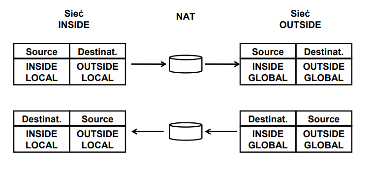

### NAT a rutowanie IP

- Generalne zasada – konfiguracja NAT nie decyduje o tym co
zrobić z datagramem IP (np. umieścić w danym interfejsie
wyjściowym), lecz jedynie podmienia wartości adresów w
datagramie. Więc decyzje o postępowaniu z datagramem są
ustalane na podstawie zawartości tablicy rutowania IP (gdy jest to
jeszcze istotne).

- Kolejność wykonywania operacji:
Router (config)#ip nat inside
- dokonanie konwersji w datagramie wchodzącym do ruter a (po przeprowadzeniu konwersji podejmowane są kroki związane z rutowaniem IP)
Router (config)#ip nat outside
- dokonanie konwersji w datagramie wychodzącym z rutera

### NAT - Tworzenie DMZ i mapowań statycznych

- Umożliwienie mapowania portów dla strumieni TCP z sieci outside
do usług w sieci inside:
Router(config)# ip nat inside source static tcp 10.0.0.2 8080
10.0.0.1 80
gdzie 10.0.0.2 to adres inside local, 10.0.0.1 to adres inside global,

- Powyższa instrukcja funkcjonuje najczęściej w połączeniu z
mapowaniem statycznym

- Mapowanie (translacja) statyczna występuje w tablicy NAT cały
czas. Zdefiniowanie translacji statycznej:
Router(config)# ip nat inside source static 10.0.0.3 200.200.200.2 

## Adresowanie IPv6

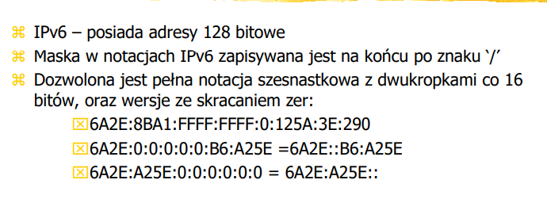

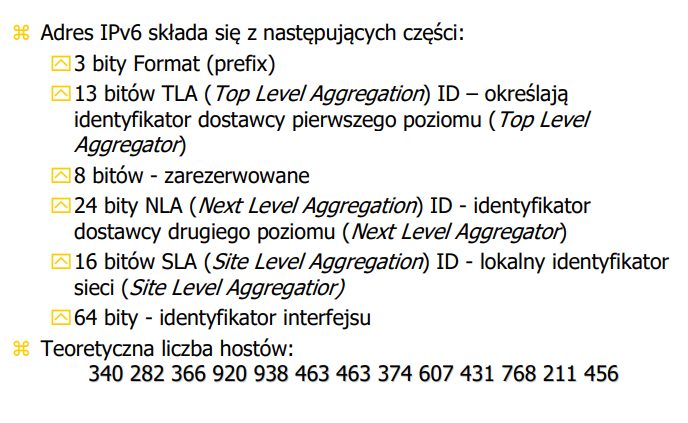

### Komponenty adresu IPv6:

- TLA odpowiadają wpisom w globalnej tablicy rutowania, może
ich być 8192, ilość tę można w przyszłości powiększyć biorąc
bity z 8 zarezerwowanych

- NLA powinny określać cel w ramach jednego TLA, typowo jeden
identyfikator może być przyznawany jednej instytucji

- SLA - pozwala na określenie podsieci lokalnych, może ich być
65535 

- Identyfikator interfejsu jest kojarzony z adresem Ethernet
(MAC), ale przeznaczono na niego 64, a nie 48 bitów. Często
konstruuje się go z MAC wstawiając po 3-cim bajcie MAC
dodatkowe 16 bitów o wartości 0xFFFE.

### IPv6 unicast

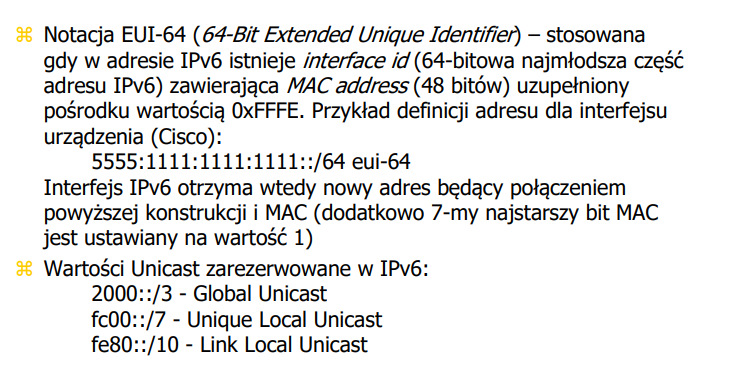

### Adresy specjalne i prefiksy

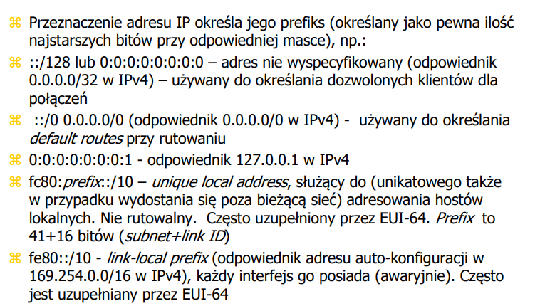

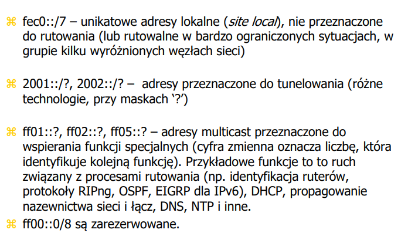

### Cechy interfesjów IPv6

- Interfejs może mieć wiele adresów IPv6, np.: kilka różnych linklocal address, global address i inne.

- Adresy mogą być trwałe lub tymczasowe (mogą być użyte tylko dla
konkretnego połączenia wychodzącego, identyfikując klienta +
usługę na bazie treści adresu IPv6)

- Istnieją konfigurowalne „tablice preferencji”, łączące każdy prefiks
danego adresu (routing prefix) z tzw. precedence level (liczbą,
będącą priorytetem). W przypadku posiadania (np. chwilowego)
danego adresu – możliwe jest wtedy automatyczne podjęcie
decyzji, którego adresu użyć np. jako źródłowego dla połączenia
wychodzącego

### Lifetime dla adresów IPv6

- Każdy adres IPv6 ma czas życia (domyślnie skonfigurowany jako
nieskończony)

- Ruter konfigurujący adresy zdalnych interfejsów IPv6 może
wymieniać ich adresy podając interfejsom dodatkową wartości
lifetime adresu

- Przeterminowany adres IPv6 przechodzi w interfejsie ze stanu
preferred do deprecated (dalej może być używany, lecz bez
możliwości nawiązywania nowych połączeń przy jego użyciu)

- Po dalszym czasie przechodzi do stanu invalid. Wtedy może być już
przypisany do innego interfejsu

### IPv6 multicast

- Adres IPv6 multicast zawiera:
    
    - 8-bitowy prefiks o wartości 11111111 (FF)
    
    - 4-bitowe pole flag (3 bity używane)
    
    - 4-bitowe pole scope field identyfikujące unikatowość adresu i
    (częściowo) przynależność do konkretnej usługi oraz przede
    wszystkim zasięg, w jakim znajdować się mogą odbiorcy
    datagramu
    
    - 112-bitowe pole identyfikatora grupy multicast

- Adresy IPv6 multicast są powszechnie użytkowane do wspierania
protokołów Internetu zarządzających ruchem nad IPv6

### IPv6 multiclass address scpoes

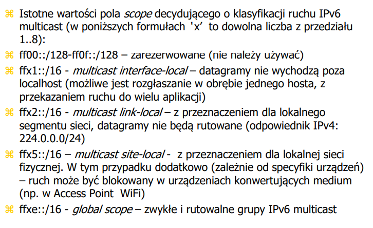

### IPv6 i IPv4 - mapowanie adresów

- Użytkowanie IPv6 jest obecnie w dużej mierze oparte na mapowaniach
tych adresów wykorzystujących poprzednią wersję protokołu (IPv4).
Technika ta określana jest skrótem 6to4. Mapowanie adresów:
2002:xxxx:xxxx::/16 <-> xx.xx.xx.xx
gdzie xxxxxxxx to treść adresu IPv4 (reprezentację dziesiętną należy
zamienić na heksadecymalną przy zapisywaniu tej treści)

- Istnieją także adresy IPv6 mapowane z IPv4 w inny sposób. Powstały tu
adres jest określany mianem IPv4-mapped IPv6
lub IPv4 compatible address:
0:0:0:0:0:FFFF:x.x.x.x/96 lub 0:0:0:0:0:0:x.x.x.x/96
gdzie x.x.x.x to adres IPv4 (stosuje się reprezentację dziesiętną, która
jest automatycznie zamieniania na heksadecymalną). Zapis adresu
zawiera więc zarówno symbole „ : ” jak i „ .” i taka jego postać jest
przetwarzana przez systemy operacyjne urządzeń w wydawanych im
komendach

### Tunelowanie IPv6

- Mechanizm polega umieszczaniu datagramów IPv6 w tunelach
punkt-punkt tworzonych w sieciach IPv4 (następuje enkapsulacja w
datagramach IPv4)

- Do oznaczenia protokołu tunelowania (6in4) w datagramach IP
wykorzystywana jest wartość 41

- Tunele są zestawiane manualnie przez odpowiednią konfigurację
ruterów-bramek

- Istnieje możliwość zestawiania tuneli „dynamicznych” ('proto-41
heartbeat' tunnels) – gdzie przeciwległy koniec tunelu może
migrować pomiędzy kilkoma hostami (ruterami). Nowy adres tunelu
jest wtedy przekazywany poprzez komunikat heartbeat.

### Użytkowanie adresów IPv6 w systemie operacyjnym

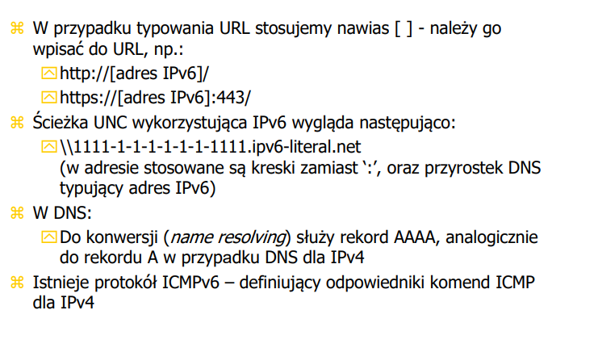

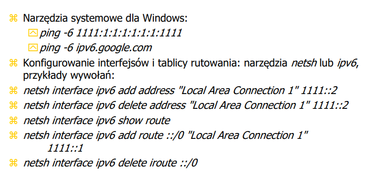

## NAT w IPv6

- NAT, z uwagi na szeroki zakres adresacyjny IPv6, nie jest
technologią bezpośrednio z IPv6 powiązaną (powstał nad IPv4 z
uwagi na braki w adresacji)

- Implementowane jest prowadzenie konwersji host-host (bez
techniki oveloading) – technologia nosi nazwę NAT64. Jest to tak
zwany wariant stateless (brak overloading)

- NAT stosowany jest dość często do prowadzenia konwersji
IPv4 <-> IPv6 - gdy hosty nie posiadające przeciwległych adresów
(odpowiednio IPv4 i IPv6) potrzebują się komunikować.
Technologia nosi nazwę NAT64. W jej przypadku konieczna jest
translacja wszystkiego, co napływa do interfejsu IPv6(nie są
definiowane pule adresów IP). Po stronie IPv6 technika używa
pseudo-interfejsów IPv6 (generuje adresy IPv6 nadawcy). Po
stronie IPv4 – używany jest adres IPv4 urządzenia, które dokonuje
translacji rutera.

- Host IPv6 zamierza połączyć się z serwerem IPv4, znając jego adres
(IPv4, przykładowo 1.1.1.1). Wysyła wtedy do rutera NAT64 pakiet IPv6
z adresem docelowym IPv6 o następującej treści: 64:ff9b::0101:0101,
gdzie starsze 64 bity to wartość charakterystyczna dla NAT64
zdefiniowana przez IANA, a młodsze 64 bity to adres IPv4 (1.1.1.1)

- Ruter NAT64 na podstawie otrzymanego pakietu IPv6 generuje pakiet
IPv4 i wysyła do celu ze swoim adresem IPv4 jako adresem nadawcy.
Gdy otrzyma odpowiedź – dokonuje konwersji odwrotnej i wysyła pakiet
IPv6 do początkowego hosta

- Istnieje usługa DNS64, stanowiąca serwer pośredniczący dla DNS i
działający na podobnych zasadach: zapytanie o rekord AAAA wysłane do
takiej usługi powoduje wygenerowanie następnego zapytania o rekord
A, a po otrzymaniu odpowiedzi – przesłanie jej do pytającego o rekord
AAAA z dodaniem w adresie IPv

---
---
---
---
---

# Sieci Komputerowe – Notatki z wykładu

## Wykład 1

### Podstawowe pojęcia
- **Enkapsulacja** – proces owijania danych nagłówkami kolejnych warstw modelu sieciowego
- **Preambuła** – pole w ramce Ethernet poprzedzające właściwe dane
- **Broadcast** – wysyłanie ramki/pakietu do wszystkich urządzeń w sieci

### VLAN
- **Trunk** – łącze między przełącznikami przenoszące ruch wielu VLANów
- **Tag port / port tagowany** – port przekazujący ramki z tagiem VLAN
- **Port nietagowany** – port usuwający tag przed wysłaniem ramki do urządzenia końcowego
- **IEEE 802.1Q** – standard tagowania ramek w sieciach VLAN *(warto znać!)*
- **CoS (Class of Service)** – pole w nagłówku 802.1Q służące do oznaczania priorytetu ruchu
- **Private VLAN** – mechanizm izolacji urządzeń wewnątrz jednego VLANu

### Warstwy i topologie
- **Fragmentacja transparentna vs. nietransparentna**
- **Peer-to-peer vs. point-to-point**
- **Węzeł hub-and-spoke** – topologia z węzłem centralnym (hub) i węzłami końcowymi (spoke)

---

## Wykład 2

### Adresacja IP
- **Notacja CIDR** – zapis adresu z maską w postaci `/n` (np. `192.168.1.0/24`)
- **Klasy adresów:** A, B, C, multicast, broadcast
- **Sieci klasowe / nieklasowe (CIDR)**
- **APIPA** – automatyczny adres `169.254.x.x` przydzielany gdy brak serwera DHCP
- **Localhost** – adres `127.0.0.1`, pętla zwrotna

### Diagnostyka
- **Echo Request / Echo Reply** – mechanizm ICMP używany przez `ping`
- **TTL (Time to Live)** – licznik ograniczający liczbę skoków pakietu

### Przydatne komendy (IOS)
| Komenda | Opis |
|---|---|
| `tracert` | Śledzenie trasy pakietu |
| `debug ip icmp` | Debugowanie ruchu ICMP |
| `no debug all` | Wyłączenie wszystkich debugów |
| `logging` | Konfiguracja logowania |

### Konfiguracja urządzenia
- **Line** – interfejs dostępu (np. `line vty 0 4` = 5 sesji zdalnych)
- **VTY (Virtual Terminal)** – wirtualne linie do zdalnego dostępu (SSH/Telnet)
- **Tworzenie użytkownika:** `username <nazwa> password <hasło>`

### STP (Spanning Tree Protocol)

- **Unikatowość** – kluczowa cecha (unikalny Bridge ID)
- **UDLD (Unidirectional Link Detection)** – wykrywanie jednokierunkowych łączy; tryby: *normal* i *aggressive*
- **Parametry:** `cost` (koszt portu) i `port priority` (priorytet portu)
- **Root Port** – port z najlepszą ścieżką do Root Bridge
- **Designated Port** – port wyznaczony na danym segmencie
- **Traffic Scrambling** – technika eliminacji problemów z jednokierunkowością
- **EtherChannel (LAG)** – agregacja łączy fizycznych w jedno logiczne

## Wykład 3 – Notatki

### Port Priority vs Cost (STP)

**Port Priority**
- Określa preferencję portu
- Niższa wartość = lepszy port
- Używana tylko gdy cost jest taki sam

**Cost (Path Cost)**
- Określa koszt ścieżki do root bridge
- Zależny od przepustowości
- Niższy = lepsza ścieżka

**Różnica:**
- Cost decyduje o trasie
- Port Priority rozstrzyga remisy

---

### Switch vs Router

**Switch (L2)**
- Działa na MAC address
- Przekazuje ramki
- Nie usuwa nagłówka Ethernet

**Router (L3)**
1. Usuwa nagłówek Ethernet
2. Analizuje adresy IP
3. Podejmuje decyzję routingową
4. Tworzy nową ramkę Ethernet

---

### TTL (Time To Live)

- Pole w nagłówku IP
- Każdy router zmniejsza TTL o 1
- TTL = 0 → pakiet usuwany
- Zapobiega pętlom

---

### Routing vs Bridging

**Routing**
- Warstwa 3 (IP)
- Oddziela broadcast domains

**Bridging**
- Warstwa 2 (MAC)
- Jedna domena broadcastowa

**Logika Bridgingu:**
- Learning (uczenie MAC)
- Flooding (gdy nieznany MAC)
- Forwarding
- Filtering

---

### Interfejsy L2 vs L3

**L2**
- Brak IP
- switchport

**L3**
- Ma IP
- routing

## Wykład 4

Listy kontrolne - ACL

Przykłady łącz szeregowych: SLIP - END/ESC - głónie

Przykład użycia SLIP dla łącza async

PPP

SNMP